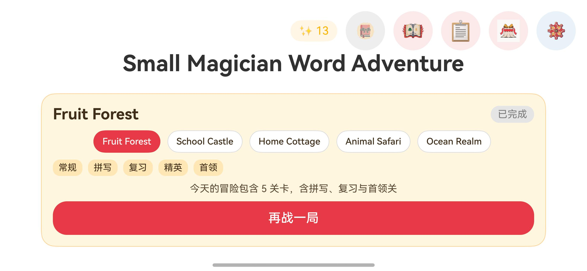
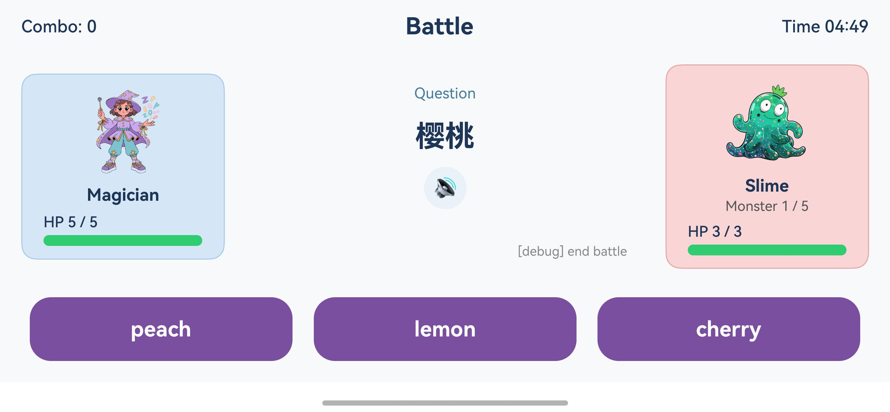
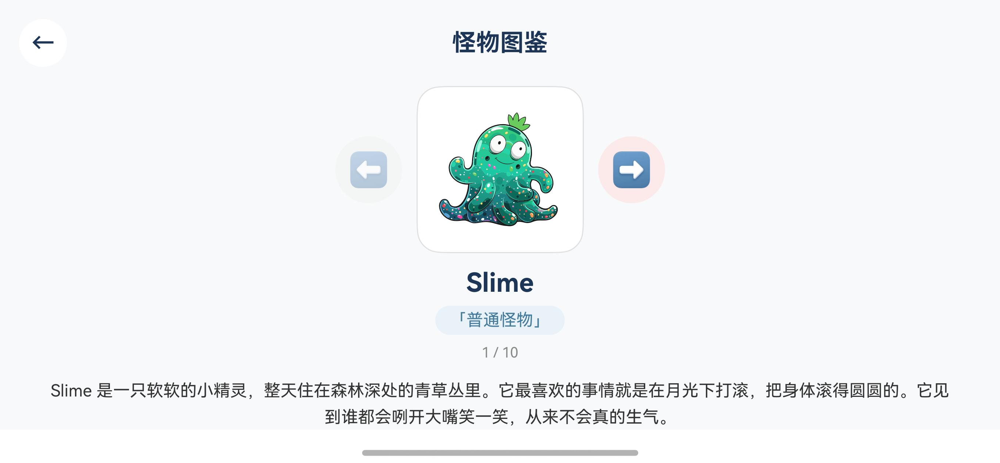
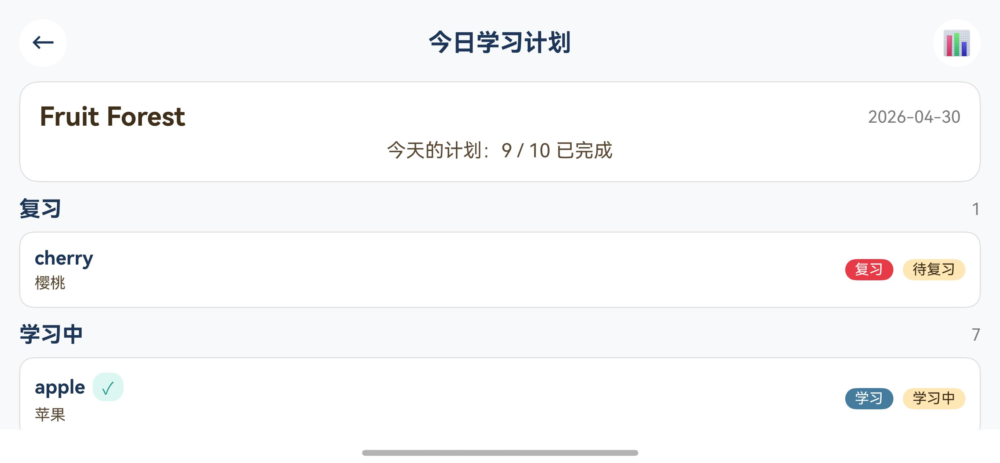
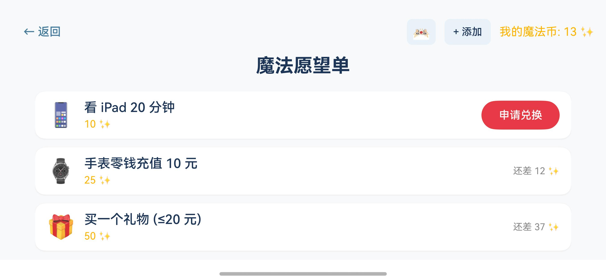

# Small Magician Word Adventure

快乐背单词是一个面向儿童的 HarmonyOS NEXT 英语单词学习小游戏。游戏把单词练习包装成“小魔法师对战怪物”的轻量冒险：孩子在横屏战斗中识别单词、补全拼写、积累魔法币，并通过每日计划和学习报告持续复习。

## Screenshots

| 首页与今日冒险 | 战斗答题 |
| --- | --- |
|  |  |

| 怪物图鉴 | 今日学习计划 | 魔法愿望单 |
| --- | --- | --- |
|  |  |  |

## Highlights

- **儿童友好的战斗学习循环**：选择正确单词会释放魔法攻击，答错会受到怪物反击，反馈直接、规则轻量。
- **多题型词汇训练**：支持三选一、补字母、完整拼写等题型，用不同怪物承载不同学习挑战。
- **今日冒险**：按主题区域生成每日练习计划，混合复习词、学习中词和新词。
- **本地学习记录**：记录词汇掌握状态，区分新词、学习中、熟悉、掌握，并支撑复习安排。
- **魔法愿望单**：完成冒险和击败怪物获得魔法币，孩子可以向家长申请兑换愿望。
- **怪物图鉴与主题区域**：包含 Slime、Zombie、Dragon 以及多个童话风 Boss，覆盖水果森林、学校城堡、家庭小屋、动物 Safari、海洋王国等区域。
- **离线优先**：首版词库、角色、怪物、音效和学习数据均在本地运行，适合平板短时练习。

## Tech Stack

- HarmonyOS NEXT
- ArkTS / ArkUI
- DevEco Studio managed project
- Local rawfile assets for words, characters, icons, and sound effects

## Project Structure

```text
entry/src/main/ets/
  pages/        HomePage, BattlePage, ResultPage, TodayPlanPage, WishlistPage
  components/   CharacterCard, ChoiceButton, HpBar, MagicProjectile
  models/       BattleState, Question, WordEntry, SessionResult
  services/     BattleEngine, QuestionGenerator, LearningRecorder, AudioService
  data/         AdventureCatalog, MonsterCatalog, MonsterCodex

entry/src/main/resources/rawfile/
  data/         bundled word lists
  character/    player and monster SVG assets
  sound/        battle sound effects and BGM candidates

docs/
  WordMagicGame_overall_spec.md
  WordMagicGame_roadmap.md
```

## Local Development

Install dependencies:

```bash
ohpm install
```

Build debug HAP:

```bash
hvigorw assembleHap
```

Run CodeLinter after a successful HAP build:

```bash
codelinter -c ./code-linter.json5 . --fix
```

Connect a device or emulator:

```bash
hdc list targets
```

Install the built HAP:

```bash
hdc install entry/build/default/outputs/default/entry-default-signed.hap
```

The detailed build, test, device, and log workflow lives in [`.cursor/dev-commands.md`](.cursor/dev-commands.md).

## Roadmap

The product roadmap is tracked in [`docs/WordMagicGame_roadmap.md`](docs/WordMagicGame_roadmap.md). Current major directions include battle audio mixing with BGM, richer learning reports, backend content tooling, parent account/device binding, AI-assisted story content, and a later Cocos2D battle presentation rewrite.
