# Small Magician Word Adventure

魔法背单词是一个面向儿童的英语单词学习冒险产品。游戏把单词练习包装成“小魔法师对战怪物”的轻量冒险：孩子在横屏战斗中识别单词、补全拼写、积累魔法币，并通过每日计划和学习报告持续复习。

仓库现在按 monorepo 组织：`harmonyos/`、`ios/`、`android/` 三个原生客户端与 `server/` 后端并列推进，`shared/` 只保存跨端契约、schema 和测试 fixtures。HarmonyOS NEXT 是参考实现；iOS / Android 已按原生 SwiftUI / Jetpack Compose 方向复制主要产品闭环，并通过三端 feature SOP 持续对齐。

**路线图（里程碑与后续方向）：** [`docs/WordMagicGame_roadmap.md`](docs/WordMagicGame_roadmap.md)

## Screenshots

Clients ship separate binaries; screenshots are grouped **by platform** under [`assets/screenshots/`](assets/screenshots/).

### HarmonyOS NEXT (reference UI)

Captured from the current HarmonyOS device/emulator state. Gameplay and most child-facing surfaces are landscape; configuration and longer management surfaces are portrait after the recent orientation pass. Some long-page archives still keep numbered strips under `assets/screenshots/harmonyos/`, but this README shows one representative image per surface. Regenerate on a connected device or emulator with:

`python3 scripts/capture_harmony_screenshots.py` (see script docstring; requires `hdc`).

| Landscape: battle | Landscape: result | Landscape: question types |
| --- | --- | --- |
|  |  | 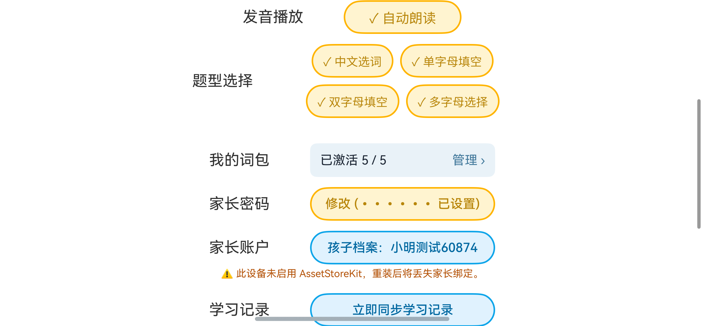 |

| Landscape: daily check-in | Landscape: monster codex | Landscape: wishlist |
| --- | --- | --- |
| 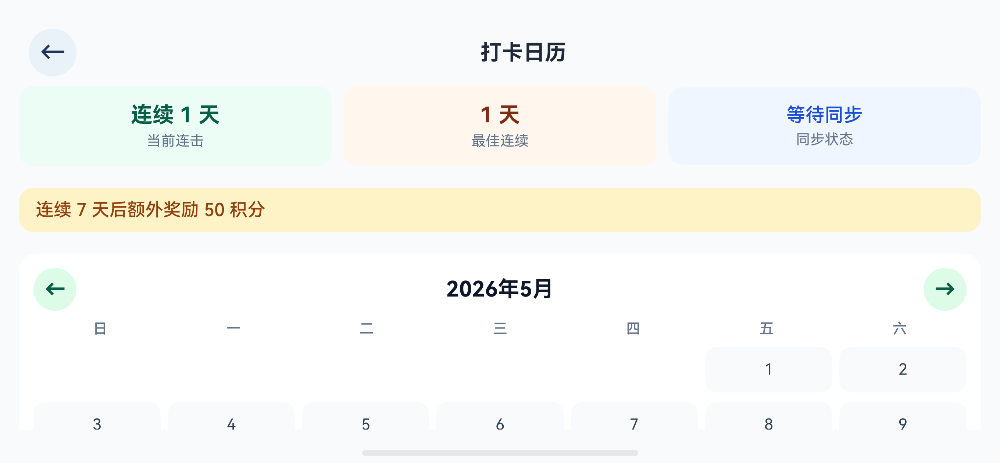 |  |  |

| Portrait: config | Portrait: today plan | Portrait: pack manager |
| --- | --- | --- |
|  |  |  |

| Portrait: learning report | Portrait: redemption history | Portrait: parent admin |
| --- | --- | --- |
|  |  |  |

**Capture notes:**

- V0.9.1 full UI automation is green on HarmonyOS, but the screenshot script remains environment-sensitive. The latest run refreshed several HarmonyOS PNGs and still reported failed/skipped steps for battle/result, parent PIN/admin, and scan-binding states.
- **`pages/ScanBindingPage`** — the bind button is hidden when the device already has a parent binding; capture `scan-binding.png` manually from an **unbound** install or after clearing binding.
- **`pages/LessonDraftReviewPage`** — needs at least one server-backed lesson draft in **pending**; capture manually from Parent admin when a row exists.

### iOS

Native SwiftUI client screenshots live under [`assets/screenshots/ios/`](assets/screenshots/ios/). Child-facing and settings routes below are landscape; Parent Admin is portrait. V0.9.1 sentence cloze and the missing Home / Config / Parent Admin screenshots were captured from the iPhone simulator after the full XCUITest suite passed.

| Landscape: home | Landscape: config | Landscape: sentence cloze battle |
| --- | --- | --- |
| 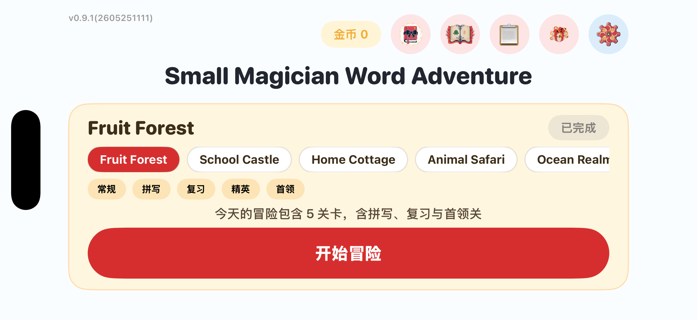 | 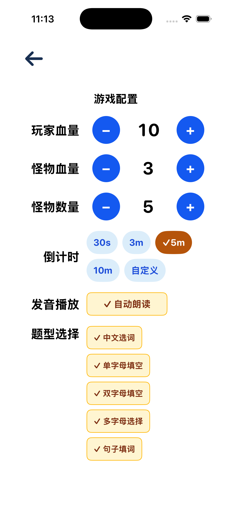 | 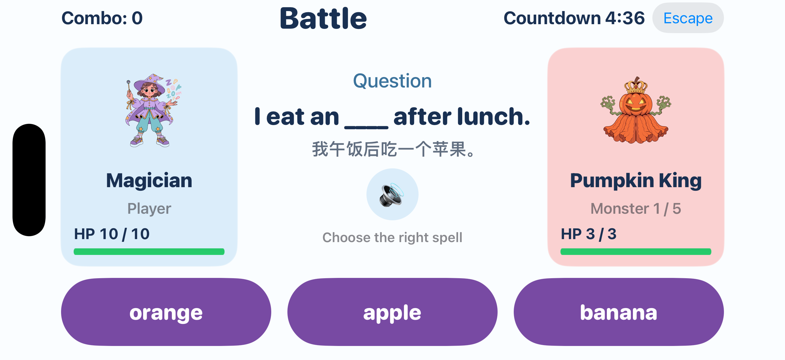 |

| Landscape: daily check-in | Landscape: today plan | Portrait: parent admin |
| --- | --- | --- |
| 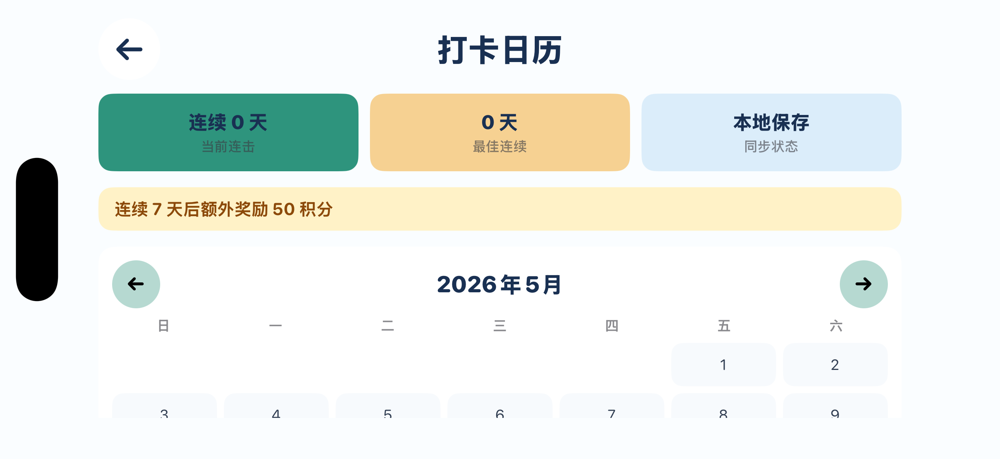 | 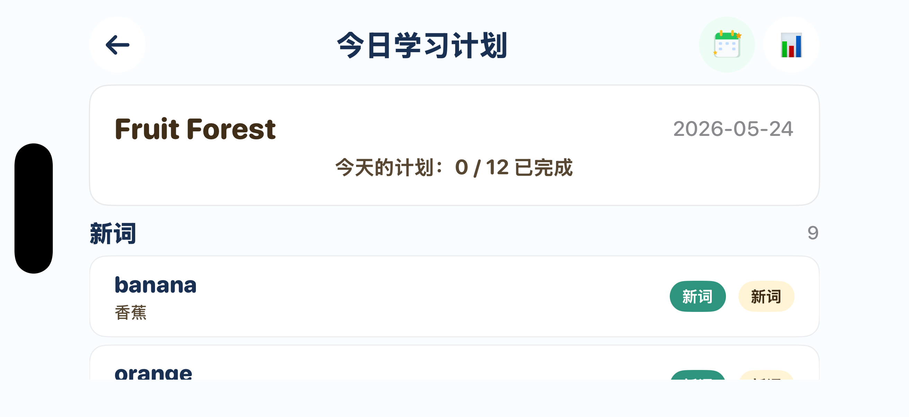 | 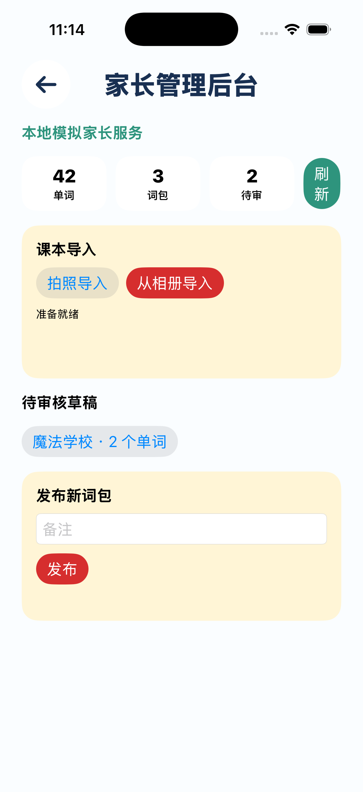 |

### Android

Native Jetpack Compose client screenshots live under [`assets/screenshots/android/`](assets/screenshots/android/). Gameplay and most child-facing routes are landscape; Config and parent/admin flows are portrait. V0.9.1 config and sentence cloze screenshots were refreshed after the full connected UI suite passed.

| Landscape: home | Landscape: battle | Landscape: sentence cloze battle |
| --- | --- | --- |
| 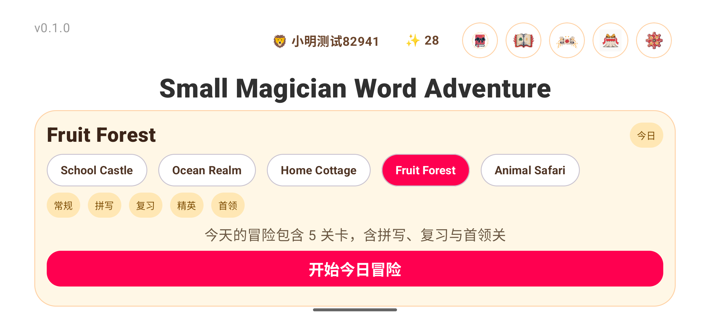 | 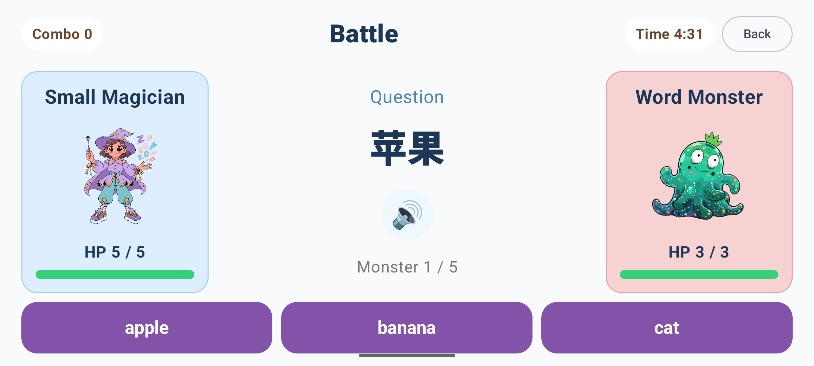 | 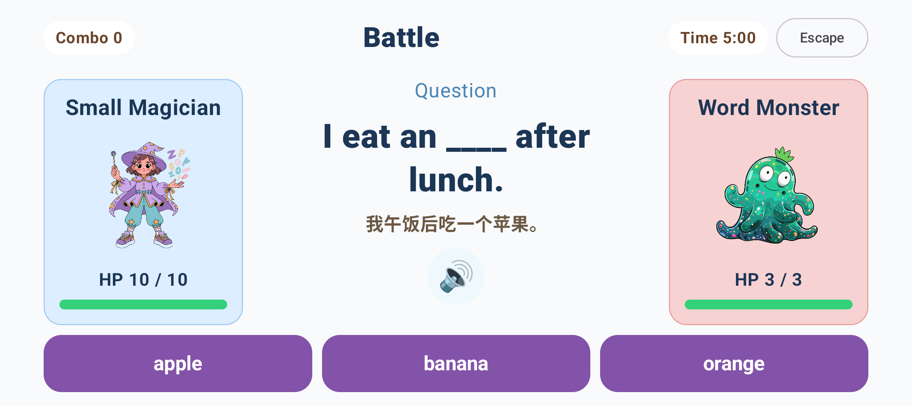 |

| Landscape: result | Portrait: config | Portrait: parent admin |
| --- | --- | --- |
| 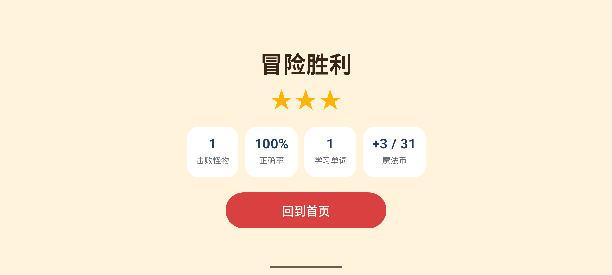 | 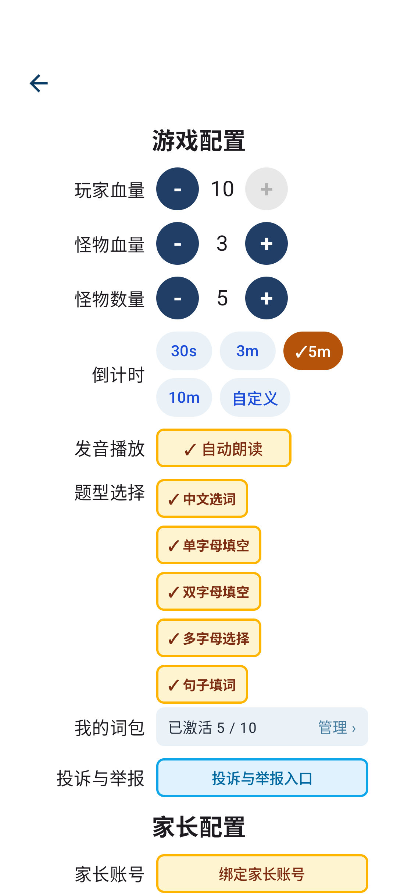 | 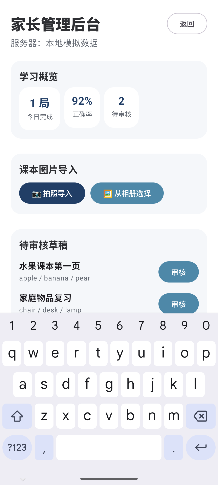 |

## Highlights

- **儿童友好的战斗学习循环**：选择正确单词会释放魔法攻击，答错会受到怪物反击，反馈直接、规则轻量。
- **多题型词汇训练**：支持三选一、补字母、完整拼写等题型，用不同怪物承载不同学习挑战。
- **今日冒险**：按主题区域生成每日练习计划，混合复习词、学习中词和新词。
- **本地学习记录**：记录词汇掌握状态，区分新词、学习中、熟悉、掌握，并支撑复习安排。
- **魔法愿望单**：完成冒险和击败怪物获得魔法币，孩子可以向家长申请兑换愿望。
- **怪物图鉴与主题区域**：包含 Slime、Zombie、Dragon 以及多个童话风 Boss，覆盖水果森林、学校城堡、家庭小屋、动物 Safari、海洋王国等区域。
- **离线优先**：首版词库、角色、怪物、音效和学习数据均在本地运行，适合平板短时练习。

## Tech Stack

- HarmonyOS NEXT client: `harmonyos/`, ArkTS / ArkUI, DevEco Studio managed project
- iOS client: `ios/`, native Swift / SwiftUI
- Android client: `android/`, native Kotlin / Jetpack Compose
- Server: `server/`, Python / FastAPI / MongoDB / Vercel
- Shared contracts: `shared/`, schemas and golden fixtures only; no shared client runtime
- Assets: local rawfile assets plus durable design-source assets under `assets/`

## Project Structure

```text
harmonyos/   HarmonyOS NEXT client; open this directory in DevEco Studio
ios/         Native iOS client; Swift / SwiftUI
android/     Native Android client; Kotlin / Jetpack Compose
server/      FastAPI content backend, parent web, device APIs, Vercel config
shared/      Contracts, schemas, and golden fixtures only
assets/      Design-source assets; per-platform screenshots under assets/screenshots/{harmonyos,ios,android}/
docs/        Product specs, roadmap, implementation plans, and runbooks
tools/       Asset generation and deployment helpers
scripts/     Root orchestration scripts
```

Documentation: [overall spec](docs/WordMagicGame_overall_spec.md) · [roadmap](docs/WordMagicGame_roadmap.md)

## Local Development

Each top-level module owns its own toolchain. HarmonyOS is the reference client; iOS and Android are native clients that replicate the shared product contract. Server development and tests are independent of the client SDKs.

### HarmonyOS client

Open the HarmonyOS project in DevEco Studio from:

```text
harmonyos/
```

Install HarmonyOS dependencies:

```bash
cd harmonyos && ohpm install
```

Build debug HAP:

```bash
cd harmonyos && hvigorw assembleHap
```

Run CodeLinter after a successful HAP build:

```bash
cd harmonyos && codelinter -c ./code-linter.json5 . --fix
```

Connect a device or emulator:

```bash
hdc list targets
```

Install the built HAP:

```bash
hdc install harmonyos/entry/build/default/outputs/default/entry-default-signed.hap
```

Run **no-device unit tests** (`harmonyos/entry/src/test/`):

```bash
cd harmonyos && hvigorw -p module=entry@default test
```

Run **on-device UI / Instrument tests** (`harmonyos/entry/src/ohosTest/`) with the project orchestrator — starts `server/mock_ui_server.py`, sets up `hdc rport`, installs HAPs, and runs `aa test`:

```bash
scripts/run_ui_tests.sh
```

Expect `TestFinished-ResultCode: 0` and `OHOS_REPORT_CODE: 0` when the suite passes. You need a connected device or emulator (`hdc list targets`).

The detailed build, test, device, and log workflow lives in [`.cursor/ohos-dev-commands.md`](.cursor/ohos-dev-commands.md).

### Debug: backend environment

Debug builds can switch API base URL at runtime (local machine, a Vercel preview deployment, or staging). Open the developer menu by **triple-tapping** the small grey **version label** at the **top-left of the home screen** (there is no Settings entry). The menu shows a card grid — **tap a card to apply** immediately (Preview runs a health probe first and may ask for a Vercel protection-bypass secret). The preview PR list is always fetched from production **`https://happyword.cool/api/v1/public/preview-urls.json`**, independent of the env you selected. Release builds hide the label and this flow. See [DevMenu runbook](docs/superpowers/runbooks/dev-menu-runbook.md), [backend env switcher spec](docs/superpowers/specs/2026-05-06-client-backend-env-switcher-design.md), and [triple-tap / DevMenu UI spec](docs/superpowers/specs/2026-05-07-home-version-triple-tap-design.md).

### iOS client

The iOS module lives at [`ios/`](ios/) and uses native Swift / SwiftUI. It mirrors product contracts through `shared/` fixtures while keeping runtime code native to iOS.

### Android client

The Android module lives at [`android/`](android/) and uses native Kotlin / Jetpack Compose. It uses the same shared contracts and server APIs without introducing a cross-platform client runtime.

## Server

The Python/FastAPI content backend (词库管理、家长账户、设备配对、家庭包等) lives under [`server/`](server/). For local dev, offline + E2E tests, and Vercel 部署说明，见 [`server/README.md`](server/README.md)。设计规范见 [V0.5 后端设计](docs/superpowers/specs/2026-04-30-v0.5-content-backend-design.md)。

## CI / GitHub Actions

The `server-ci` / `server-cd` / `cursor-autofix-e2e` / `preview-manifest` /
`atlas-cleanup` workflows expect a small set of GitHub Actions secrets
(Vercel, Mongo Atlas, Slack, Cursor). All of them are documented — with
**how to obtain each value and what breaks when one is missing** — in
[`docs/ci-secrets.md`](docs/ci-secrets.md). Read that page first when
forking the repo or bringing up CI from scratch.

## Roadmap

The product roadmap — milestones, version threads, and planned work — lives in **[`docs/WordMagicGame_roadmap.md`](docs/WordMagicGame_roadmap.md)**. For product intent and scope, see also **[`docs/WordMagicGame_overall_spec.md`](docs/WordMagicGame_overall_spec.md)**.

Current major directions include battle audio mixing with BGM, richer learning reports, backend content tooling, parent account/device binding, AI-assisted story content, and a later Cocos2D battle presentation rewrite.
