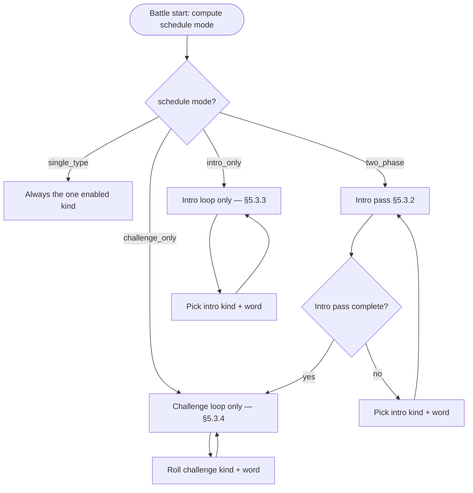

# V0.8.4 — 战斗平衡与题型节奏 — Cross-Platform Design

> Feature ID: `2026-05-18-battle-balance-v0-8-4`
> Status: `three-platform-core-implemented; gate-cleanup-open`
> Owner: Terry Ma (orchestrating); HarmonyOS implementer = first
> Last updated: 2026-05-23

Platform-neutral source of truth for V0.8.4. HarmonyOS, iOS, and Android plans cite this document; they do not redesign.

**Prerequisite:** Ship on top of [V0.8.3 battle polish](../2026-05-18-battle-polish-v0-8-3/00-design.md) (pack cap 10, monster level metadata, bonus / heavy attack, damage floater). V0.8.4 does **not** revert those behaviors.

**2026-05-23 gate cleanup:** the V0.8.4-specific core is present on all three clients (0.8.4 version bump, default HP 10, Spell wrong-tap penalty, scheduler-driven question pacing). The V0.8.3 prerequisite has now been copied to iOS / Android at code level; the broader release gate remains open on targeted verification and release checklist cleanup.

V0.8.4 sits between V0.8.3 and the V0.9 AI/语境 line. It is a **client-only balance** release: no server contract, no new screens, no LLM.

---

## 1. Motivation

After V0.8.3 adds combat weight (floaters, bonus monsters, HP-2 hits), playtests show three pacing issues:

1. **Player HP is too tight** at the default of 5 — especially once Spell and medium fill-letter sessions run longer; the magician (`magician` / 魔法师) should feel sturdier at the start of a fight.
2. **Spell (multi-letter pick) has no wrong-answer cost** — wrong letter taps only shake locally (V0.4.1); children can brute-force the pool without risk, unlike Choice / FillLetter wrong answers.
3. **Question-type mix repeats easy drills** — the same word can appear as both Choice and single-blank FillLetter in one battle, and monster-level routing (V0.8.3) does not enforce a “warm-up then challenge” arc inside a single session.

V0.8.4 tunes defaults and session scheduling so each battle opens with at most one light question per word, then shifts to harder formats.

---

## 2. Goals

| ID | Goal |
| --- | --- |
| **G1** | Raise default **player max HP** from **5 → 10** (magician). Config UI range stays **1–10**; new installs and reset defaults use 10. |
| **G2** | On **`Spell` (多字母选择 / `SpellingArea`)**, each **wrong letter tap** costs the player **1 HP** (same damage channel as a wrong Choice), including floater + hurt feedback. |
| **G3** | **Per-word intro cap:** in a battle, each `wordId` may appear **at most once** as **`Choice` (中文选词)** and **at most once** as **`FillLetter` (单字母填空)** — i.e. up to **two** intro questions per word (one per light type), never a second `Choice` or second single-blank `FillLetter` for the same word. After intro slots for the plan are exhausted, remaining prompts use only **`FillLetterMedium` (双字母填空)** and **`Spell` (多字母选择)** with **50% / 50%** probability each (per question roll, with graceful degradation if a word cannot host the rolled type). |
| **G4** | Preserve V0.8.3 monster **bonus** and **heavy attack** rules; only **question-type selection** for today/normal plan battles moves to the new scheduler (see §6.3). |

---

## 3. Non-Goals

- No change to monster catalog size, art, or `MonsterLevel` labels on codex (V0.8.3).
- No change to pack cap 10 / auto-rotate (V0.8.3).
- No change to ⭐ 0–3 cap or bonus coin formula (V0.8.3).
- No new `QuestionKind` (SentenceCloze remains V0.9.1).
- No change to review-mode battle overrides (`REVIEW_MODE_*` constants) unless a follow-up explicitly asks — review keeps its own monster count / timer; intro scheduler may still apply to its word pool in a later patch.
- No server / shared contract changes.

---

## 4. Terminology (product ↔ code)

| Product (中文) | `QuestionKind` | Notes |
| --- | --- | --- |
| 中文选词 | `choice` | Chinese prompt, 3 English options |
| 单字母填空 | `fill-letter` | One missing letter, 3 letter options |
| 双字母填空 | `fill-letter-medium` | Two blanks, two steps; wrong step still uses existing wrong-answer HP -1 |
| 多字母选择 | `spell` | `SpellingArea` letter pool; V0.8.4 adds **per wrong tap** HP -1 |

---

## 5. User-visible behavior

### 5.1 Magician HP

- New battles start with **10 / 10** HP on the player card (unless the parent lowered `playerMaxHp` in Config).
- Existing saved `GameConfig` blobs with `playerMaxHp: 5` **remain 5** until the parent changes settings (no migration).

### 5.2 Spell wrong tap

- Tap a wrong letter in the pool → red shake (unchanged) **plus** player HP -1, hurt animation, backward projectile timing, and `BattleDamageFloaterLabel_player` showing `-1` (or `-2` only when V0.8.3 heavy attack applies on a **full** wrong answer — heavy attack does **not** apply to Spell letter taps; letter taps are always **1** damage).
- Tap a correct letter → no HP change (unchanged).
- Complete the word correctly → monster takes damage as today (unchanged).

### 5.3 Battle question schedule (today / plan-driven battles)

The scheduler derives **phase pools** from Config, then picks one of four **schedule modes**. Pools use canonical `QuestionKind` strings from `sanitizeEnabledQuestionTypes`.

```text
INTRO_KINDS      = { choice, fill-letter }
CHALLENGE_KINDS  = { fill-letter-medium, spell }

effectiveIntroPool     = INTRO_KINDS     ∩ enabledQuestionTypes
effectiveChallengePool = CHALLENGE_KINDS ∩ enabledQuestionTypes
```

#### 5.3.1 Schedule modes (derived once at battle start)

| Mode | Condition | Battle shape |
| --- | --- | --- |
| `single_type` | `enabledQuestionTypes.length === 1` | Every question is that type (**100%**). No phase machine. |
| `intro_only` | `effectiveIntroPool` non-empty **and** `effectiveChallengePool` empty | **Only Intro** for the whole battle — never enter Challenge. |
| `challenge_only` | `effectiveIntroPool` empty **and** `effectiveChallengePool` non-empty | **Only Challenge** from question 1 — Intro pass **skipped**. |
| `two_phase` | both pools non-empty | **Intro pass** until exhausted → then **Challenge** for the rest of the battle. |



If **both pools are empty** after intersection, `HomePage` must keep blocking battle start (`anyWordSupportsQuestionTypes` — unchanged).

#### 5.3.2 Per-word intro caps (all modes that use Intro)

For each `wordId` and each intro kind `T ∈ effectiveIntroPool`:

- At most **one** served question of kind `T` for that `wordId` in the entire battle.

Track with bitsets or `Set<wordId>` per kind (`servedChoice`, `servedFillLetter`).

#### 5.3.3 Intro pass (modes `two_phase` and the opening segment of `intro_only`)

**Goal:** Give every plan word its “light” exposure before harder formats.

**Intro pass complete** when **no** plan `wordId` has any **unserved** intro kind in `effectiveIntroPool` that `wordSupportsQuestionType(word, T)` (generator pre-check).

Algorithm for each intro question while intro pass is active:

1. Pick `wordId` — round-robin over `plan.wordPlan` shuffle order; honour skip-last-word; prefer words that still have an unserved intro kind.
2. Pick intro kind `T` — among unserved kinds for that word in `effectiveIntroPool`, prefer alternation (`Choice` ↔ `FillLetter`) when both are enabled; if only one intro kind is in the pool, always pick that kind.
3. If generation fails after `resolveQuestionTypeForWord`, try the other intro kind for the same word; if still failing, mark that (word, kind) as unsupported and continue (do not infinite-loop).
4. On success, `markServed(wordId, T)` and emit question.

**`intro_only` after intro pass:** Intro pass completion equals “every word got every enabled intro type once.” The battle **continues** with **intro sustain** (§5.3.5) — still **never** Challenge kinds.

#### 5.3.4 Challenge loop (modes `challenge_only`, `two_phase` after intro pass, and sustained play)

Each challenge question:

1. **Roll kind** within `effectiveChallengePool`:
   - Pool size **2** → `P(fill-letter-medium) = 0.5`, `P(spell) = 0.5`.
   - Pool size **1** → that kind with **probability 1.0**.
2. Pick `wordId` — may **reuse** words; round-robin / shuffle; skip-last-word best-effort.
3. If rolled kind cannot generate, degrade with `resolveQuestionTypeForWord` **within `effectiveChallengePool` only** (e.g. Spell → medium if medium enabled; never emit disabled intro kinds).
4. If still failing, try next word (bounded attempts); last resort `Choice` only if `choice ∈ enabledQuestionTypes` (defensive).

#### 5.3.5 Intro sustain (mode `intro_only` only, after intro pass)

Battle still has monsters / timer, so questions continue using **only** `effectiveIntroPool`:

1. Pick `wordId` (reuse allowed).
2. Among intro kinds **still allowed for that word** (not yet served for that `wordId`), pick one (alternate when two remain; if both already served for this word, pick another `wordId`).
3. Same generation / degradation rules as intro pass, but **do not** re-open Challenge.

#### 5.3.6 Single-type mode (`single_type`)

`nextKind()` always returns the sole enabled type. No intro pass, no challenge roll, no phase pointer. Degrade + fallback unchanged.

### 5.4 Config examples (multi-type)

| `enabledQuestionTypes` | Schedule mode | Behaviour |
| --- | --- | --- |
| `{ choice, fill-letter, fill-letter-medium, spell }` | `two_phase` | Intro pass (每词各最多 1× Choice + 1× 单字母) → Challenge 50/50 |
| `{ choice, fill-letter }` | `intro_only` | 整局只有中文选词 / 单字母；Intro pass 后 intro sustain |
| `{ fill-letter-medium, spell }` | `challenge_only` | 从第 1 题起双字母 / 多字母；无 Intro |
| `{ choice, spell }` | `two_phase` | Intro 仅 Choice（每词 1 次）→ Challenge 仅 Spell（100%） |
| `{ fill-letter-medium }` | `single_type` | 100% 双字母填空 |
| `{ fill-letter }` | `single_type` | 100% 单字母（ohosTest `FillLetterFlow`） |

`selectOnlyQuestionTypeShared` (ohosTest) sets one chip → `single_type` → **100%** that type.

**Interaction with V0.8.3 monster level**

- `MonsterLevel` continues to control **bonus spawn** and **heavy attack** on wrong **full answers** (Choice / FillLetter / completed Spell submit).
- **Question kind** for plan/today battles is chosen by this scheduler, **not** by `questionTypeForMonsterLevel`. Monster level remains visible on codex only.

---

## 6. Technical design

### 6.1 Default player HP = 10

```text
BattleEngine.DEFAULT_PLAYER_HP = 10
GameConfig.playerMaxHp default = 10   // clamp still [1, 10]
```

ConfigPage labels and engine bootstrap must agree. Unit test `defaultsMatchEngineDefaults` (or equivalent) updated.

### 6.2 Spell wrong-tap damage

```text
SpellingArea.onWrongLetterTap():
  BattlePage.applySpellWrongTapDamage()
    → BattleEngine.applySpellLetterPenalty()  // new: playerHp -= 1, return damage=1
    → same feedback path as wrong Choice (projectile, floater, grunt)
    → if playerHp == 0: end battle Lost
```

Constraints:

- **Do not** call `submitAnswer` until the word is complete — partial spell state stays inside `SpellingArea`.
- **Do not** reset combo on letter tap unless product later asks; V0.8.4 only adds HP penalty (combo reset remains on full wrong `submitAnswer` for other kinds).
- Letter penalty does **not** advance `totalAnswers` / learning recorder until the question resolves.

### 6.3 Session question scheduler

New module: `services/BattleQuestionScheduler.ets`

```typescript
export enum BattleScheduleMode {
  SingleType = 'single_type',
  IntroOnly = 'intro_only',
  ChallengeOnly = 'challenge_only',
  TwoPhase = 'two_phase',
}

export class BattleQuestionScheduler {
  constructor(planWordIds: string[], enabledTypes: string[], rng: RandomFn)

  /** Resolved once in constructor from effectiveIntroPool / effectiveChallengePool. */
  scheduleMode(): BattleScheduleMode

  /** Next primary kind before word-level degradation in PlanQuestionSource. */
  nextKind(): QuestionKind

  markServed(wordId: string, kind: QuestionKind): void

  /** true while two_phase has not finished intro pass, or intro_only before sustain. */
  isIntroPassActive(): boolean
}
```

`PlanQuestionSource.nextQuestion()` calls the scheduler instead of `questionTypeForMonsterLevel(level)`. Pass the same `enabledQuestionTypes` snapshot as `HomePage` / `TodaySessionPlan`.

**Constructor — derive mode:**

```text
if enabledTypes.length === 1:
  mode = single_type
else if effectiveIntroPool empty:
  mode = challenge_only
else if effectiveChallengePool empty:
  mode = intro_only
else:
  mode = two_phase
```

**`nextKind()` — by mode:**

| Mode | `nextKind()` |
| --- | --- |
| `single_type` | the only enabled kind |
| `challenge_only` | roll §5.3.4 (from first question) |
| `intro_only` | if intro pass active → pick §5.3.3; else → pick §5.3.5 |
| `two_phase` | if intro pass active → pick §5.3.3; else → roll §5.3.4 |

**Intro pass active flag:**

- `two_phase`: `true` until §5.3.3 completion predicate is met, then `false` permanently for this battle.
- `intro_only`: `true` until intro pass complete, then `false` (sustain uses same pick helpers but never flips to challenge).
- `challenge_only` / `single_type`: intro pass flag always `false`.

**Internal state (minimum):**

- `scheduleMode`, `rng`, shuffled `wordIds[]`, cursor indices.
- `servedChoice: Set<wordId>`, `servedFillLetter: Set<wordId>`.
- `introPassComplete: boolean`.
- `lastIntroKind` (optional, for alternation).

**Review mode / free practice:** If they use `QuestionGenerator` only, document whether scheduler applies in V0.8.4 Harmony scope:

- **Today mode (primary):** scheduler **required**.
- **Normal / review:** Harmony V0.8.4 may limit to today-only first; iOS/Android copy the same boundary. Note in plan if review is out of scope.

### 6.4 Edge cases

| Case | Behavior |
| --- | --- |
| Both pools empty | Block battle on HomePage (existing guard). |
| Plan has 1 word | `two_phase`: serve each enabled intro kind once on that word, then challenge (reuse that word). `intro_only`: intro pass serves enabled intro kinds once; sustain has no unused (word, kind) pairs — keep picking the same word only for kinds not yet served; once all intro kinds served for that word, battle continues with other words only if plan has more (if only one word, generator cycles with best-effort same-word challenge N/A in intro_only). |
| `{ choice, fill-letter }` only | `intro_only` — never medium/spell. |
| `{ fill-letter-medium, spell }` only | `challenge_only` — question 1 is already medium or spell. |
| `{ choice, spell }` | `two_phase` — intro pass is Choice-only per word → then 100% Spell. |
| Only `spell` enabled | `single_type` — 100% Spell. |
| Two challenge types in pool | 50/50 on each challenge question. |
| Word too short for rolled kind | Degrade **within current phase pool only**; never cross from challenge pool into intro pool or vice versa except defensive `Choice` fallback. |
| Spell wrong tap at 1 HP | HP → 0, battle lost. |
| Parent `playerMaxHp` = 3 | Respect 3; default for new config is 10. |

### 6.5 UI automation (专测模式 A)

ohosTest **does not** rely on V0.3 monster-slot ordering (`Normal → Spelling → … → Boss`). It uses Config **single-type mode** (§5.4) so component suites stay deterministic.

| Suite | Harness | Expected under V0.8.4 |
| --- | --- | --- |
| `FillLetterFlow` | `selectOnlyQuestionType('fill-letter')` or `'fill-letter-medium'` | 100% of questions show `LetterTemplateRow`; wait for 1- or 2-blank pattern, not monster index |
| `SpellQuestionFlow` | `selectOnlyQuestionType('spell')` | 100% Spell; remove or shorten `driveUntilSpell` slot-walk; first screen may already be `BattleSpellArea` |
| `RoutingFlow` / `MagicAttack` / `ReviewMode` | Default all types ON | Update HP literals `5` → `10`; battle flow unchanged |
| `BattlePacing` (new, optional) | All types ON (`two_phase`) | Intro caps + later medium & spell |
| Config matrix (unit) | N/A | `intro_only` / `challenge_only` / `two_phase` mode derivation |

**Optional UI cases for schedule modes:**

- `selectQuestionTypes(['choice','fill-letter'])` → first 10 questions never show Spell area / 2-blank medium template.
- `selectQuestionTypes(['spell','fill-letter-medium'])` → question 1 is already medium or Spell (no `BattleOptionA`-only stretch at start).

**Spell wrong-tap case** must assert: slots unchanged **and** player HP −1 (and optional damage floater), not “no HP change”.

---

## 7. Persistence and migration

| Item | Change |
| --- | --- |
| `GameConfig.playerMaxHp` | Default **10** for new `GameConfig()`; existing prefs unchanged |
| Battle snapshots | None |
| Server | None |

---

## 8. Cross-platform contracts

None.

---

## 9. Acceptance (three platforms)

- Default battle shows **10** player HP (fresh install / cleared config).
- Spell: three wrong letter taps → player HP 10 → 7 (floaters visible).
- **Schedule modes** (Config-driven, today battle):
  - Only Intro types enabled → never see `LetterTemplateRow` with 2 blanks or `BattleSpellArea` in first N questions after intro pass (sustain may still be Choice / single fill).
  - Only Challenge types enabled → first question is already medium or Spell (no initial Choice-only stretch).
  - Mixed types → intro pass completes before first challenge-only kind; then medium/spell appear.
- `two_phase` with ≥3 words: no duplicate Choice per `wordId`; no duplicate single FillLetter per `wordId`; challenge segment ~50/50 when both challenge types on.
- V0.8.3 bonus star, heavy attack, damage floater still work on applicable wrong **answers**.

---

## 10. References

- Roadmap: [`docs/WordMagicGame_roadmap.md`](../../WordMagicGame_roadmap.md) §3 + §15.4
- Overall spec: [`docs/WordMagicGame_overall_spec.md`](../../WordMagicGame_overall_spec.md) §4.1, §4.3
- Prior release: [`../2026-05-18-battle-polish-v0-8-3/00-design.md`](../2026-05-18-battle-polish-v0-8-3/00-design.md)
- Harmony plan: [`10-harmony-plan.md`](10-harmony-plan.md)
