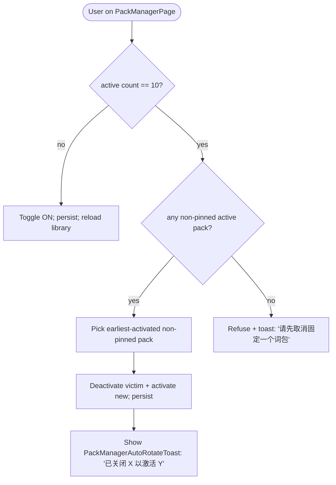
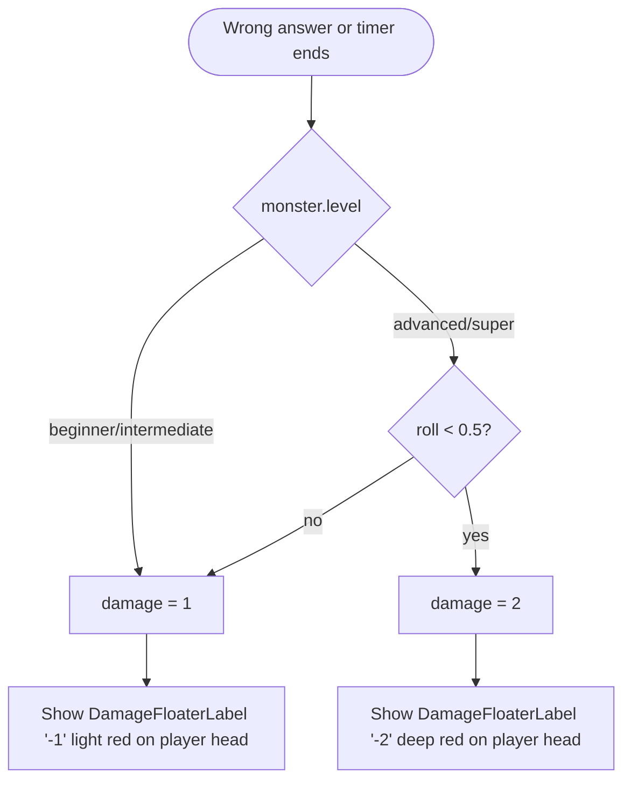
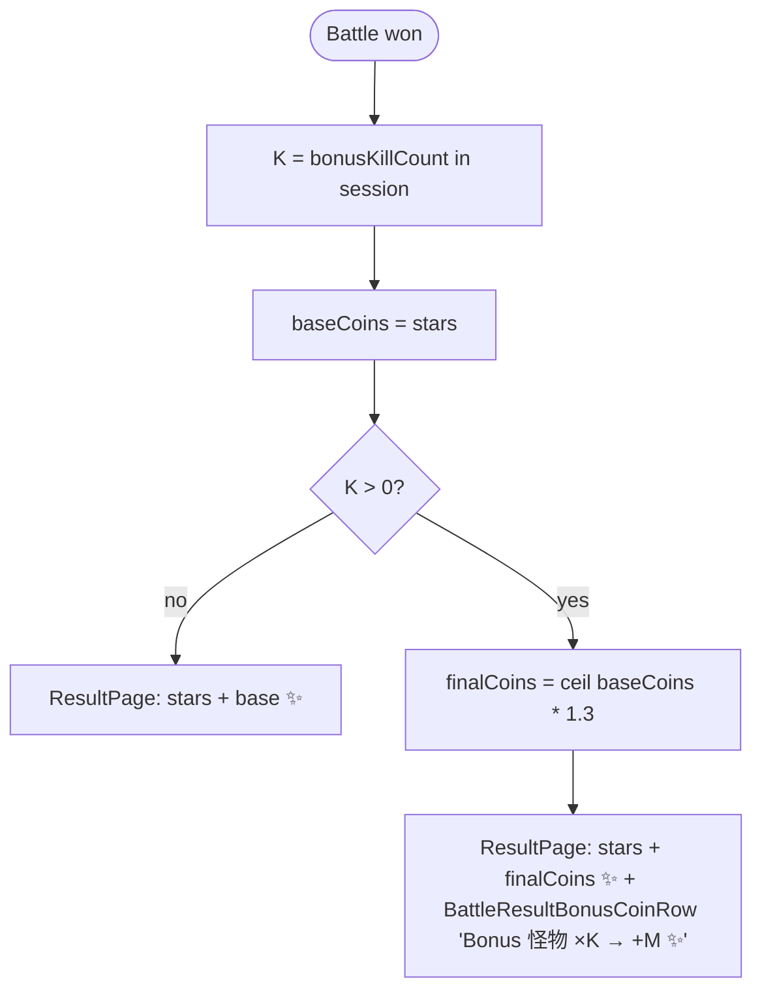

# V0.8.3 — 战斗与词包体验小优化 — Cross-Platform Design

> Feature ID: `2026-05-18-battle-polish-v0-8-3`
> Status: `done`
> Owner: Terry Ma (orchestrating); HarmonyOS implementer = first
> Last updated: 2026-05-23

This document is the platform-neutral source of truth for V0.8.3. HarmonyOS, iOS, and Android plans cite it; they do not redesign. Long-form spec notes — if needed — go under [`docs/superpowers/specs/`](../../superpowers/specs/) and back-link here.

**2026-05-29 closeout:** HarmonyOS contains the V0.8.3 implementation, and V0.8.4 was built on top of it. iOS / Android parity code covers the full V0.8.3 polish contract (10-pack activation cap / auto-rotate, MonsterLevel badges, bonus/heavy-attack parity, stable IDs). Product owner confirmed V0.8.3 is complete. See [`20-replication-trigger.md`](20-replication-trigger.md) and [`50-parity-checklist.md`](50-parity-checklist.md).

V0.8.3 inserts between the V0.8 backoffice line (shipped) and the V0.9 AI/语境 line (not yet started). It is a **pure polish** release; no AI, no server contract changes, no new screens.

---

## 1. Motivation

After three-platform parity (V0.7.1) and the V0.8 backoffice line, the most visible rough edges children and parents hit in daily play are:

1. **Pack cap of 5 is too tight** once a family has more than a few global + family packs synced — parents have to manually toggle packs off to add new ones.
2. **Monsters feel uniform**: 10 monsters, no level identity tied to question difficulty, no "this one is dangerous" cue, and no spike of variety inside a battle.
3. **Combat feedback is light**: a correct/wrong answer drains HP silently; there is no floater that tells the child *how much* HP was lost, especially when V0.4.x already deals doubled damage on critical hits without surfacing the difference.

V0.8.3 ships small, **independently shippable** changes that target each item, while keeping the shared semantics that future V0.9.1 (sentence cloze) will extend.

## 2. Goals

- **G1** Raise active pack cap 5 → 10 and add a graceful auto-rotation flow when the user tries to activate an 11th pack.
- **G2** Introduce a 4-level monster taxonomy (`beginner` / `intermediate` / `advanced` / `super`) with target ratio 10 / 60 / 20 / 10 (initial roster of 10 mapped as 1 / 6 / 2 / 1), routed to question types per level.
- **G3** Add a 30% chance for `advanced` / `super` monsters to carry a `bonus` flag, granting `coinReward × 1.3 (ceil)` at session end.
- **G4** Make `advanced` / `super` monster attacks deal HP-2 with 50% probability (otherwise still HP-1).
- **G5** Add a `DamageFloaterLabel` that rises from the head of the hit character/monster, with HP-2 rendered in a deeper color to feel "heavier".

## 3. Non-Goals

- No change to the existing ⭐ 0–3 cap on `ResultPage`. Bonus reward shows up as ✨ coins, not as 4 ⭐.
- No change to V0.4.x critical-hit logic (combo double-damage is **already** in the engine; we only surface it through the floater).
- No new asset pipeline, no audio additions, no BGM (V0.10 owns audio).
- No new server contract, no schema migration, no Pack schema bump.
- No change to learning report, mastery state machine, forgetting curve, or `WordStat`.
- No change to monster art (V0.11 Cocos owns visual redesign).
- No expansion of the monster catalog to 100; this version codifies the **schema** and seeds 10 with levels. Catalog scale-up is V0.9 incremental work.

## 4. User Flows

### 4.1 PackManager — toggle the 11th pack (auto-rotate)



### 4.2 Battle — monster attack damage path



### 4.3 Battle — bonus reward at result



## 5. Stable Test IDs (parity contract)

Every ID listed here must be implemented verbatim on **HarmonyOS / iOS / Android**. Agents may not rename them per platform.

| ID | Where it lives | Purpose |
| --- | --- | --- |
| `PackManagerAutoRotateToast` | PackManagerPage top toast (2.4 s) | UI test asserts text contains `'已关闭'` and `'以激活'` after the auto-rotate flow |
| `PackManagerCapRefuseToast` | PackManagerPage top toast | Shown when all 10 active packs are 📌; asserts `'请先取消固定一个词包'` |
| `MonsterBonusStar_{monsterIndex}` | Per-monster overlay on the monster card during battle | Visible iff the spawned monster has `bonus = true`. Index = 1-based position in the battle's monster sequence |
| `BattleDamageFloaterLabel_player` | Floater label spawned over the player CharacterCard | Asserts presence + text `-1` or `-2` after a damage event |
| `BattleDamageFloaterLabel_monster` | Floater label spawned over the active monster card | Asserts presence + text `-1` or `-2` after a damage event |
| `BattleResultBonusCoinRow` | ResultPage, below the existing coin total row | Asserts text contains the killed-bonus count and the bonus ✨ delta |
| `MonsterCodexLevelBadge_{monsterKey}` | MonsterCodexPage detail panel | Small badge `初/中/高/Super` next to the monster name |

Platform mapping reminder:

- HarmonyOS: ArkUI `.id('<ID>')` and the `findComponent` lookup used by ohosTest.
- iOS: SwiftUI `.accessibilityIdentifier("<ID>")`.
- Android: Compose `Modifier.testTag("<ID>")`.

## 6. Domain Rules

### 6.1 Pack activation (G1)

```text
const MAX_ACTIVE_PACKS = 10

function tryActivate(packId):
  selection = currentSelection()
  if selection.contains(packId): return  // already active, no-op
  if selection.activeIds.length < MAX_ACTIVE_PACKS:
    selection.append(packId)
    persist(selection)
    return { result: "activated", autoClosed: null }

  // at cap: find the earliest-activated NON-PINNED pack
  victim = first(selection.activeIds, where: id => !selection.pinnedIds.contains(id))
  if victim == null:
    return { result: "refused-all-pinned" }
  selection.remove(victim)
  selection.append(packId)
  persist(selection)
  return { result: "activated", autoClosed: victim }

function tryDeactivate(packId):
  // unchanged from current behavior; pinned packs can still be deactivated by user action,
  // we only protect them from *auto* rotation.
```

Auto-rotation hooks for V0.6.5.1 `recordPerfectAdventure` (perfect rotation) are unchanged: they already exclude pinned packs and still operate on the 10-slot pool.

### 6.2 Monster level + question-type routing (G2)

New per-monster field:

```text
type MonsterLevel = "beginner" | "intermediate" | "advanced" | "super"

// Catalog field, in addition to existing MonsterKind.
interface MonsterEntry {
  ...existing fields...
  level: MonsterLevel
  bonus?: boolean   // runtime-assigned at spawn (not persisted in catalog)
}
```

Initial mapping for the existing 10 monsters (`harmonyos/entry/src/main/ets/data/MonsterCatalog.ets`, 1-based index):

| Index | Name | Existing `MonsterKind` | New `MonsterLevel` |
| --- | --- | --- | --- |
| 1 | Slime | Normal | `beginner` |
| 2 | Zombie | Spelling | `intermediate` |
| 3 | Dragon | Elite | `intermediate` |
| 4 | Pumpkin King | Boss | `intermediate` |
| 5 | Imp King | Boss | `intermediate` |
| 6 | Phoenix | Boss | `intermediate` |
| 7 | Witch | Boss | `intermediate` |
| 8 | Snow Queen | Boss | `advanced` |
| 9 | Unicorn | Boss | `advanced` |
| 10 | Kraken | Boss | `super` |

Ratio = 1 / 6 / 2 / 1 ≈ target 10 / 60 / 20 / 10 after scale-up.

> Compatibility: `MonsterKind` stays for art / codex grouping (Boss vs Normal art); `MonsterLevel` is orthogonal and controls difficulty + question routing.

Question-type routing per level (default battle plan):

| Level | Primary question type | Notes |
| --- | --- | --- |
| `beginner` | `Choice` (3-pick) | Existing question type |
| `intermediate` | `FillLetter` beginner (1 missing letter) | Existing |
| `advanced` | `FillLetter` medium (2–3 missing letters) | Existing |
| `super` | `Spell` (full-word letter picker) | V0.4.1 |

`QuestionGenerator` consumes a per-position monster level and produces a question of the matching primary type. Fallback chain when the matched type cannot be generated for the chosen word (e.g., word too short for FillLetter-medium): degrade one tier down toward `Choice` rather than failing the battle.

V0.9.1's `SentenceCloze` will join the `advanced` / `super` pools in V0.9.1's design, not here.

> **V0.8.4 supersession:** For today / `PlanQuestionSource` battles, [V0.8.4](../2026-05-18-battle-balance-v0-8-4/00-design.md) replaces this level→type table with per-session intro + 50/50 challenge scheduling. `MonsterLevel` from V0.8.3 **remains** for bonus spawn and heavy attack only.

### 6.3 Bonus monster (G3)

At spawn time, for each monster of level `advanced` or `super`:

```text
spawn(monster):
  if monster.level in ("advanced", "super") and Random.float() < 0.30:
    monster.bonus = true
```

UI: `MonsterBonusStar_{index}` overlay (a small ✨) on the monster card; not on `beginner` / `intermediate`.

Scoring:

```text
onBattleResult(session):
  baseCoins = session.stars              // 0..3
  bonusKills = session.killedMonsters.filter(m => m.bonus).length
  finalCoins = bonusKills > 0
    ? ceil(baseCoins * 1.3)
    : baseCoins
  // Stars unchanged (0..3 cap). The +30% always lands on coins only.
```

The `BattleResultBonusCoinRow` shows only if `bonusKills > 0` and the player won. If the player loses, the row is hidden (no consolation bonus).

### 6.4 Heavy attack (G4)

```text
applyMonsterAttack(monster):
  baseDamage = 1
  if monster.level in ("advanced", "super") and Random.float() < 0.50:
    baseDamage = 2
  player.hp = max(0, player.hp - baseDamage)
  emitDamageFloater(side: "player", amount: baseDamage)
```

Player attacks (correct answer dealing damage to monster) keep current V0.4.x semantics:

- Normal: 1 damage to monster.
- Combo crit (existing): 2 damage to monster.

The damage floater is fed by the actual damage applied, so combo crits naturally show `-2` on the monster.

### 6.5 Damage floater (G5)

```text
component DamageFloaterLabel(amount: 1 | 2, side: "player" | "monster"):
  text = "-" + amount
  color = amount == 2 ? "#7F1D1D" : "#F87171"
  shadow = amount == 2 ? 2px : null
  stroke = amount == 1 ? "1px white" : null
  fontSize = amount == 2 ? 20 : 18

  anchor:
    side == "player": player CharacterCard top - 10vp
    side == "monster": active monster card top - 12vp

  animation: 450ms ease-out
    opacity:   0 -> 1 -> 0  (keyframes 0 / 50 / 100)
    translateY: 0 -> -28vp
  dispose-on-complete: true
```

Concurrency: if multiple floaters fire within 450 ms (e.g., player gets hit twice in quick succession), they stack vertically with a 6 vp offset so neither label is hidden.

## 7. Persistence and Migration

| Key | Type | Default | Migration from older snapshot |
| --- | --- | --- | --- |
| `wordmagic_pack_selection / selection_v1` (existing) | JSON blob | unchanged | None — `MAX_ACTIVE_PACKS` change is a runtime constant; existing snapshots with ≤ 5 ids still parse, snapshots with > 5 ids never existed before |
| Monster `level` | catalog-only static metadata | hard-coded in `MonsterCatalog.ets` (and equivalent on iOS/Android) | None — no on-device persistence |
| `bonus` flag on monster | runtime only (per-battle) | absent | None — not persisted across sessions |

No on-device snapshot bump. No server contract changes.

## 8. Cross-Platform Contracts

None.

V0.8.3 does not change any HTTP endpoint, shared schema, or fixture. `shared/contracts/` and `shared/fixtures/` are untouched.

## 9. Edge Cases and Error Paths

- **All 10 active packs are pinned + user toggles ON an 11th:** refuse with `PackManagerCapRefuseToast: '请先取消固定一个词包'`. The 11th pack does NOT activate.
- **Auto-rotate victim is also the currently-displayed `todayActivePack` on HomePage:** allowed. HomePage `onPageShow` re-runs `loadHomeIntegration` (V0.6.7.4) so chip row + today card refresh to a different pack. No mid-battle pack swap can happen because PackManagerPage is not reachable from BattlePage.
- **Word too short for `FillLetter` medium on `advanced` monster:** fall back per §6.2 down-chain (medium → beginner → Choice); battle does not abort.
- **Monster catalog runs out of monsters for a chosen level (e.g., super):** sequential picker wraps with replacement; same monster can appear twice in a long battle.
- **`bonus` roll on a 1-monster battle of super level:** if it lands true, bonus reward triggers; if false, normal reward. No retry, no streak protection.
- **Combo crit AND heavy attack in the same frame:** they are independent: combo applies to player→monster, heavy attack applies to monster→player. Both can show `-2` floaters on opposite sides simultaneously.
- **Damage floater spam during a long timeout-triggered chain:** stacking offset capped at 4 simultaneous floaters per side; older ones dispose first.

## 10. Telemetry / Logs

No new server-side events. Local console log lines (HarmonyOS only, parity not required) for debugging:

| Event | Trigger | Fields |
| --- | --- | --- |
| `pack.selection.auto-rotated` | Auto-rotation fires | `victimId`, `addedId` |
| `pack.selection.cap-refused` | All pinned + tried to add 11th | `attemptedId` |
| `battle.monster.spawn` | Each monster spawn | `monsterIndex`, `level`, `bonus` |
| `battle.heavy-attack.fired` | HP-2 attack lands | `monsterIndex`, `level` |
| `battle.bonus.reward` | Result calc adds bonus | `bonusKills`, `baseCoins`, `finalCoins` |

## 11. Accessibility / Localization

- `BattleResultBonusCoinRow` Chinese text template: `Bonus 怪物 ×{K} → +{M} ✨`. English fallback (for accessibility readers): `Bonus monsters x{K} → +{M} coins`.
- `MonsterCodexLevelBadge_{monsterKey}` short labels (zh-CN): `初` / `中` / `高` / `Super`. English fallback: `Beginner` / `Intermediate` / `Advanced` / `Super`.
- `PackManagerAutoRotateToast` zh-CN: `已关闭 '{old}' 以激活 '{new}'`. English fallback: `Deactivated '{old}' to activate '{new}'`.
- `PackManagerCapRefuseToast` zh-CN: `请先取消固定一个词包`. English fallback: `Please unpin one pack first`.
- Damage floater labels are pure text (`-1` / `-2`), no localization needed; screen-reader hint `loss {amount} HP`.

## 12. Open Questions

- **Scale-up plan for monsters to 100**: when do we start adding the remaining 90 monsters? Tracked as a V0.9.x content task, not part of V0.8.3. (See §6.2.)
- **SentenceCloze x monster level mapping** (V0.9.1): we have placeholder text that SentenceCloze joins `advanced` / `super` pools, but the exact split (e.g., super = 50% Spell + 50% SentenceCloze?) is V0.9.1's call.
- **Should bonus-conditional combo crit double the bonus?** No — bonus is at-result, combo is in-flight. They compose only via base damage → stars → coins → ceil. Locked.

## 13. References

- HarmonyOS source touched: `harmonyos/entry/src/main/ets/services/PackSelectionService.ets`, `harmonyos/entry/src/main/ets/pages/PackManagerPage.ets`, `harmonyos/entry/src/main/ets/pages/ConfigPage.ets`, `harmonyos/entry/src/main/ets/pages/BattlePage.ets`, `harmonyos/entry/src/main/ets/pages/ResultPage.ets`, `harmonyos/entry/src/main/ets/pages/MonsterCodexPage.ets`, `harmonyos/entry/src/main/ets/data/MonsterCatalog.ets`, `harmonyos/entry/src/main/ets/services/BattleEngine.ets`, `harmonyos/entry/src/main/ets/services/QuestionGenerator.ets`, new `harmonyos/entry/src/main/ets/components/DamageFloaterLabel.ets`.
- Existing specs this design extends:
  - V0.4.1 Spell question-type ([roadmap §11](../../WordMagicGame_roadmap.md))
  - V0.4.x critical-hit double-damage (existing engine behavior)
  - V0.6.5 / V0.6.5.1 three-layer pack model + `PackSelectionService`
- Three-platform feature SOP: [`docs/sop/00-three-platform-feature-sop.md`](../../sop/00-three-platform-feature-sop.md).
- Roadmap entry: [`docs/WordMagicGame_roadmap.md`](../../WordMagicGame_roadmap.md) §3 (overview table) + §15.3 (V0.8.3 section).
