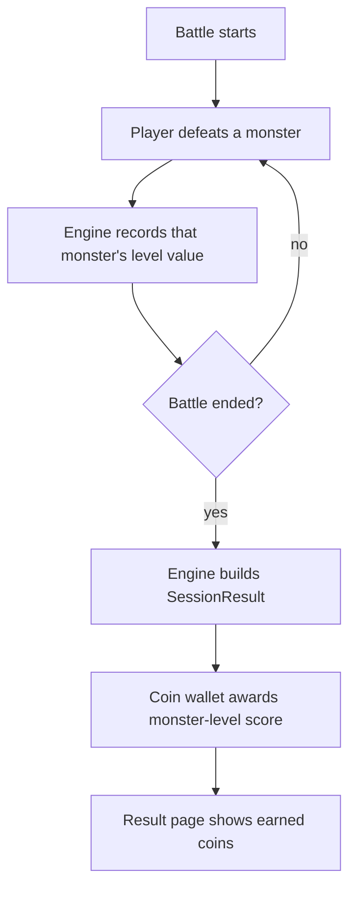

# V0.8.6 — 怪物等级积分金币 — Cross-Platform Design

> Feature ID: `2026-05-23-coin-reward-by-monster-level-v0-8-6`
> Status: `done`
> Owner: Terry Ma (orchestrating); HarmonyOS implementer = first
> Last updated: 2026-05-24

Platform-neutral source of truth for V0.8.6. HarmonyOS, iOS, and Android plans cite this document; they do not redesign.

V0.8.6 is a client-only reward-rule release. It changes how battle-end magic coins are calculated, without adding screens, assets, server contracts, or new persistence keys.

---

## 1. Motivation

Current battle rewards use the star rating as the base coin award, with V0.8.3 Bonus monsters applying a `ceil(stars * 1.3)` coin multiplier on wins. That makes coin rewards depend mostly on accuracy and the win/loss tier, while the monster ladder shown during battle has little direct economic weight.

V0.8.6 makes coins match what the player defeated: each defeated monster contributes points equal to its monster level. A harder monster is worth more, and partial progress on a loss still earns coins for monsters already defeated.

## 2. Goals

| ID | Goal |
| --- | --- |
| **G1** | Completely replace the old coin formula (`stars`, plus Bonus `×1.3`) with monster-level score: `Σ defeatedMonsterCount(level) * levelValue`. |
| **G2** | Record the defeated monster's level at the moment it is killed, inside the battle engine, so result pages and wallet code consume a precomputed result field. |
| **G3** | Preserve existing star calculation and display. Stars no longer drive coins, but they still support result feedback and perfect-adventure logic. |
| **G4** | Preserve V0.8.3 Bonus monster spawn, count, visuals, and heavy-attack behavior. Bonus kills no longer add any extra coins. |
| **G5** | Keep the change client-only: no server API, shared fixture, or persistence migration. |

## 3. Non-Goals

- No change to the star table, star UI, or perfect-adventure rotation hook.
- No change to monster HP, count, spawn order, levels, catalog labels, art, Bonus spawn chance, or heavy-attack chance.
- No new daily-cap behavior. Coin awards still pass through the existing coin-account cap where a platform has one.
- No new stable UI IDs unless implementation discovers an automation gap.
- No server, OpenAPI, MongoDB, or `shared/fixtures/` change.

## 4. User Flows

### 4.1 Battle Settlement



### 4.2 Example

If the player defeats 2 level-1 monsters, 2 level-2 monsters, and 1 level-3 monster:

```text
coins = 2 * 1 + 2 * 2 + 1 * 3 = 9
```

## 5. Stable Test IDs (parity contract)

No new stable IDs are required. Existing result and home coin labels continue to be used by each platform's current UI tests.

| ID | Where it lives | Purpose |
| --- | --- | --- |
| N/A | N/A | This feature reuses existing platform selectors for result earned coins and home wallet balance. |

## 6. Domain Rules

### 6.1 Monster Level Values

The coin value is the numeric difficulty tier:

| Monster level | Coin value |
| --- | ---: |
| `Beginner` / level 1 | 1 |
| `Intermediate` / level 2 | 2 |
| `Advanced` / level 3 | 3 |
| `Super` / level 4 | 4 |

### 6.2 Reward Formula

```text
function monsterLevelCoinValue(level):
  if level == Beginner: return 1
  if level == Intermediate: return 2
  if level == Advanced: return 3
  if level == Super: return 4

onMonsterDefeated:
  value = monsterLevelCoinValue(currentMonster.level)
  state.defeatedMonsterLevelScore += value
  state.defeatedMonsterLevelCounts[value] += 1

onBuildSessionResult:
  result.monsterLevelScore = state.defeatedMonsterLevelScore

onBattleSettlement:
  awardAmount = result.monsterLevelScore
  result.coinsEarned = wallet.earn(awardAmount)
```

The formula applies to wins and losses. A loss after one level-2 kill earns 2 coins. A loss with no defeated monsters earns 0 coins.

### 6.3 Replacement of Existing Coin Formula

V0.8.6 completely replaces these previous reward rules:

- `coins = stars`
- `coins = ceil(stars * 1.3)` when a won battle includes at least one Bonus kill

Stars and `bonusKillCount` still exist for display/diagnostics, but neither contributes to `coinsEarned`.

Existing fields named around the old formula, such as HarmonyOS `coinsBaseFromStars`, must no longer be treated as the source of the award. During migration they may be set to `monsterLevelScore` for backward-compatible display math, or retired from the result UI if the platform can do that cleanly.

### 6.4 Source of Truth

The battle engine records the score when each monster dies. Code must not recalculate the reward later from only `defeatedMonsters`, because TodayPlan slots can map monster index to a catalog entry and normal battles can use catalog-index wrapping. The active monster's catalog level at kill time is the source of truth.

## 7. Persistence and Migration

No new persistence keys and no migration.

| Key | Type | Default | Migration from older snapshot |
| --- | --- | --- | --- |
| Existing coin ledger | Platform-local wallet model | Existing default | Existing balances remain unchanged; only future battle rewards use the new formula. |

## 8. Cross-Platform Contracts

None.

- New / changed endpoints: none
- Schema additions: none
- Fixture diffs under [`shared/fixtures/`](../../../shared/fixtures/): none
- Server contract regeneration: not required

## 9. Edge Cases and Error Paths

- **No monsters defeated:** score is 0, no coin transaction should be written unless the existing platform wallet needs a zero-value completion marker for first-today badge semantics.
- **Loss after partial progress:** award coins for killed monsters only.
- **Bonus kill:** count remains visible/available, but coin delta is not boosted.
- **Daily cap:** existing cap logic clamps the score after formula calculation. Result pages show actual earned coins after cap, not the unclamped score.
- **TodayPlan monster slots:** use the current monster's catalog index provider at kill time to determine level.
- **Timer loss:** if time expires after previous kills, build result from the recorded score.

## 10. Telemetry / Logs

No new telemetry events or stable log strings.

## 11. Accessibility / Localization

No new user-facing labels are required. Existing earned-coin text remains localized per platform. If a platform currently shows a Bonus extra coin line, remove or hide that line when it would only describe the retired multiplier.

## 12. Open Questions

None. The human owner confirmed that the monster-level formula completely replaces the old star and Bonus coin formula.

## 13. References

- HarmonyOS reward helper: [`harmonyos/entry/src/main/ets/services/BattleRewardCalc.ets`](../../../harmonyos/entry/src/main/ets/services/BattleRewardCalc.ets)
- HarmonyOS battle engine: [`harmonyos/entry/src/main/ets/services/BattleEngine.ets`](../../../harmonyos/entry/src/main/ets/services/BattleEngine.ets)
- HarmonyOS battle settlement: [`harmonyos/entry/src/main/ets/pages/BattlePage.ets`](../../../harmonyos/entry/src/main/ets/pages/BattlePage.ets)
- HarmonyOS result model/page: [`harmonyos/entry/src/main/ets/models/SessionResult.ets`](../../../harmonyos/entry/src/main/ets/models/SessionResult.ets), [`harmonyos/entry/src/main/ets/pages/ResultPage.ets`](../../../harmonyos/entry/src/main/ets/pages/ResultPage.ets)
- iOS counterpart: [`ios/WordMagicGame/Core/BattleEngine.swift`](../../../ios/WordMagicGame/Core/BattleEngine.swift)
- Android counterpart: [`android/app/src/main/java/cool/happyword/wordmagic/core/BattleEngine.kt`](../../../android/app/src/main/java/cool/happyword/wordmagic/core/BattleEngine.kt)
- Extends V0.8.3/V0.8.4 monster-level behavior: [`../2026-05-18-battle-polish-v0-8-3/00-design.md`](../2026-05-18-battle-polish-v0-8-3/00-design.md), [`../2026-05-18-battle-balance-v0-8-4/00-design.md`](../2026-05-18-battle-balance-v0-8-4/00-design.md)
