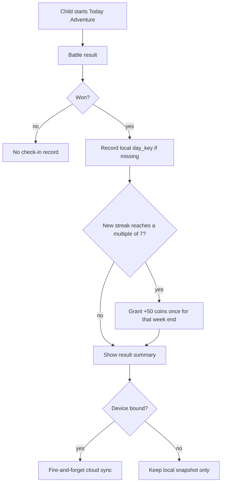
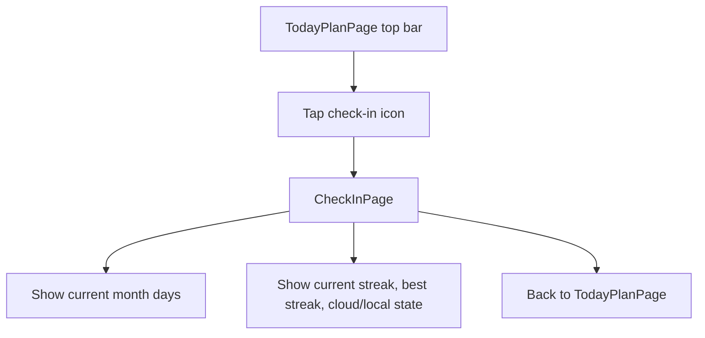

# V0.8.8 — Daily Check-in Rewards — Cross-Platform Design

> Feature ID: `2026-05-23-daily-checkin-v0-8-8`
> Status: `ready-for-harmony`
> Owner: Terry Ma
> Last updated: 2026-05-23

This document is the platform-neutral source of truth for V0.8.8 daily check-ins. HarmonyOS implements first; iOS and Android replicate only after the Harmony soft gate and human signature in [`20-replication-trigger.md`](20-replication-trigger.md).

## 1. Motivation

The app already rewards today's adventure with magic coins, but children cannot see a calendar trail of daily effort and the coin wallet is local-only. V0.8.8 adds a lightweight habit loop: winning any today adventure automatically checks in for that local calendar day, records it on a calendar, and grants an extra 50 coins after each completed seven-day streak. If the device is bound, check-ins and coin totals sync to the family cloud; otherwise they remain local and sync after binding.

## 2. Goals

- Auto-check-in after any won Today Adventure.
- Show a check-in calendar and current streak.
- Award exactly one `+50` coin bonus for each contiguous seven-day streak block.
- Keep the feature local-first and offline-safe.
- Sync check-ins and coin totals to cloud when the child device is bound.
- Update roadmap after implementation.

## 3. Non-Goals

- No manual "tap to check in" task.
- No make-up cards, streak freeze items, or parent-adjusted streak repair.
- No push notification reminders.
- No iOS / Android implementation before the signed replication trigger.
- No shared client runtime under `shared/`.

## 4. User Flows

### 4.1 Auto Check-in



### 4.2 Calendar Review



## 5. Stable Test IDs (parity contract)

Every ID listed here must be implemented verbatim on all three platforms.

| ID | Where it lives | Purpose |
| --- | --- | --- |
| `TodayPlanCheckInButton` | TodayPlanPage top bar | Opens the check-in calendar. |
| `CheckInPageTitle` | Check-in page | Page identity. |
| `CheckInCurrentStreak` | Check-in page summary | Current streak assertion. |
| `CheckInBestStreak` | Check-in page summary | Best streak assertion. |
| `CheckInCloudState` | Check-in page summary | Shows `云端已同步`, `等待同步`, or `本地保存`. |
| `CheckInPrevMonthButton` | Check-in page calendar header | Moves calendar to the previous month. |
| `CheckInMonthLabel` | Check-in page calendar header | Displays the visible month, e.g. `2026年5月`. |
| `CheckInNextMonthButton` | Check-in page calendar header | Moves calendar to the next month. |
| `CheckInCalendarGrid` | Check-in page calendar | Container for day cells. |
| `CheckInDay_<YYYY-MM-DD>` | Check-in page day cell | Per-day checked / unchecked assertion. |
| `CheckInWeeklyBonusBanner` | Check-in page / result page | Shows the latest +50 weekly bonus. |
| `ResultCheckInBonusRow` | Result page | Result summary row for newly granted +50. |

## 6. Domain Rules

```text
recordTodayWin(nowMs):
  dayKey = local YYYY-MM-DD from nowMs
  if dayKey already exists in checked_days:
    return { changed: false, bonusCoins: 0 }

  add dayKey to checked_days
  currentStreak = count contiguous checked days ending at dayKey
  bestStreak = max(bestStreak, currentStreak)

  if currentStreak > 0 and currentStreak % 7 == 0 and weekly_bonus_day_keys lacks dayKey:
    add dayKey to weekly_bonus_day_keys
    add coin transaction:
      delta = 50
      reason = "checkin-weekly-bonus:" + dayKey
    return { changed: true, bonusCoins: 50 }

  return { changed: true, bonusCoins: 0 }
```

Rules:

- `dayKey` uses device-local calendar time, matching existing `formatDayKeyLocal`.
- A lost battle never checks in.
- Same-day repeated wins never add another check-in or weekly bonus.
- Existing star / bonus-monster coin awards continue unchanged.
- Weekly bonus is awarded on day 7, 14, 21, ... of one uninterrupted streak.
- A missed day breaks the streak. Previous checked days remain visible.
- Sync failures never block navigation or rewards.
- Cloud merge uses set union for `checked_days` and `weekly_bonus_day_keys`; coin totals are derived from merged transactions on the client/server boundary, not by double-adding bonus reasons.

## 7. Persistence and Migration

| Key | Type | Default | Migration from older snapshot |
| --- | --- | --- | --- |
| `wordmagic_checkins/snapshot_v1` | `CheckInSnapshot` JSON | empty snapshot | None; old installs start empty. |
| `wordmagic_coins/snapshot_v1` | `CoinSnapshot` JSON | existing wallet | Version bumps to 2 by tolerating new check-in transaction reasons. |
| `wordmagic_checkin_sync/sync_checkpoint_ms` | string number | `0` | None. |

`CheckInSnapshot` fields:

- `version: 1`
- `checkedDayKeys: string[]`
- `weeklyBonusDayKeys: string[]`
- `currentStreak: number`
- `bestStreak: number`
- `lastSyncedAtMs: number`
- `pendingSync: boolean`

## 8. Cross-Platform Contracts

New child-device endpoints:

- `POST /api/v1/family/{family_id}/checkins/sync`
- `GET /api/v1/family/{family_id}/checkins`

Schemas:

- `CheckInSyncIn`: `checked_day_keys: string[]`, `weekly_bonus_day_keys: string[]`, `coin_txns: CloudCoinTxnIn[]`, `synced_through_ms: int`
- `CloudCoinTxnIn`: `txn_id: string`, `ts: int`, `delta: int`, `reason: string`, `balance_after: int`
- `CheckInSyncOut`: `checked_day_keys: string[]`, `weekly_bonus_day_keys: string[]`, `coin_txns: CloudCoinTxnOut[]`, `server_now_ms: int`
- `CloudCoinTxnOut`: same as input plus `updated_at`
- `CheckInListOut`: same merged outbound shape as `CheckInSyncOut`

Fixture diffs:

- Add `shared/fixtures/child/checkins-sync.sample.json`.

Regenerate:

- `cd server && uv run python ../tools/contracts/export_openapi.py`

Verify:

- `cd server && uv run pytest tests/test_shared_contracts.py -q`

## 9. Edge Cases and Error Paths

- Unbound device: local snapshot changes, `CheckInCloudState` shows `本地保存`, no network call.
- Bound device offline: local snapshot changes, `pendingSync = true`, sync retries later.
- Same day replay: result does not show `ResultCheckInBonusRow`; calendar remains checked.
- Clock crosses midnight during a battle: check-in day is based on the result-time `Date.now()` used at victory.
- Cloud has days from a sibling device: local sync applies union and recomputes streaks.
- Duplicate cloud sync: `day_key` and `txn_id` are idempotent; no duplicate +50.
- Account unbound: future check-ins remain local; existing local records are not deleted.

## 10. Telemetry / Logs

| Event | Trigger | Fields |
| --- | --- | --- |
| `checkin.recorded` | New day checked in | `day_key`, `current_streak`, `bonus_coins`, `cloud_bound` |
| `checkin.sync_failed` | Cloud sync fails | `status`, `pending_days` |

## 11. Accessibility / Localization

- TodayPlan top-bar icon button: check-in calendar icon, transparent-background raster derived from editable SVG source.
- Streak text: `连续 N 天`.
- Calendar checked day label: `YYYY-MM-DD 已打卡`.
- Calendar unchecked day label: `YYYY-MM-DD 未打卡`.
- Cloud state labels: `云端已同步`, `等待同步`, `本地保存`.

## 12. Open Questions

None. The selected trigger rule is: winning any Today Adventure automatically checks in.

## 13. References

- Existing coin wallet: `harmonyos/entry/src/main/ets/services/CoinAccount.ets`
- Existing today completion gate: `harmonyos/entry/src/main/ets/pages/BattlePage.ets`
- Existing cloud device auth: `server/app/routers/child_word_stats.py`
- Three-platform lifecycle: `docs/sop/00-three-platform-feature-sop.md`
