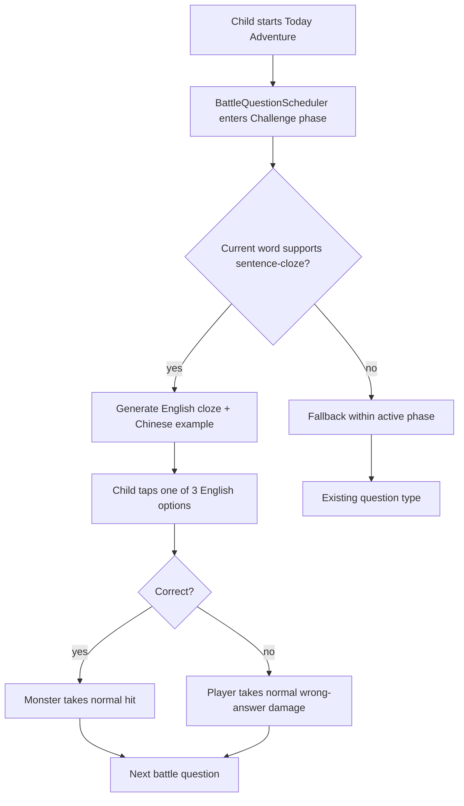
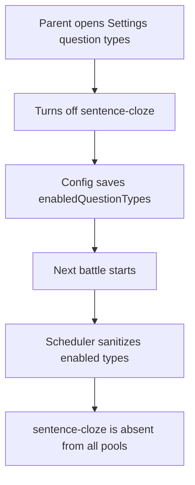

# V0.9.1 — Sentence Cloze — Cross-Platform Design

> Feature ID: `2026-05-24-sentence-cloze-v0-9-1`
> Status: `draft`
> Owner: Terry Ma
> Last updated: 2026-05-24

This document is the platform-neutral source of truth for V0.9.1 sentence cloze questions. HarmonyOS implements first; iOS and Android replicate only after the Harmony soft gate and human signature in [`20-replication-trigger.md`](20-replication-trigger.md).

## 1. Motivation

The current battle loop tests recognition and spelling, but it does not yet ask children to understand a word inside a short sentence. The server and pack schemas already carry approved bilingual example sentences through `example.en` and `example.zh`. V0.9.1 turns that existing content into a new battle question type without adding new backend generation or review workflows.

## 2. Goals

- Add an independent `SentenceCloze` / `sentence-cloze` question type.
- Use existing `WordEntry.example.en` and `WordEntry.example.zh` as the only content source.
- Show an English sentence with the target word replaced by `____`, plus the Chinese example line for comprehension support.
- Keep the answer interaction as 3-option tapping, with the same damage and feedback semantics as `Choice`.
- Add `sentence-cloze` to the default enabled question types and existing parent question-type settings.
- Add examples for every word in the five built-in packs on HarmonyOS, iOS, and Android.
- Keep old and sparse remote packs playable through deterministic fallback.

## 3. Non-Goals

- No new service endpoint, OpenAPI change, or server-side migration.
- No new LLM batch-generation screen; that remains V0.9.6.
- No Boss dialogue, region story card, or chapter-completion celebration; those remain V0.9.2 / V0.9.3.
- No typed keyboard input; children still answer by tapping one of three options.
- No client runtime under `shared/`.
- No Android built-in-pack JSON migration in this feature; Android keeps its current Kotlin `BuiltinPacks` constants and adds examples there.

## 4. User Flows

### 4.1 Today Battle With Sentence Cloze Enabled



### 4.2 Parent Disables Sentence Cloze



## 5. Stable Test IDs (parity contract)

Every ID listed here must be implemented verbatim on all three platforms.

| ID | Where it lives | Purpose |
| --- | --- | --- |
| `ConfigQuestionType_sentence-cloze` | Settings / question-type toggle row | Toggles the new question type. |
| `BattleSentenceClozePrompt` | Battle prompt area | Asserts the English cloze sentence is visible. |
| `BattleSentenceClozeZh` | Battle prompt area | Asserts the Chinese example support text is visible. |
| `BattleSentenceClozeOption_0` | Battle options row | First candidate answer. |
| `BattleSentenceClozeOption_1` | Battle options row | Second candidate answer. |
| `BattleSentenceClozeOption_2` | Battle options row | Third candidate answer. |
| `BattleOptionsRow_SentenceCloze` | Battle options row container | Distinguishes sentence cloze from normal Choice UI. |

Platform mapping reminder:

- HarmonyOS: ArkUI `.id('<ID>')` and the `findComponent` lookup used by ohosTest.
- iOS: SwiftUI `.accessibilityIdentifier("<ID>")`.
- Android: Compose `Modifier.testTag("<ID>")`; use `contentDescription` only when the same string also doubles as accessibility text.

## 6. Domain Rules

### 6.1 Question Type Identity

Use the same wire string across platforms:

```text
QuestionKind.SentenceCloze = "sentence-cloze"
```

On Android, where `QuestionKind` is currently an enum with Kotlin-style names, the policy mapping still exposes the type ID as `sentence-cloze` for settings and parity.

### 6.2 Support Check

```text
function supportsSentenceCloze(word):
  if word.example is missing:
    return false
  if trim(word.example.en) is empty:
    return false
  if trim(word.example.zh) is empty:
    return false
  return findTargetSpan(word.example.en, word.word) exists
```

`findTargetSpan(exampleEn, targetWord)` rules:

- Match case-insensitively.
- Match the whole target token or target phrase, not a partial substring.
- For single words, both sides of the match must be a non-letter boundary or string edge.
- For phrases, collapse internal whitespace in the target and example while preserving the original span for replacement.
- Return the first valid match only.

Examples:

| Target | Example | Supported? | Cloze |
| --- | --- | --- | --- |
| `apple` | `I eat an apple.` | yes | `I eat an ____.` |
| `book` | `The book is blue.` | yes | `The ____ is blue.` |
| `cat` | `A caterpillar is small.` | no | N/A |
| `magic wand` | `I hold a magic wand.` | yes | `I hold a ____.` |
| `magic wand` | `This magic is bright.` | no | N/A |

### 6.3 Generation

```text
function generateSentenceCloze(word, repo, lastWordId):
  span = findTargetSpan(word.example.en, word.word)
  if span is missing:
    return undefined

  options = unique([
    word.word,
    ...word.distractors,
    ...repo.words excluding word and lastWordId, mapped to .word
  ])

  if options has fewer than 3 unique values:
    return undefined

  chosen = shuffle([word.word, first two non-answer options])
  return Question(
    kind = "sentence-cloze",
    wordId = word.id,
    answer = word.word,
    options = chosen,
    sentenceTemplate = example.en with first span replaced by "____",
    sentenceZh = word.example.zh,
    promptZh = word.meaningZh
  )
```

Option uniqueness is case-insensitive for comparison, but the displayed option keeps the source spelling.

### 6.4 Answer Semantics

Sentence cloze answers use the same battle semantics as `Choice`:

- Correct answer: normal player attack / monster damage.
- Wrong answer: normal wrong-answer player damage.
- No per-letter local penalty.
- `LearningRecorder` records the answer against the target `wordId` the same way existing question types do.

### 6.5 Scheduling

`sentence-cloze` belongs to the Challenge pool:

```text
INTRO_KINDS = ["choice", "fill-letter"]
CHALLENGE_KINDS = ["fill-letter-medium", "spell", "sentence-cloze"]
DEFAULT_ENABLED_QUESTION_TYPES = [
  "choice",
  "fill-letter",
  "fill-letter-medium",
  "spell",
  "sentence-cloze"
]
```

Scheduling rules:

- If only `sentence-cloze` is enabled, battle uses `single_type`; unsupported words fall back to `Choice` so the battle remains playable.
- In `two_phase`, sentence cloze appears only after the intro pass.
- In `challenge_only`, sentence cloze can appear from the first question.
- Challenge rotation should choose among all enabled Challenge types with stable RNG. If the existing implementation uses a fixed 50/50 branch for two challenge types, V0.9.1 changes it to uniform selection over the enabled Challenge pool.
- `resolveQuestionTypeWithinPool` tries the requested type first, then other active phase types the word supports, then `Choice`.

### 6.6 Built-in Pack Examples

All words in these built-in packs must gain `example.en` and `example.zh`:

- `fruit-forest`
- `school-castle`
- `home-cottage`
- `animal-safari`
- `ocean-realm`

Requirements:

- Every `example.en` must contain the exact target word or phrase according to §6.2.
- Every `example.zh` must be non-empty and child-safe.
- HarmonyOS and iOS update their JSON files.
- Android updates the `BuiltinPacks` Kotlin constants.
- Tests assert every built-in word supports `sentence-cloze`.

## 7. Persistence and Migration

| Key | Type | Default | Migration from older snapshot |
| --- | --- | --- | --- |
| Existing `enabledQuestionTypes` / equivalent config field | `string[]` | Add `sentence-cloze` to the sanitized default | Existing saved configs are not forcibly migrated; if the key is missing or sanitizes to empty, the default includes `sentence-cloze`. |

No new persistence key is added.

## 8. Cross-Platform Contracts

No endpoint or OpenAPI change.

- New / changed endpoints: None.
- Schema additions: None. `example` already exists in pack payloads and native models.
- Fixture diffs under [`shared/fixtures/`](../../../shared/fixtures/): None required for Stage 1. Implementation may add or update a pack fixture if tests need a golden sentence-cloze payload.
- Regenerate OpenAPI: Not required.
- Verify server contracts: Not required unless implementation unexpectedly changes server schemas.

## 9. Edge Cases and Error Paths

- Missing `example`: `wordSupportsQuestionType(word, sentence-cloze)` returns false.
- English example without the target word: unsupported and silently falls back.
- English example contains a partial substring only: unsupported.
- Target appears multiple times: replace only the first valid match.
- Target phrase: support only if the whole phrase appears contiguously with whitespace-tolerant matching.
- Distractors fewer than two after repo fallback: generator returns undefined and the question source falls back.
- Parent disables `sentence-cloze`: it is absent from all scheduler pools.
- Old remote packs: continue to decode and play; they simply produce fewer sentence cloze questions.
- Old clients reading built-in/remote examples: already tolerate unknown or optional `example` fields.

## 10. Telemetry / Logs

No new analytics event is required.

Optional debug logs may use these stable prefixes during development:

| Event | Trigger | Fields |
| --- | --- | --- |
| `sentence_cloze.unsupported` | Generator refuses a word in debug/test builds | `word_id`, `reason` |

## 11. Accessibility / Localization

- `BattleSentenceClozePrompt` label: English sentence with `blank` spoken for `____` where platform accessibility allows.
- `BattleSentenceClozeZh` label: Chinese example sentence.
- Setting row label: `句子填词`.
- Setting row helper text: `在例句里选择正确单词`.
- Candidate buttons keep the English option as their accessible label.

## 12. Open Questions

None. The selected scope is the minimum shippable V0.9.1: existing examples only, default enabled, configurable, with all built-in words backfilled.

## 13. References

- Three-platform lifecycle: [`docs/sop/00-three-platform-feature-sop.md`](../../sop/00-three-platform-feature-sop.md)
- Roadmap entry: [`docs/WordMagicGame_roadmap.md`](../../WordMagicGame_roadmap.md) §16
- HarmonyOS question model: [`harmonyos/entry/src/main/ets/models/Question.ets`](../../../harmonyos/entry/src/main/ets/models/Question.ets)
- HarmonyOS question scheduling: [`harmonyos/entry/src/main/ets/services/BattleQuestionScheduler.ets`](../../../harmonyos/entry/src/main/ets/services/BattleQuestionScheduler.ets)
- HarmonyOS type policy: [`harmonyos/entry/src/main/ets/services/BattleQuestionTypePolicy.ets`](../../../harmonyos/entry/src/main/ets/services/BattleQuestionTypePolicy.ets)
- HarmonyOS built-in packs: [`harmonyos/entry/src/main/resources/rawfile/data/builtin/`](../../../harmonyos/entry/src/main/resources/rawfile/data/builtin/)
- iOS question model: [`ios/WordMagicGame/Core/Question.swift`](../../../ios/WordMagicGame/Core/Question.swift)
- iOS built-in packs: [`ios/WordMagicGame/Resources/BuiltinPacks/`](../../../ios/WordMagicGame/Resources/BuiltinPacks/)
- Android question model and built-ins: [`android/app/src/main/java/cool/happyword/wordmagic/core/Models.kt`](../../../android/app/src/main/java/cool/happyword/wordmagic/core/Models.kt), [`android/app/src/main/java/cool/happyword/wordmagic/core/PackModels.kt`](../../../android/app/src/main/java/cool/happyword/wordmagic/core/PackModels.kt)
