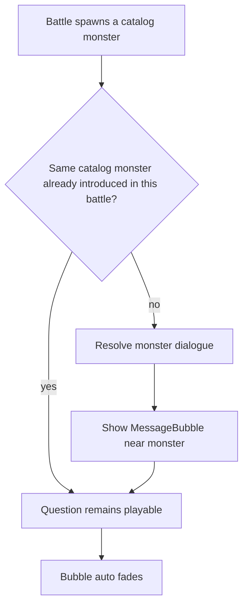
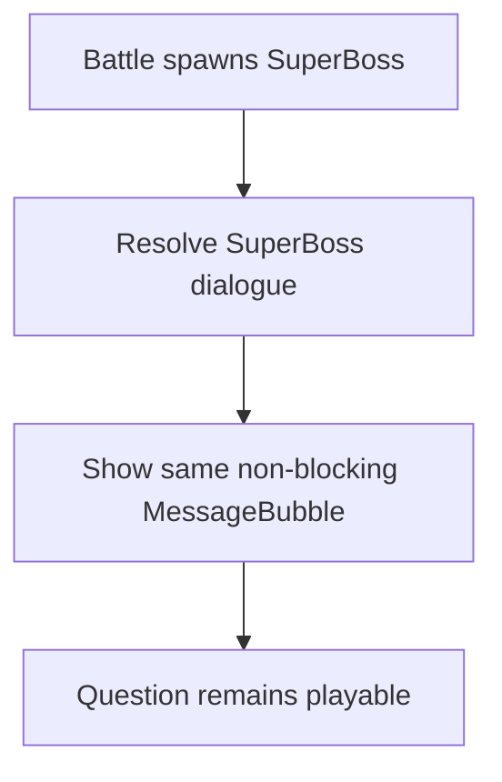
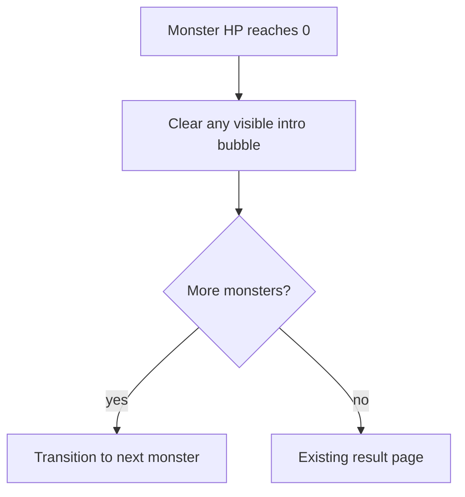

# V0.9.2 — Boss Dialogue and Built-in Pack Expansion — Cross-Platform Design

> Feature ID: `2026-05-25-boss-dialogue-v0-9-2`
> Status: `replicating`
> Owner: Terry Ma
> Last updated: 2026-05-26

This document is the platform-neutral source of truth for V0.9.2 Boss personality dialogue, built-in pack expansion, and initial battle defaults. HarmonyOS implements first; iOS and Android replicate only after the Harmony soft gate and human signature in [`20-replication-trigger.md`](20-replication-trigger.md).

## 1. Motivation

V0.9.1 added sentence cloze questions, moving the learning loop from word recognition toward context understanding. The battle loop still treats most monsters as visual targets rather than characters. V0.9.2 gives every current monster a short personality beat at entry, while also increasing built-in pack word counts so longer initial battles can show more monster variety without repeating the same small word pool too quickly.

## 2. Goals

- Add short bilingual Boss dialogue for all 100 current `MonsterCatalog` entries.
- Show lightweight non-blocking intro bubbles for all monster levels, including SuperBoss.
- Suppress repeated intro bubbles when the same catalog monster appears again in the same battle.
- Use English as the primary line and Chinese as smaller supporting text.
- Keep the tone playful and challenging, with slightly more fairy-tale drama for SuperBoss entries.
- Expand each of the five built-in packs from 10 words to 15 words.
- Change first-install battle defaults to `monstersTotal=10`, `monsterMaxHp=5`, and `playerMaxHp=10`.
- Preserve existing saved `GameConfig` values instead of forcibly overwriting returning users.

## 3. Non-Goals

- No server endpoint, OpenAPI, or shared client runtime changes.
- No admin or parent editing UI for dialogue copy.
- No LLM generation flow; content production and review remain a V0.9.6 concern.
- No region story card, chapter intro, or chapter completion celebration; those remain V0.9.3.
- No battle BGM, audio mixing, or voice acting; those remain V0.10.
- No click-to-start interaction for intro bubbles.
- No defeat bubble or result-page redesign for defeat dialogue in V0.9.2; defeat copy stays in the catalog for a later exit-effect design.

## 4. User Flows

### 4.1 Monster Intro



### 4.2 SuperBoss Intro



### 4.3 Defeat Dialogue



## 5. Stable Test IDs (parity contract)

Every ID listed here must be implemented verbatim on all three platforms. Agents may not rename them per platform.

| ID | Where it lives | Purpose |
| --- | --- | --- |
| `BattleBossIntroBubble` | Monster intro overlay | Asserts intro is the shared lightweight `MessageBubble` UI. |
| `BattleBossIntroName` | Monster intro overlay | Shows the monster display name. |
| `BattleBossIntroLineEn` | Monster intro overlay | Shows the English intro line. |
| `BattleBossIntroLineZh` | Monster intro overlay | Shows the Chinese support line. |
| `BattleMonsterLevelLabel` | Monster card | Shows compact `L1` / `L2` / `L3` / `L4` level badge. |

Platform mapping reminder:

- HarmonyOS: ArkUI `.id('<ID>')` and the `findComponent` lookup used by ohosTest.
- iOS: SwiftUI `.accessibilityIdentifier("<ID>")`.
- Android: Compose `Modifier.testTag("<ID>")`; use `contentDescription` only when the same string also doubles as accessibility text.

## 6. Domain Rules

### 6.1 Dialogue Data

Each current `MonsterCatalog` entry must have complete global default dialogue:

```text
MonsterDialogue {
  introLine.en
  introLine.zh
  defeatLine.en
  defeatLine.zh
}
```

The source copy for all 100 entries is [`boss-dialogue-catalog.md`](boss-dialogue-catalog.md). Implementations may store it in platform-native code or JSON, but the shipped content must match that catalog unless the design document is updated first.

Future pack / scene overrides are allowed by the model, but V0.9.2 does not ship remote editing or server publication for them. Dialogue resolution uses this priority:

```text
pack / scene override for selected monster
→ global monster dialogue
→ safe fallback generated from monster name
```

The fallback is defensive only. Tests must assert every current catalog index has complete bilingual dialogue.

### 6.2 Presentation by Level

```text
function introPresentation(level):
  return small_nonblocking_message_bubble
```

Intro bubbles:

- Appear near the monster.
- Do not pause the battle.
- Do not require a tap.
- Fade automatically.
- Must not block answer options, HP, or the main prompt.
- Use the shared `MessageBubble` component and battle boss style on all platforms.
- Use the same behavior for SuperBoss as for Level 1 / 2 / 3 monsters.
- Do not show another intro when the same catalog monster appears again in the same battle.

Defeat bubbles:

- Disabled for V0.9.2 to avoid overlap between monster exit and the next monster intro.
- Keep `defeatLine` data in the catalog for a later exit-effect design.
- Do not move `defeatLine` into ResultPage.

### 6.3 Copy Rules

- English is primary; Chinese is supporting text below it.
- English should be short and child-readable, preferably no more than 32 characters.
- Chinese should be natural, not stiff literal translation, preferably no more than 18 Chinese characters.
- Intro copy should sound like a playful challenge.
- Defeat copy should sound surprised, impressed, or gently yielding.
- SuperBoss copy may be slightly more fairy-tale dramatic.
- Copy must not frighten, shame, belittle, or use adult themes.
- Copy should avoid broad repeated formulas across the 100-entry catalog.

### 6.4 Built-in Pack Expansion

The five built-in packs must expand from 10 words to 15 words each:

- `fruit-forest`
- `school-castle`
- `home-cottage`
- `animal-safari`
- `ocean-realm`

Required additions:

| Pack | New word ids / words | Chinese meanings |
| --- | --- | --- |
| `fruit-forest` | `fruit-strawberry` / `strawberry`, `fruit-pineapple` / `pineapple`, `fruit-watermelon` / `watermelon`, `fruit-kiwi` / `kiwi`, `fruit-blueberry` / `blueberry` | 草莓、菠萝、西瓜、猕猴桃、蓝莓 |
| `school-castle` | `place-restaurant` / `restaurant`, `place-cinema` / `cinema`, `place-airport` / `airport`, `place-playground` / `playground`, `place-bookstore` / `bookstore` | 餐厅、电影院、机场、操场、书店 |
| `home-cottage` | `home-kitchen` / `kitchen`, `home-bathroom` / `bathroom`, `home-clock` / `clock`, `home-phone` / `phone`, `home-fridge` / `fridge` | 厨房、浴室、时钟、电话、冰箱 |
| `animal-safari` | `animal-bird` / `bird`, `animal-elephant` / `elephant`, `animal-monkey` / `monkey`, `animal-rabbit` / `rabbit`, `animal-panda` / `panda` | 鸟、大象、猴子、兔子、熊猫 |
| `ocean-realm` | `ocean-shell` / `shell`, `ocean-coral` / `coral`, `ocean-beach` / `beach`, `ocean-wave` / `wave`, `ocean-seaweed` / `seaweed` | 贝壳、珊瑚、海滩、海浪、海草 |

New built-in words must include:

```text
id
word
meaningZh
distractors
example.en
example.zh
```

`example.en` and `example.zh` are required because V0.9.1 sentence cloze is default-enabled. New words must support sentence cloze under the V0.9.1 matching rules.

### 6.5 Initial Battle Defaults

First-install battle defaults change to:

```text
monstersTotal = 10
monsterMaxHp = 5
playerMaxHp = 10
```

These defaults apply only when no saved `GameConfig` exists. Existing user-saved config snapshots are not forcibly overwritten.

## 7. Persistence and Migration

| Key | Type | Default | Migration from older snapshot |
| --- | --- | --- | --- |
| Existing `GameConfig.monstersTotal` | integer | `10` | Only new / missing config uses this default. Preserve saved value. |
| Existing `GameConfig.monsterMaxHp` | integer | `5` | Only new / missing config uses this default. Preserve saved value. |
| Existing `GameConfig.playerMaxHp` | integer | `10` | Already the current default; preserve saved value. |
| New platform-local monster dialogue table | static data | complete 100-entry catalog | No user persistence; shipped with app. |
| Future pack / scene dialogue overrides | optional structured data | absent | V0.9.2 parser may ignore or safely carry unknown fields; no server source in this version. |

No snapshot-version bump is required unless a platform's existing config persistence cannot distinguish missing config from a saved older default. If such a platform-specific issue exists, the platform plan must spell out the migration rule and tests.

## 8. Cross-Platform Contracts

No server or OpenAPI changes.

- New / changed endpoints: None.
- Schema additions: None for server contracts.
- Fixture diffs under [`shared/fixtures/`](../../../shared/fixtures/): None required.
- Regenerate OpenAPI: Not required.
- Server test requirement: Not applicable unless implementation unexpectedly touches `server/`.

The cross-platform content contract is local to this feature folder:

- [`boss-dialogue-catalog.md`](boss-dialogue-catalog.md) is the copy source of truth.
- Each platform's `MonsterCatalog` / equivalent dialogue table must cover catalog indices 1 through 100.
- Built-in pack word additions must remain semantically aligned across HarmonyOS JSON, iOS JSON, and Android built-in constants.

## 9. Edge Cases and Error Paths

- Missing dialogue for a monster: use safe fallback generated from monster name and log a local warning; tests should prevent this in shipped data.
- Missing only one language: use fallback for the missing line; tests should prevent this in shipped data.
- Long line: allow wrapping to two lines, shrink within existing platform conventions, and avoid covering answer controls.
- Monster transition interrupted by battle end: cancel the intro bubble and show the normal result flow.
- User changes saved config: preserve their chosen `monstersTotal`, `monsterMaxHp`, and `playerMaxHp`.
- Sparse remote or family packs: built-in pack expansion does not impose a 15-word minimum on remote/family packs.

## 10. Telemetry / Logs

No analytics events are required. Optional local debug logs may be platform-specific and must not become parity requirements.

If a platform logs missing dialogue, use this stable prefix:

| Event | Trigger | Fields |
| --- | --- | --- |
| `boss_dialogue_missing` | Missing local dialogue for a catalog index | `catalogIndex`, `monsterName`, `lineKind` |

## 11. Accessibility / Localization

- Screen readers should expose the same text as visible UI: monster name, English line, then Chinese line.
- Intro bubbles are informational overlays and should not steal focus from answer controls.
- SuperBoss intro uses the same temporary informational bubble as other levels and must not require a separate dismiss action.
- Chinese support text is always visible in V0.9.2, not hidden behind a setting.
- Keep visible English and Chinese copy identical across HarmonyOS, iOS, and Android.

## 12. Open Questions

None for V0.9.2. Future V0.9.3 region story copy may reuse the dialogue override shape or introduce a separate scene-story block, but that decision is outside this feature.

## 13. References

- [`docs/WordMagicGame_roadmap.md`](../../WordMagicGame_roadmap.md) V0.9.2 row.
- [`docs/features/2026-05-24-sentence-cloze-v0-9-1/00-design.md`](../2026-05-24-sentence-cloze-v0-9-1/00-design.md) for sentence cloze example requirements.
- HarmonyOS baseline: `harmonyos/entry/src/main/ets/data/MonsterCatalog.ets`, `harmonyos/entry/src/main/ets/pages/BattlePage.ets`, `harmonyos/entry/src/main/resources/rawfile/data/builtin/*.json`.
- iOS baseline: `ios/WordMagicGame/Core/MonsterCodex.swift`, `ios/WordMagicGame/Features/CoreLoop/BattleView.swift`, `ios/WordMagicGame/Resources/BuiltinPacks/*.json`.
- Android baseline: `android/app/src/main/java/cool/happyword/wordmagic/core/GrowthModels.kt`, `android/app/src/main/java/cool/happyword/wordmagic/ui/battle/BattleUi.kt`, `android/app/src/main/java/cool/happyword/wordmagic/core/PackModels.kt`.
