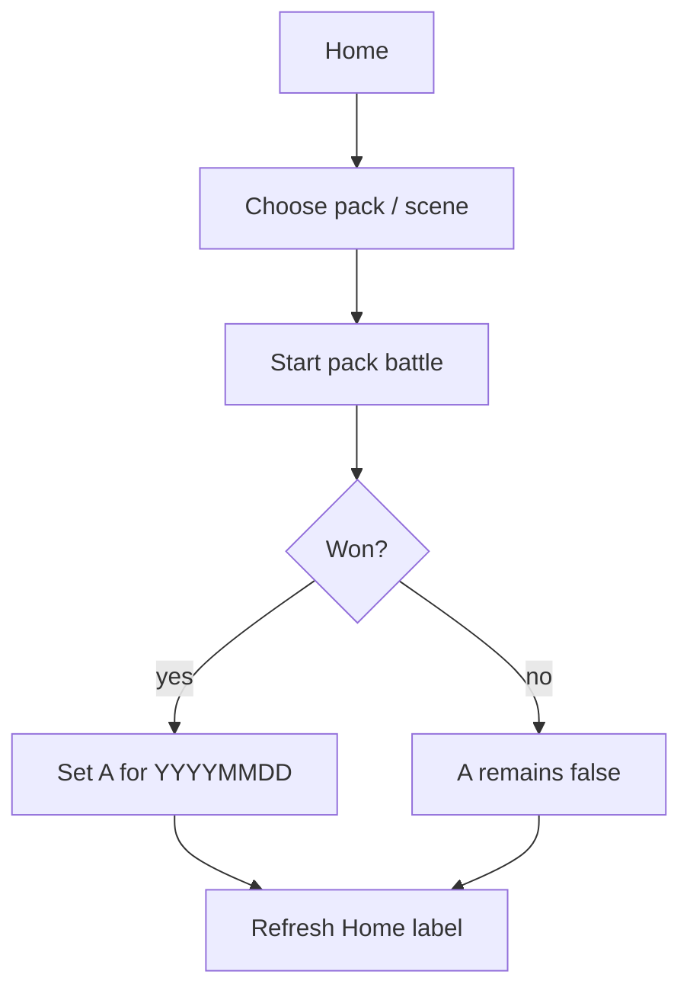
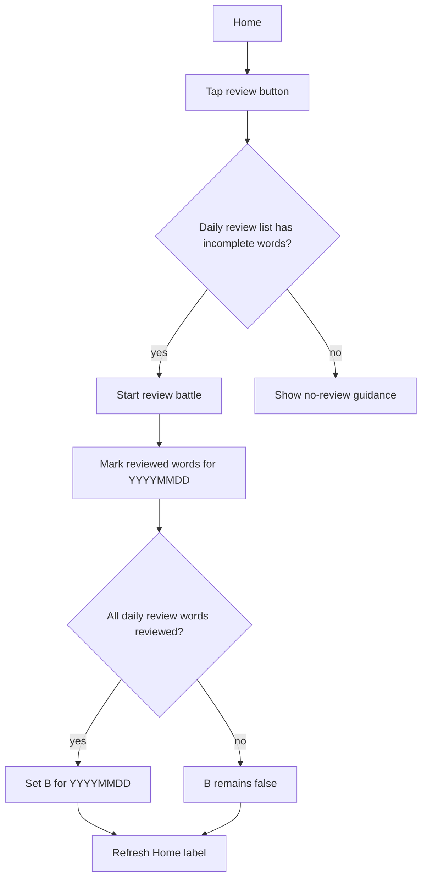

# Learning Plan and Review Logic V0.9.3 — Cross-Platform Design

> Feature ID: `2026-05-26-learning-plan-review-v0-9-3`
> Status: `draft`
> Owner: V0.9.3 — 学习计划与复习逻辑重构
> Last updated: 2026-05-26

This document is the platform-neutral source of truth for V0.9.3. HarmonyOS implements and stabilizes first; iOS and Android replicate the frozen behavior after the signed replication trigger.

## 1. Motivation

The current product has three related but inconsistent ideas of "today": the Home adventure badge, the read-only Today Plan page, and the Review button. The Home badge tracks daily adventure completion, Today Plan counts word rows answered correctly today, and Review only looks at recent wrong words. V0.9.3 consolidates these into one explainable daily learning model.

The child should see two clear entry paths: choose a scene/pack and battle, or review today's due words. The parent should be able to understand why the app says today is complete.

## 2. Goals

- Keep only two Home battle entry paths:
  - choose a pack/scene on Home and start battle;
  - tap the Home review button and start review battle.
- Define daily adventure completion as `A && B`:
  - **A**: on the local day, the child selected at least one pack/scene and won a pack battle;
  - **B**: the stable review list for that local day has all been reviewed.
- Define daily check-in completion as `A || B`.
- Replace the Home badge with a clear label state derived from A/B.
- Generate one stable daily review list from pre-day learning data: due review + recent wrong + weak words, capped at 50 words.
- Exclude mistakes made during the same local day from that day's required review list.
- Make review battle length dynamic from review word count and current battle config.

## 3. Non-Goals

- No cloud-authoritative daily plan in V0.9.3. The daily state is local-device first.
- No SM-2 / FSRS algorithm migration. V0.9.3 uses the existing memory fields and a transparent score model.
- No new battle entry points from TodayPlanPage, LearningReportPage, ResultPage, or Spellbook.
- No punishment flow for unfinished review. Labels guide the child; they do not lock normal play.
- No same-day wrong-answer injection into today's required review list.

## 4. User Flows





## 5. Stable Test IDs (parity contract)

Every ID listed here must be implemented verbatim on all three platforms. Existing IDs remain valid unless explicitly replaced.

| ID | Where it lives | Purpose |
| --- | --- | --- |
| `AdventureCardDailyStatusLabel` | Home adventure card | Shows the daily label derived from A/B. Replaces / aliases current `AdventureCardBadge`. |
| `HomeStartButton` | Home adventure card | Starts pack battle from selected pack. |
| `HomeReviewButton` | Home toolbar | Starts review battle when daily review list has incomplete words. |
| `HomeReviewCountBadge` | Home review button or nearby badge | Displays remaining required review word count when A is true and B is false. |
| `HomeReviewEmptyToast` | Home toast | Indicates there is no required review battle to run. |
| `TodayPlanProgressText` | TodayPlanPage header | Shows A/B aware daily progress copy. |
| `TodayPlanReviewRequiredSection` | TodayPlanPage | Lists today's stable required review words. |
| `TodayPlanReviewDone-<wordId>` | TodayPlanPage row | Indicates one daily review word has been reviewed today. |

## 6. Domain Rules

### 6.1 Day Key

All daily state uses the device local day key in compact form:

```text
YYYYMMDD
```

Examples: `20260526`, `20261203`.

Daily keys are derived from local midnight, not UTC.

### 6.2 Daily State

```text
DailyLearningState {
  dayKey: string
  packBattleWon: boolean       // A
  reviewAllDone: boolean       // B
  reviewSnapshot: DailyReviewSnapshot
}

DailyReviewSnapshot {
  dayKey: string
  generatedAtMs: number
  sourceCutoffMs: number       // local start-of-day ms
  wordIds: string[]            // stable order, max 50
  reviewedWordIds: string[]    // subset completed today
}
```

`packBattleWon` is set only after a Home pack/scene battle ends with `Won`.

`reviewAllDone` is true when every `wordId` in `reviewSnapshot.wordIds` is present in `reviewedWordIds`. An empty review list counts as B satisfied.

### 6.3 Daily Review Snapshot Generation

The daily review list must be stable for the whole local day.

```text
ensureDailyReviewSnapshot(dayKey, now):
  if persisted.dayKey == dayKey:
    return persisted.reviewSnapshot

  sourceCutoffMs = localStartOfDay(now)
  stats = LearningRecorder.allStats()
  activeWords = words from active packs
  candidates = []

  for word in activeWords:
    stat = stats[word.id]
    if stat is missing:
      continue
    if stat.lastAnsweredMs >= sourceCutoffMs:
      continue  // same-day answers never create today's required review
    reasons = computeReviewReasons(stat, sourceCutoffMs)
    if reasons is not empty:
      candidates.push({ wordId, reasons, score })

  sort candidates by score desc, then lastAnsweredMs desc, then wordId asc
  wordIds = first 50 candidate wordIds
  persist DailyLearningState(dayKey, reviewSnapshot.wordIds = wordIds)
```

Important: Home must call `ensureDailyReviewSnapshot` before either battle entry can run. This prevents a pack battle's same-day answers from becoming part of today's required review list.

If a legacy device opens a review-related page after same-day answers already exist and no snapshot exists, generate from stats with `lastAnsweredMs < sourceCutoffMs`. This may omit words that were due before today's battle and then answered today, but it still honors the rule that same-day mistakes are not injected into today's list. Future versions can add per-day history if stronger reconstruction is needed.

### 6.4 Review Reasons

Each word may have multiple reasons. Store all reasons for explanation, but expose one primary reason in UI.

Primary reason priority:

```text
due_review > recent_wrong > weak_word
```

#### Due Review

```text
due_review if stat.nextReviewMs > 0 && stat.nextReviewMs <= sourceCutoffMs
```

This reason represents the memory scheduler's existing promise that the word is due before today starts.

#### Recent Wrong

```text
recent_wrong if
  inferredLastOutcome(stat) == wrong
  && sourceCutoffMs - stat.lastAnsweredMs <= 7 days
```

`inferredLastOutcome(stat)` uses the new field `lastOutcome` when present. For migrated snapshots:

```text
if stat.consecutiveWrong > 0: wrong
else if stat.consecutiveCorrect > 0: correct
else unknown
```

Unknown does not qualify for recent_wrong.

#### Weak Word

```text
attempts = stat.seenCount
accuracy = stat.correctCount / max(1, stat.seenCount)

weak_word if
  stat.memoryState != Mastered
  && (
    (attempts >= 3 && accuracy < 0.6)
    || (stat.wrongCount >= 2 && stat.correctCount <= stat.wrongCount)
    || (attempts >= 2 && stat.mastery <= 35)
  )
```

### 6.5 Review Score

Use a deterministic score so the same pre-day data produces the same list and order.

```text
score =
  (due_review ? 100 : 0)
  + (recent_wrong ? 80 : 0)
  + (weak_word ? 50 : 0)
  + overdueDays * 4
  + recentWrongBoost
  + selectedPackBoost
```

Clamp `overdueDays` to `0...14`.

```text
recentWrongBoost:
  <= 1 day: +20
  <= 3 days: +10
  <= 7 days: +5
  otherwise: +0

selectedPackBoost:
  word is in currently selected Home pack: +5
```

Tie-breakers:

```text
score desc
lastAnsweredMs desc
wordId asc
```

### 6.6 A / B Completion

```text
A = DailyLearningState.packBattleWon
B = DailyLearningState.reviewAllDone
todayAdventureCompleted = A && B
dailyCheckInCompleted = A || B
```

Review completion should be word-based, not victory-based. A word is reviewed for the day when it appears in review battle and receives at least one submitted answer, correct or wrong. This avoids trapping the child in an endless review loop on hard words.

### 6.7 Home Label Logic

Home derives one label from A and B.

| A: pack battle won | B: required review all done | Label | Review count badge |
| --- | --- | --- | --- |
| false | false | `请选择一个场景加战斗` | hidden |
| false | true | `请选择一个场景加战斗` | hidden |
| true | false | `请点击复习加战斗({count})` | show remaining count |
| true | true | `已完成` | hidden |

`count` is the number of `reviewSnapshot.wordIds` not yet present in `reviewedWordIds`.

### 6.8 Review Battle Timer and Monster Count

Review battle always starts from HomeReviewButton. The countdown is fixed:

```text
reviewBattleSeconds = 10 * 60
```

Monster count is dynamic:

```text
requiredWordCount = remaining review word count
answersPerMonsterApprox = monsterHp * 4 / 3
reviewMonsterCount = ceil(requiredWordCount / answersPerMonsterApprox)
reviewMonsterCount = clamp(reviewMonsterCount, 1, configuredMonstersTotal)
```

Use the current battle config `monsterHp`. If the current config has invalid `monsterHp <= 0`, treat it as the default monster HP.

Example with `monsterHp = 5`:

```text
answersPerMonsterApprox = 5 * 4 / 3 = 6.67
requiredWordCount = 20
reviewMonsterCount = ceil(20 / 6.67) = 3
```

### 6.9 Same-Day Wrong Answers

Wrong answers made today:

- update normal learning stats immediately;
- can affect future days' review snapshot;
- do not add words to today's `reviewSnapshot.wordIds`;
- do not change today's B requirement unless the word was already in today's snapshot.

## 7. Persistence and Migration

| Key | Type | Default | Migration from older snapshot |
| --- | --- | --- | --- |
| `wordmagic_daily_learning_state_v1` | `DailyLearningState` | generated on first Home load per day | No older key; generate from current stats with `lastAnsweredMs < localStartOfDay(now)`. |
| `WordStat.lastOutcome` | `'correct' | 'wrong' | 'unknown'` | `unknown` | Backfill in memory from `consecutiveWrong` / `consecutiveCorrect` as described above. Persist on next answer. |

When the local day key changes, create a new `DailyLearningState` and discard the previous day's `reviewedWordIds` for completion purposes. Historical learning stats remain unchanged.

## 8. Cross-Platform Contracts

None for V0.9.3. This feature is local-client behavior only.

No server endpoints, OpenAPI exports, or shared fixtures are required for the first implementation. If later parity tests need shared review fixtures, add them under `shared/fixtures/learning-plan/` in a follow-up.

## 9. Edge Cases and Error Paths

- **Empty review snapshot:** B is true; Home label still asks the child to choose a scene until A is true.
- **A true, review list empty:** Home label is `已完成`.
- **A true, B false:** Home label is `请点击复习加战斗({count})`.
- **Review button tapped with no remaining words:** Show `HomeReviewEmptyToast`; do not route to BattlePage.
- **Pack deleted after snapshot generation:** Keep the snapshot word IDs. Resolve display rows from current library; missing words are silently skipped for UI, but completion logic should still allow B once all resolvable words are reviewed. A cleanup pass may remove missing IDs.
- **Battle interrupted / app killed:** A is set only after a pack battle result is `Won`; reviewed word IDs are flushed after each submitted review answer or at least at battle end.
- **Clock crosses midnight during battle:** Completion writes to the day key captured at battle start, not the current wall clock at result time.
- **Device clock moves backward:** Do not merge future-day state into older day. If dayKey changes, generate state for that key from available stats.

## 10. Telemetry / Logs

No analytics events are required. All platforms should emit stable debug logs for failures:

| Event | Trigger | Fields |
| --- | --- | --- |
| `DailyLearningState.load_failed` | Daily state load failed | `dayKey`, error summary |
| `DailyLearningState.snapshot_generated` | New daily review snapshot generated | `dayKey`, `wordCount` |
| `DailyLearningState.snapshot_reused` | Existing daily review snapshot reused | `dayKey`, `wordCount`, `remainingCount` |
| `DailyLearningState.review_mark_failed` | Reviewed word persistence failed | `dayKey`, `wordId`, error summary |

## 11. Accessibility / Localization

Home labels are Chinese in the current product:

- `请选择一个场景加战斗`
- `请点击复习加战斗({count})`
- `已完成`

Review reason labels:

- `该复习了`
- `刚刚错过`
- `还不稳定`

Accessibility labels should include the count when present, for example:

```text
请点击复习加战斗，剩余 8 个单词
```

## 12. Test Plan

### 12.1 Pure Unit Tests

| Case | Setup | Expected |
| --- | --- | --- |
| Day key compact format | timestamp on 2026-05-26 local day | `20260526` |
| Snapshot stable within day | same stats, same active packs, call generator twice | identical ordered word IDs |
| Snapshot capped at 50 | 80 qualifying candidates | exactly 50 word IDs |
| Same-day wrong excluded | stat has `lastAnsweredMs >= startOfDay`, `lastOutcome=wrong` | word is not in today's snapshot |
| Due review included | `nextReviewMs <= startOfDay` | reason includes `due_review`, primary reason `due_review` |
| Future review excluded | `nextReviewMs > startOfDay`, no other reasons | word excluded |
| Recent wrong included | `lastOutcome=wrong`, `lastAnsweredMs` 2 days before start | reason includes `recent_wrong` |
| Recent wrong too old excluded | `lastOutcome=wrong`, `lastAnsweredMs` 8 days before start, no other reasons | word excluded |
| Weak by accuracy | `seenCount=5`, `correctCount=2` | reason includes `weak_word` |
| Mastered not weak | `memoryState=Mastered`, poor historical accuracy, not due | word excluded from weak reason |
| Multiple reasons primary | due + recent wrong + weak | primary reason is `due_review` |
| Sort order deterministic | mixed scores and ties | score desc, then lastAnsweredMs desc, then wordId asc |
| Empty snapshot means B true | `wordIds=[]` | `reviewAllDone=true` |
| Partial review means B false | 5 wordIds, 4 reviewed | remaining count 1, B false |
| Full review means B true | all wordIds reviewed | remaining count 0, B true |
| Check-in condition A only | A true, B false | check-in true, adventure complete false |
| Check-in condition B only | A false, B true | check-in true, adventure complete false |
| Adventure complete | A true, B true | check-in true, adventure complete true |
| Review monster count | required 20, monsterHp 5 | 3 monsters |
| Review monster clamp minimum | required 1, monsterHp 5 | 1 monster |
| Review monster clamp maximum | required 50, monsterHp 1, configured total 10 | 10 monsters |

### 12.2 HarmonyOS Unit / Integration Tests

- `DailyLearningStateService.test.ets`
  - snapshot generation, reuse, day rollover, compact day key, migration from missing state.
- `ReviewQueueBuilder.test.ets`
  - reason detection, scoring, cap 50, same-day exclusion.
- `HomeDailyStatus.test.ets`
  - A/B label matrix and remaining count.
- `ReviewBattleConfig.test.ets`
  - 10-minute countdown and dynamic monster count formula.

### 12.3 HarmonyOS UI Tests

| Test | Steps | Assertions |
| --- | --- | --- |
| Home initial label when A false / B false | Seed daily state with required review words, no pack win | `AdventureCardDailyStatusLabel` text is `请选择一个场景加战斗`; review count badge hidden |
| Home label after pack win but review incomplete | Start pack battle, force win, return Home | label is `请点击复习加战斗(N)`; `HomeReviewCountBadge` visible |
| Home label after review complete and pack won | Complete remaining review battle, return Home | label is `已完成`; review count badge hidden |
| B-only check-in does not mark adventure complete | Seed no pack win, complete review list | check-in state is complete; Home label remains `请选择一个场景加战斗` |
| Review button empty state | Seed B true, tap review | `HomeReviewEmptyToast` appears; BattlePage not opened |
| Same-day wrong not added | Generate snapshot, answer a new wrong word in pack battle, return Home / TodayPlan | new wrong word absent from `TodayPlanReviewRequiredSection` |
| Review battle timer | Start review battle | timer starts at `10:00` |
| Review battle monster count | Seed remaining review count and HP | Battle config uses expected monster count |

### 12.4 iOS / Android Parity Tests

iOS and Android must replicate the HarmonyOS fixture cases after `20-replication-trigger.md` is signed:

- Review queue fixture: same input stats + active packs -> same ordered 50-or-less word IDs.
- Home A/B label matrix.
- Daily check-in `A || B` matrix.
- Review battle timer and monster count formula.
- Same-day wrong exclusion.

## 13. Open Questions

- Should B count a reviewed word after any submitted answer, or only after a correct answer? This design chooses any submitted answer to avoid trapping children on hard words.
- Should review snapshot include inactive packs? This design chooses active packs only, with selected pack score boost.
- Should A require any selected pack win or the currently selected pack win after day state generation? This design chooses any Home pack/scene win on the day.

## 14. References

- HarmonyOS current TodayPlan builder: `harmonyos/entry/src/main/ets/services/TodayPlanService.ets`
- HarmonyOS current adventure builder: `harmonyos/entry/src/main/ets/services/TodayAdventureBuilder.ets`
- HarmonyOS current Home label: `harmonyos/entry/src/main/ets/pages/HomePage.ets`
- HarmonyOS current today completion write: `harmonyos/entry/src/main/ets/pages/BattlePage.ets`
- Current roadmap V0.9.3 entry: `docs/WordMagicGame_roadmap.md`
