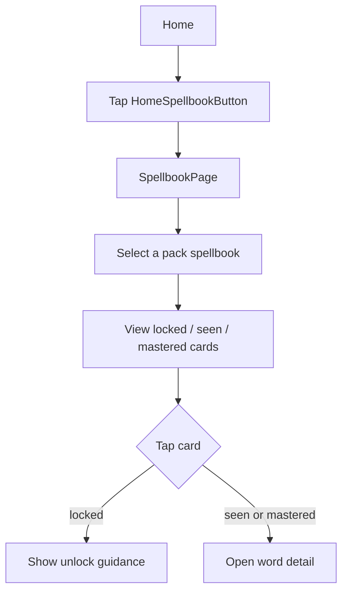
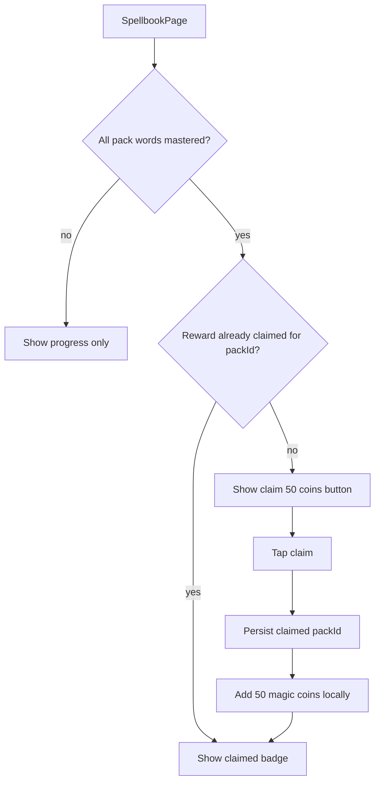
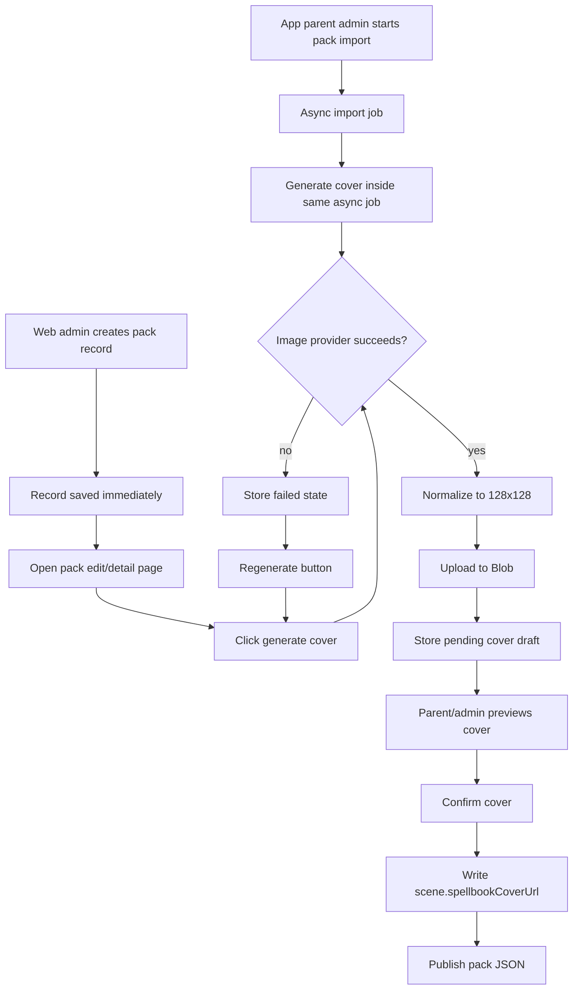

# V0.9.5 Spellbook Codex — Cross-Platform Design

> Feature ID: `2026-05-29-spellbook-v0-9-5`
> Status: `done`
> Owner: V0.9.5 — 魔法书图鉴
> Last updated: 2026-05-29

This document is the platform-neutral source of truth for V0.9.5. HarmonyOS implements and stabilizes first; iOS and Android replicate the frozen behavior after the signed replication trigger.

## 1. Motivation

V0.9.1 through V0.9.4 made battles more contextual and packs more story-like, but a child still has no satisfying place to see "these are the words I have collected." Learning report pages explain progress to adults; they do not feel like a reward object.

V0.9.5 turns mastered vocabulary into a collectible spellbook. The release deliberately does **not** add another battle question type. Existing question types are enough for the current learning loop; this version makes progress visible, memorable, and rewardable.

## 2. Goals

- Add `SpellbookPage`, a collectible pack-grouped codex for learned words.
- Represent each pack as a small magic book with a cover, story line, progress, and word-card grid.
- Use three word-card states: locked, seen-but-not-mastered, and mastered.
- Let the child claim a one-time 50 magic coin reward when every word in a pack is mastered.
- Persist reward claim state locally by `packId`; do not sync it to the server in this version.
- Add spellbook cover metadata to pack scene data and show it on Home and Spellbook.
- Generate, preview, regenerate, confirm, and publish pack spellbook covers on the server.
- Add a system-admin-only Image Provider configuration surface, separate from parent workflows.
- Reuse Blob/object storage for generated covers. Pack JSON stores URLs, not base64 image payloads.

## 3. Non-Goals

- No `QuestionKind.ListenAndPick` or other new battle question type.
- No new learning algorithm, SM-2 / FSRS migration, or per-pack `WordStat` split.
- No server-side reward redemption record or cloud sync for spellbook rewards.
- No parent PIN for claiming the 50 coin reward; this is a learning achievement, not a wishlist redemption.
- No PackManager cover art redesign in V0.9.5.
- No chapter intro, area map, recommended adventure card, or chapter-completion celebration; these are out of scope and no longer planned.
- No base64 image embedding in pack JSON.
- No real provider network calls in automated tests; provider calls are stubbed.

## 4. User Flows

### 4.1 Child Opens The Spellbook



### 4.2 Child Claims A Completed Pack Reward



### 4.3 Server Generates A Pack Cover



Cover generation must not block synchronous pack creation. It can run as part of an existing asynchronous import workflow, or it can be triggered manually after a pack record already exists.

## 5. Stable Test IDs (parity contract)

Every ID listed here must be implemented verbatim on all three child clients. Agents may not rename them per platform.

| ID | Where it lives | Purpose |
| --- | --- | --- |
| `HomeSpellbookButton` | Home toolbar | Opens `SpellbookPage`. |
| `HomePackSpellbookCover` | Home selected pack card | Shows the current pack's spellbook cover or fallback. |
| `SpellbookPage` | Spellbook root | Confirms the spellbook route is open. |
| `SpellbookBackButton` | Spellbook top chrome | Returns to Home. |
| `SpellbookTitle` | Spellbook header | Page title. |
| `SpellbookPackCover_<packId>` | Pack section / selector | Shows one pack cover. |
| `SpellbookPackProgress_<packId>` | Pack section | Shows mastered / total count. |
| `SpellbookPackRewardButton_<packId>` | Completed unclaimed pack | Claims the 50 coin reward. |
| `SpellbookPackRewardClaimed_<packId>` | Completed claimed pack | Shows reward already claimed. |
| `SpellbookCard_<packId>_<wordId>` | Word card | Stable card node for any state. |
| `SpellbookCardLocked_<packId>_<wordId>` | Locked word card | Asserts a word with no stat remains locked. |
| `SpellbookCardSeen_<packId>_<wordId>` | Seen word card | Asserts seen-but-not-mastered visual state. |
| `SpellbookCardMastered_<packId>_<wordId>` | Mastered word card | Asserts collected visual state. |
| `SpellbookLockedTip` | Locked-card hint | Explains how to unlock the word. |
| `SpellbookWordDetailSheet` | Word detail layer | Opens for seen and mastered cards. |
| `SpellbookWordDetailTitle` | Word detail layer | Shows the selected word. |
| `SpellbookWordDetailState` | Word detail layer | Shows `尚未掌握` or `已掌握`. |
| `SpellbookWordDetailClose` | Word detail layer | Closes the detail layer. |

Platform mapping reminder:

- HarmonyOS: ArkUI `.id('<ID>')` and ohosTest lookup.
- iOS: SwiftUI `.accessibilityIdentifier("<ID>")`.
- Android: Compose `Modifier.testTag("<ID>")`; use `contentDescription` only when the same string also doubles as accessibility text.

## 6. Domain Rules

### 6.1 Card State

Spellbook state derives from existing local learning stats. It does not write new learning data.

```text
function spellbookCardState(wordId, stats):
  stat = stats[wordId]
  if stat is missing or stat.seenCount <= 0:
    return locked
  if stat.memoryState == "mastered":
    return mastered
  return seen
```

Locked cards show a hidden/locked visual and guidance to continue adventure battles. Seen cards are grey but open the full word detail. Mastered cards are lit and count toward pack completion.

### 6.2 Pack Completion

```text
function packComplete(pack, stats):
  if pack.words.length == 0:
    return false
  return every word in pack.words has spellbookCardState(word.id, stats) == mastered
```

Repeated `wordId`s across packs light up together because `WordStat` remains global by `wordId`.

### 6.3 Reward Claim

```text
SPELLBOOK_PACK_REWARD_COINS = 50

function canClaimPackReward(pack, stats, rewardSnapshot):
  return packComplete(pack, stats)
    && rewardSnapshot.claimedPackIds does not contain pack.id

function claimPackReward(packId):
  if packId already in claimedPackIds:
    return already_claimed
  add packId to claimedPackIds
  CoinAccount.credit(50, reason="spellbook_pack_complete", refId=packId)
  persist reward snapshot and coin snapshot
  return claimed
```

Reward de-duplication is by `packId`, not `packId + version`. If a pack later adds words, progress recomputes against the current pack words, but the first-completion reward is not issued again.

### 6.4 Cover Resolution

```text
function resolveSpellbookCover(pack):
  if pack.source == builtIn and builtInCoverAsset exists for pack.id:
    return localAsset(builtInCoverAsset)
  if pack.scene.spellbookCoverUrl is non-empty:
    return remoteCachedAsset(pack.scene.spellbookCoverUrl)
  return localAsset(defaultSpellbookCover)
```

If remote loading or cache fetch fails, the UI falls back to `defaultSpellbookCover`.

### 6.5 Cover Generation

Server cover generation uses pack metadata:

- pack name
- `scene.storyEn` / `scene.storyZh` when available
- up to 24 sampled words with English word, Chinese meaning, category, and difficulty

The provider prompt asks for a child-safe square magic book cover for a vocabulary pack. It must not include readable text, brand marks, copyrighted characters, realistic children, weapons, scary horror imagery, or UI chrome.

Generated output is normalized to a 128x128 image, uploaded to Blob/object storage, and stored as a pending draft until confirmed.

Generation timing depends on the management surface:

- **In-app parent management:** pack import is already an asynchronous workflow. The import job may enqueue/run one spellbook cover generation attempt after the pack metadata is available. The parent UI shows import progress/status and must remain usable while the image provider runs.
- **Web admin management:** creating a global/family pack record must return quickly without waiting for image generation. After the record exists, the pack edit/detail page exposes a generate/regenerate cover action. The page shows `generating`, `pending_review`, or `failed` status and allows retry.
- **Publish behavior:** pack publish remains allowed without a generated or confirmed cover. Child clients use the default cover until `scene.spellbookCoverUrl` is confirmed and present in published pack JSON.

## 7. Persistence and Migration

### 7.1 Client Persistence

| Key | Type | Default | Migration from older snapshot |
| --- | --- | --- | --- |
| `wordmagic_spellbook_rewards` | `{ version: 1, claimedPackIds: string[] }` | empty set | Missing key means no rewards claimed. Invalid pack IDs are ignored on load. |

Coin persistence reuses the existing local coin account. Claiming a reward appends/records a local coin mutation with reason `spellbook_pack_complete` where the platform already supports transaction reasons.

### 7.2 Server Persistence

`FamilyPackDefinition.scene` gains optional published cover metadata:

| Key | Type | Default | Notes |
| --- | --- | --- | --- |
| `scene.spellbookCoverUrl` | `string?` | absent | Confirmed 128x128 Blob URL used by child clients. |

The server also stores draft/operational cover state for backend UI. Exact storage may be either a small embedded object on the definition or a separate collection, but it must represent:

| Field | Type | Notes |
| --- | --- | --- |
| `status` | `idle | generating | pending_review | confirmed | failed` | `confirmed` means the URL is already copied to `scene.spellbookCoverUrl`. |
| `draftUrl` | `string?` | Blob URL for the latest unconfirmed candidate. |
| `providerId` | `string?` | Provider used for the latest attempt. |
| `model` | `string?` | Model used for the latest attempt. |
| `promptHash` | `string?` | Stable hash for audit/debug, not raw prompt if too long. |
| `errorMessage` | `string?` | Last failure shown in admin/parent UI. |
| `updatedAt` | `datetime` | Latest state transition. |
| `confirmedAt` | `datetime?` | Human confirmation time. |
| `confirmedBy` | `string?` | Parent/admin username. |
| `source` | `parent_import_job | web_admin_manual | manual_regenerate` | Where the latest generation request came from. |

## 8. Cross-Platform Contracts

- New / changed endpoints:
  - Parent HTML/import workflow: optionally trigger spellbook cover generation inside the existing asynchronous family-pack import task, then expose preview/regenerate/confirm actions for one family pack.
  - Admin HTML: create global/family pack records without waiting for image generation; pack edit/detail pages expose manual generate/regenerate/confirm actions.
  - Admin HTML: choose and test the global image-generation provider.
- Schema additions:
  - `Pack.scene.spellbookCoverUrl?: string`
  - child/global/family pack JSON must preserve `scene.spellbookCoverUrl`.
  - shared OpenAPI schemas that expose pack scene metadata must include the optional field.
- Fixture diffs under [`shared/fixtures/`](../../../shared/fixtures/):
  - Add at least one sample `spellbookCoverUrl` to global/family pack fixtures.
- Regenerate: `cd server && uv run python ../tools/contracts/export_openapi.py`
- Verify: `cd server && uv run pytest tests/test_shared_contracts.py -q`

### 8.1 Image Provider Configuration

Add an Image Provider section to the existing admin system config page. It is system-admin-only.

Required behavior:

- list configured provider options and whether each API key is present;
- show the current effective provider and model;
- allow selecting the global default provider;
- allow a small test generation action;
- record admin audit actions for provider changes and tests;
- keep provider choice out of parent pages.

Provider implementation must use a replaceable adapter shape. The first implementation targets one overseas provider path and one China-hosted provider path. Current design references:

- OpenAI Images API / GPT Image family for overseas generation.
- Qwen-Image / DashScope-style image generation for China-hosted generation.

Model names and endpoint defaults are deployment configuration, not product semantics. The implementation plan must verify current official docs before pinning defaults.

## 9. Edge Cases and Error Paths

- **Pack has zero words:** show the pack with `0/0` or empty guidance, but do not mark complete and do not show the reward button.
- **Word appears in multiple packs:** one global `Mastered` stat lights it in every pack.
- **Pack disappears after reward claim:** keep `claimedPackIds` in local persistence; ignore orphan IDs in UI.
- **Pack adds new words after reward claim:** progress can drop below 100%, but reward remains claimed and cannot be claimed again.
- **Reward button double-tap:** local claim operation must be idempotent by `packId`.
- **Coin persistence fails:** do not mark the reward claimed unless the coin credit also persists successfully.
- **Remote cover URL missing:** show default cover.
- **Remote cover URL fails to load:** show default cover and keep UI usable.
- **Remote cover exists but not cached offline:** show default cover offline; populate cache on next successful online load.
- **Provider not configured:** cover generation button shows a clear backend error; pack publish remains allowed.
- **Provider call fails:** store failed status and allow regenerate; publish remains allowed.
- **Provider call is slow:** app parent import progress may remain in an image-generation step, but the UI must not be frozen; web admin record creation must already have completed before generation starts.
- **Generated image is unsafe or unsuitable:** human confirmation is required before publishing to child clients.
- **Blob upload fails after provider success:** store failed status; do not write `scene.spellbookCoverUrl`.

## 10. Telemetry / Logs

Client telemetry is optional in V0.9.5. If platform logs are added, use stable strings:

| Event | Trigger | Fields |
| --- | --- | --- |
| `spellbook.open` | `SpellbookPage` opens | `pack_count` |
| `spellbook.card_open` | Seen/mastered card detail opens | `pack_id`, `word_id`, `state` |
| `spellbook.reward_claim` | 50 coin reward succeeds | `pack_id`, `coins` |
| `spellbook.cover_load_failed` | Remote cover fails and fallback is used | `pack_id` |

Server audit actions are required:

| Event | Trigger | Fields |
| --- | --- | --- |
| `system_config.update_image_provider` | Admin changes provider | `provider_id` |
| `system_config.test_image_provider` | Admin test generation completes or fails | `provider_id`, `ok` |
| `pack.spellbook_cover_generate` | Cover generation/regeneration requested | `pack_id`, `provider_id`, `status`, `source` |
| `pack.spellbook_cover_confirm` | Human confirms cover | `pack_id`, `url` |

## 11. Accessibility / Localization

- `HomeSpellbookButton`: accessible label `魔法书`.
- Pack cover images: label `"{packName} 魔法书封面"`.
- Locked card: label `"{wordPosition} 未解锁"`.
- Seen card: label `"{word} 尚未掌握"`.
- Mastered card: label `"{word} 已掌握"`.
- Reward button: label `领取 50 魔法币`.
- Parent/admin cover-generation UI remains zh-CN first, matching existing pack pages.
- Child-facing spellbook labels use concise zh-CN strings, matching current local-growth pages.

## 12. Open Questions

None after the 2026-05-29 brainstorming decisions. Provider defaults must still be verified against official docs during implementation planning.

## 13. References

- Roadmap: [`docs/WordMagicGame_roadmap.md`](../../WordMagicGame_roadmap.md) V0.9.5 row.
- V0.9.3 daily learning state: [`../2026-05-26-learning-plan-review-v0-9-3/00-design.md`](../2026-05-26-learning-plan-review-v0-9-3/00-design.md)
- V0.9.4 pack stories and scene metadata: current main implementation in `server/app/services/pack_story_service.py`, `server/app/routers/admin_pages.py`, `server/app/routers/parent_packs_pages.py`, and three client `Pack.scene` models.
- Existing local report / mastery source: HarmonyOS `LearningReportBuilder`, iOS `LearningReportBuilder`, Android `LearningReportBuilder`.
- Existing asset path precedent: V0.5.6 word `illustrationUrl` / `audioUrl` and `RemoteAssetCache`.
