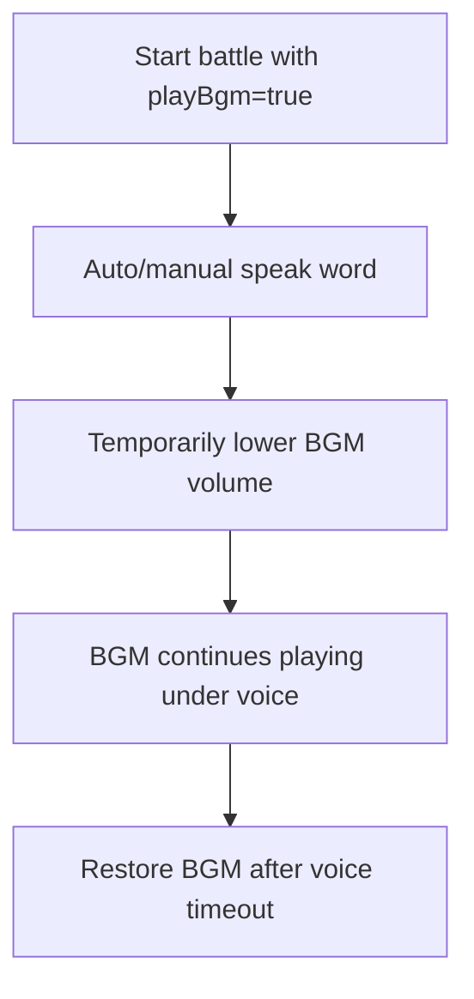
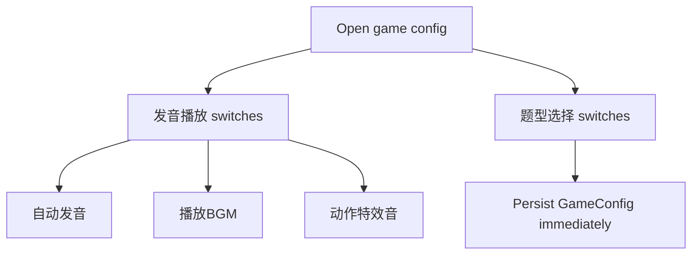
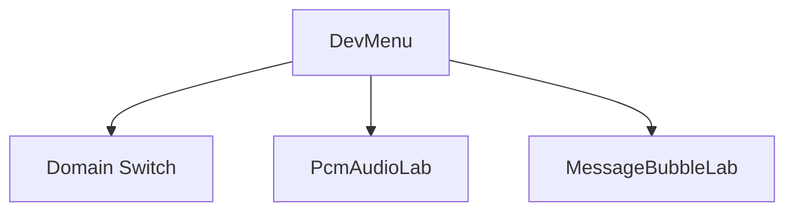

# PCM Audio Mixing V1.0.0 — Cross-Platform Design

> Feature ID: `2026-06-01-pcm-audio-v1-0-0`
> Status: `frozen`
> Owner: matianyi
> Last updated: 2026-06-01

This document is the platform-neutral source of truth for replicating the HarmonyOS V1.0.0 PCM audio behavior and related configuration UI to iOS and Android. HarmonyOS implementation details are captured in [`docs/superpowers/specs/2026-05-30-v1-0-0-audio-lab-design.md`](../../superpowers/specs/2026-05-30-v1-0-0-audio-lab-design.md) and [`docs/superpowers/plans/2026-05-30-v1-0-0-audio-lab.md`](../../superpowers/plans/2026-05-30-v1-0-0-audio-lab.md).

## 1. Motivation

The old battle audio path let pronunciation playback interrupt or stop BGM. V1.0.0 replaces stop/resume coordination with a PCM-owned mixing route so voice, BGM, and action SFX can overlap predictably during battle.

## 2. Goals

- Battle voice playback must not stop BGM.
- BGM is optional and controlled by `GameConfig.playBgm`, default `false`.
- Voice, BGM, and action SFX settings are visible as three switches on the configuration page.
- Question type selection uses switch controls instead of selected chips.
- Developer audio lab exists as `PcmAudioLab` and does not expose a System TTS switch.
- Configuration UI follows the settled Harmony style for switch color, alignment, grouping, and parent action buttons.

## 3. Non-Goals

- No new game rules, scoring changes, or content changes.
- No reintroduction of direct System TTS playback in battle or debug lab.
- No server or shared-contract changes.
- No cross-platform redesign. iOS and Android copy Harmony semantics.

## 4. User Flows







## 5. Stable Test IDs

Every ID listed here must be implemented verbatim where the platform has the corresponding surface.

| ID | Where it lives | Purpose |
| --- | --- | --- |
| `ConfigAutoSpeakSwitch` | Config page | Toggle automatic pronunciation. |
| `ConfigPlayBgmSwitch` | Config page | Toggle battle BGM. |
| `ConfigActionSfxSwitch` | Config page | Toggle action SFX. |
| `ConfigQuestionType_<typeId>` | Config page | Toggle one question type. Type IDs match platform question-kind ids. |
| `ConfigParentPinButton` | Config page | Parent PIN setup/edit button, uses learning-record blue style. |
| `ConfigCloudSyncButton` | Config page | Learning record sync button, source style for parent action buttons. |
| `ConfigParentAdminButton` | Config page | Parent admin entry, uses learning-record blue style. |
| `DevMenuDomainSwitchButton` | Dev menu | Opens Domain Switch page. |
| `DevMenuAudioLabButton` | Dev menu | Opens `PcmAudioLab`. |
| `DevMenuMessageBubbleLabButton` | Dev menu | Opens MessageBubbleLab. |
| `PcmAudioLabTitle` | Debug audio lab | Confirms PCM-only lab title. |

## 6. Domain Rules

```text
battleAudioConfig:
  masterVolume = 1.0
  musicVolume = 0.32
  musicLoweredVolumeWhileVoice = 0.50
  sfxDuringVoiceVolume = 0.35
  resumeMusicAfterVoice = false

onBattleEnter(config):
  if config.playBgm:
    startMusicLoop(volume=0.32)

onSpeak(word):
  if voiceDisabled:
    return
  if musicPlaying:
    setMusicVolume(0.50)
  synthesizeAndPlayVoiceAsPcm(word)
  after voice timeout:
    if musicPlaying:
      setMusicVolume(0.32)

onSfx(event):
  if config.actionSfx == false:
    return
  if voiceActive:
    playSfx(event, volume=0.35)
  else:
    playSfx(event, normalVolume)
```

Question type switches must preserve the invariant that at least one type remains enabled.

## 7. Persistence and Migration

| Key | Type | Default | Migration from older snapshot |
| --- | --- | --- | --- |
| `GameConfig.autoSpeak` | boolean | `true` | Missing value backfills to `true`. |
| `GameConfig.playBgm` | boolean | `false` | Missing value backfills to `false`. |
| `GameConfig.actionSfx` | boolean | `true` | Missing value backfills to `true`. |
| `GameConfig.enabledQuestionTypes` | string array | platform default list | Missing/empty value sanitizes to at least one supported question type. |

## 8. Cross-Platform Contracts

None. This feature is client-only.

## 9. Edge Cases and Error Paths

- If BGM is disabled, speaking still plays voice and never attempts music start/resume.
- If action SFX is disabled, SFX calls are suppressed and must not lower BGM.
- Victory/defeat/win sequence SFX must not stop BGM.
- `System TTS` must not appear as a selectable backend.
- Config switch visual state must update immediately after tap.
- Parent action buttons (`家长密码`, `学习记录`, `管理后台`) share the same blue action style.
- Group spacing: options in one setting stay close; different setting groups use larger vertical gaps.

## 10. Telemetry / Logs

No new product telemetry required. Debug logs may be platform-local.

## 11. Accessibility / Localization

- Parent/config labels remain Chinese.
- Debug labels use `Domain Switch`, `PcmAudioLab`, and `MessageBubbleLab` to match Harmony.
- iOS uses `accessibilityIdentifier`; Android uses Compose `testTag`.

## 12. Open Questions

None.

