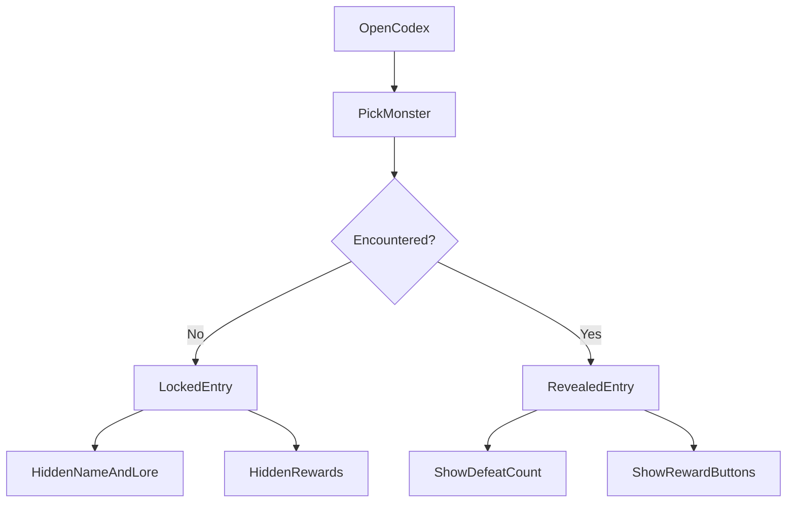
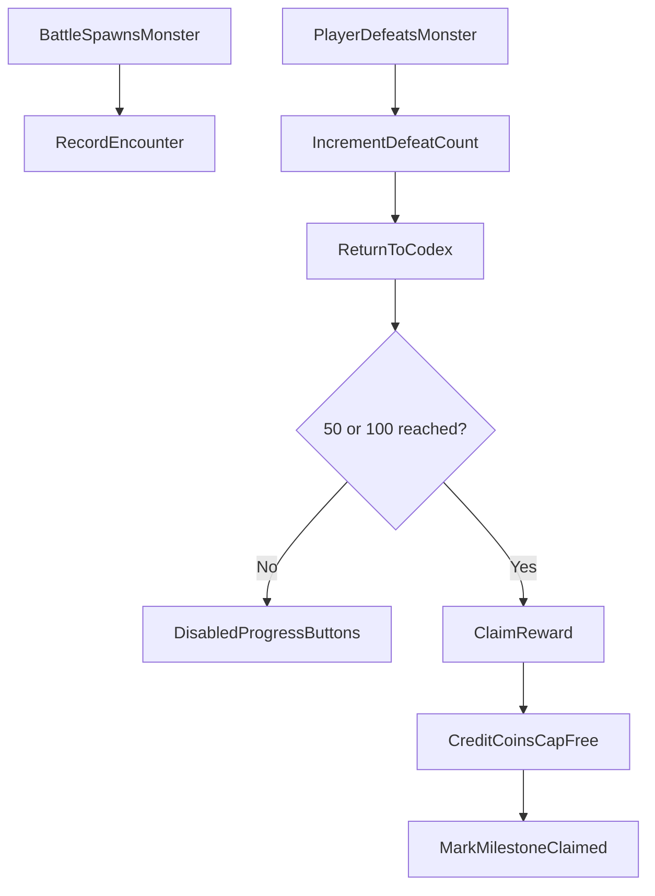

# Monster Codex Progress v1.0.2 — Cross-Platform Design

> Feature ID: `2026-06-05-monster-codex-progress-v1-0-2`
> Status: `ready-for-harmony`
> Owner: matianyi
> Last updated: 2026-06-05

This document is the platform-neutral source of truth for Monster Codex progress in v1.0.2. HarmonyOS implements first; iOS and Android replicate only after [`20-replication-trigger.md`](20-replication-trigger.md) is signed.

## 1. Motivation

The current Monster Codex shows all 100 monsters immediately, which removes discovery from the battle loop. The v1.0.2 codex turns the roster into a local collection: unknown monsters stay mysterious, encountered monsters reveal their lore, and repeated defeats create small coin milestones.

The first three monster display names also need to match the later Chinese bestiary voice. `Slime`, `Zombie`, and `Dragon` are renamed for display only; internal keys, assets, and catalog order stay stable.

## 2. Goals

- Hide unencountered monster images, names, kind labels, descriptions, defeat counts, and reward controls.
- Reveal an encountered monster immediately after it appears in battle, even if it is not defeated.
- Track per-monster defeat counts locally.
- Let each monster grant one 50-coin reward at 50 defeats and one 100-coin reward at 100 defeats.
- Allow catch-up claims: at 100 defeats, an unclaimed 50-defeat reward remains claimable.
- Keep reward claims cap-free and non-consuming.
- Rename the first three display names to `软泥小灵`, `书页僵僵`, and `云眠巨龙`.

## 3. Non-Goals

- No server sync for monster progress in this release.
- No new rewards beyond the 50 and 100 defeat milestones.
- No catalog reorder, asset key changes, or battle spawn rule changes.
- No redesign of the codex page beyond the new progress and reward states.

## 4. User Flows





## 5. Stable Test IDs (parity contract)

Every ID listed here must be implemented verbatim on all three platforms. Agents may not rename them per platform.

| ID | Where it lives | Purpose |
| --- | --- | --- |
| `CodexAvatar` | Monster image frame | Existing avatar image / mystery image lookup. |
| `CodexName` | Monster display name | Assert revealed vs masked name. |
| `CodexKindLabel` | Kind pill | Assert revealed vs masked kind label. |
| `CodexDescription` | Lore paragraph | Assert revealed vs masked lore. |
| `CodexPositionIndicator` | Position text | Existing `N / 100` indicator. |
| `CodexDefeatCount` | Defeat count row | Assert hidden before encounter and visible after encounter. |
| `CodexReward50Button` | 50-defeat reward button | Assert hidden, disabled, enabled, and claimed states. |
| `CodexReward100Button` | 100-defeat reward button | Assert hidden, disabled, enabled, and claimed states. |

Platform mapping reminder:

- HarmonyOS: ArkUI `.id('<ID>')` and the `findComponent` lookup used by ohosTest.
- iOS: SwiftUI `.accessibilityIdentifier("<ID>")`.
- Android: Compose `Modifier.testTag("<ID>")`; use `contentDescription` only when the same string also doubles as accessibility text.

## 6. Domain Rules

```text
function displayFor(entry, progress):
  if progress.encountered is false:
    return {
      assetPath: "character/monster-mystery-question.svg",
      name: questionMarks(countCharacters(entry.nameEn)),
      kindLabel: questionMarks(countCharacters(entry.kindLabelZh)),
      description: questionMarks(countCharacters(entry.descriptionZh)),
      showDefeatCount: false,
      rewardButtons: hidden
    }

  return {
    assetPath: entry.assetPath,
    name: entry.nameEn,
    kindLabel: entry.kindLabelZh,
    description: entry.descriptionZh,
    defeatCount: progress.defeatCount,
    rewardButtons: [
      rewardState(50, progress),
      rewardState(100, progress)
    ]
  }
```

```text
function rewardState(milestone, progress):
  if progress.claimedMilestones contains milestone:
    return disabled("已领 " + milestoneReward(milestone) + " 金币")

  if progress.defeatCount >= milestone:
    return enabled("领 " + milestoneReward(milestone) + " 金币")

  return disabled(milestoneReward(milestone) + " 金币 " + progress.defeatCount + "/" + milestone)

function milestoneReward(milestone):
  if milestone == 50: return 50
  if milestone == 100: return 100
```

```text
function recordEncounter(catalogIndex):
  record = getOrCreateRecord(catalogIndex)
  record.encountered = true

function recordDefeat(catalogIndex):
  record = getOrCreateRecord(catalogIndex)
  record.encountered = true
  record.defeatCount += 1

function claimReward(catalogIndex, milestone, coins):
  record = getOrCreateRecord(catalogIndex)
  if not record.encountered: return false
  if record.claimedMilestones contains milestone: return false
  if record.defeatCount < milestone: return false

  amount = milestoneReward(milestone)
  credited = coins.creditCapFree("monster-codex:" + milestone + ":" + catalogIndex, amount)
  if credited:
    record.claimedMilestones.add(milestone)
    save()
  return credited
```

Display name changes:

| Catalog index | Key | Display name |
| --- | --- | --- |
| 1 | `slime` | `软泥小灵` |
| 2 | `zombie` | `书页僵僵` |
| 3 | `dragon` | `云眠巨龙` |

## 7. Persistence and Migration

| Key | Type | Default | Migration from older snapshot |
| --- | --- | --- | --- |
| `monster_progress/snapshot_v1` | JSON string | `{"version":1,"records":[]}` | No older snapshot exists. |

Record schema:

| Field | Type | Default | Notes |
| --- | --- | --- | --- |
| `catalogIndex` | number | required | One-based index. Invalid indexes are ignored while parsing. |
| `encountered` | boolean | `false` | True once a monster appears or is defeated. |
| `defeatCount` | number | `0` | Clamped to non-negative integer. |
| `claimedMilestones` | number[] | `[]` | Allowed values: `50`, `100`; duplicates removed. |

CoinAccount must expose an explicit cap-free credit path for these rewards. It updates total coins and transaction history, but does not update `todayCoinsEarned`. Coin transactions use cap-free reasons:

- `monster-codex:50:<catalogIndex>`
- `monster-codex:100:<catalogIndex>`

## 8. Cross-Platform Contracts

None. This is local client state only. No server endpoints, shared fixtures, or OpenAPI contracts change.

## 9. Edge Cases and Error Paths

- Unencountered entries hide defeat count and reward controls even if a malformed snapshot contains claim data.
- Defeat records also mark encountered so a missed spawn event cannot leave a defeated monster locked.
- At 100 defeats, both 50 and 100 rewards can be claimed if neither was claimed earlier.
- Claimed milestones cannot be claimed twice.
- Reward claim updates progress only after cap-free coin credit succeeds.
- Invalid persisted records are ignored and do not crash the codex page.
- Locked string masking preserves source character counts.

## 10. Telemetry / Logs

No telemetry events. Implementations may log recoverable parse failures with platform-local debug messages, but no cross-platform event contract is introduced.

## 11. Accessibility / Localization

- The codex remains a child-facing Chinese UI.
- Locked entries should be announced as unknown: `未知怪物`.
- Reward buttons should expose their visible text to accessibility.
- Disabled reward buttons must remain readable and visually distinct from enabled claim buttons.

## 12. Open Questions

None.

## 13. References

- [`docs/superpowers/specs/2026-06-05-monster-codex-progress-v1-0-2-design.md`](../../superpowers/specs/2026-06-05-monster-codex-progress-v1-0-2-design.md)
- [`assets/screenshots/harmonyos/monster-codex-part1.png`](../../../assets/screenshots/harmonyos/monster-codex-part1.png)
- [`assets/screenshots/harmonyos/monster-codex-part2.png`](../../../assets/screenshots/harmonyos/monster-codex-part2.png)
- HarmonyOS page: [`harmonyos/entry/src/main/ets/pages/MonsterCodexPage.ets`](../../../harmonyos/entry/src/main/ets/pages/MonsterCodexPage.ets)
- HarmonyOS data: [`harmonyos/entry/src/main/ets/data/MonsterCodex.ets`](../../../harmonyos/entry/src/main/ets/data/MonsterCodex.ets)
