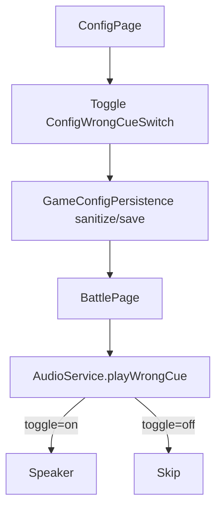

# Example Stable-ID Toggle — Cross-Platform Design

> Feature ID: `_example` (worked-through reference; not a real shippable feature)
> Status: `frozen`
> Owner: SOP authors
> Last updated: 2026-05-12

This is a **fully-populated example** of a Stage 1 design doc. It is intentionally small so the shape is easy to read. A real feature would have more flows and more domain rules.

## 1. Motivation

Parents currently cannot opt out of the optional sound-effect cue that plays when a battle answer is wrong. Some children find the cue startling. We add a single Config toggle that mutes the wrong-answer cue without affecting BGM, TTS pronunciation, or the player-hurt voice.

## 2. Goals

- One Config toggle persists "play wrong-answer cue" on/off; default on.
- Battle audio service reads the persisted value and skips the cue when off.
- All three platforms expose the same toggle and the same stable IDs.

## 3. Non-Goals

- Do not add per-effect volume sliders.
- Do not change BGM or TTS behavior.
- Do not add a master mute control.

## 4. User Flows



## 5. Stable Test IDs (parity contract)

| ID | Where it lives | Purpose |
| --- | --- | --- |
| `ConfigWrongCueRow` | ConfigPage row container | Locate the row in UI tests |
| `ConfigWrongCueSwitch` | Toggle inside the row | Read / set the value in UI tests |
| `ConfigWrongCueLabel` | Label text | Assert the localized label |
| `BattleWrongCueSkippedMarker` | Hidden marker view rendered when `playWrongCue` is asked to play but skipped because the toggle is off | Lets UI tests assert "we did not play the cue" without listening to audio |

Platform mapping reminder:

- HarmonyOS: ArkUI `.id('ConfigWrongCueSwitch')` and the `findComponent` lookup used by ohosTest.
- iOS: SwiftUI `.accessibilityIdentifier("ConfigWrongCueSwitch")`.
- Android: Compose `Modifier.testTag("ConfigWrongCueSwitch")`.

## 6. Domain Rules

```text
type GameConfig = {
  ...existing fields...
  playWrongCue: boolean   # default true
}

function AudioService.playWrongCue(cfg, audio):
  if cfg.playWrongCue:
    audio.play(WRONG_CUE_ASSET)
  else:
    emitSkipMarker()      # observable in UI tests via BattleWrongCueSkippedMarker
```

Sanitization on persistence load: any non-boolean value collapses to `true` (preserve existing behavior on upgrade).

## 7. Persistence and Migration

| Key | Type | Default | Migration from older snapshot |
| --- | --- | --- | --- |
| `playWrongCue` | `boolean` | `true` | Missing key on upgrade ⇒ `true` (current behavior). No snapshot version bump. |

## 8. Cross-Platform Contracts

None. This is a device-local setting; no server, no shared fixtures.

## 9. Edge Cases and Error Paths

- **Cold start with no persisted value** → default `true`.
- **Mid-battle toggle change** → next call to `playWrongCue` honors the new value; in-flight audio is not interrupted.
- **Persistence corruption** → sanitize to `true`.

## 10. Telemetry / Logs

None new.

## 11. Accessibility / Localization

- `ConfigWrongCueLabel`:
  - en: `Wrong-answer sound`
  - zh-CN: `答错音效`
- The toggle's `accessibilityLabel` is the localized label; `accessibilityHint` is `"On plays a sound when an answer is wrong"`.

## 12. Open Questions

None remaining.

## 13. References

- HarmonyOS audio service: `harmonyos/entry/src/main/ets/services/AudioService.ets`.
- HarmonyOS Config: `harmonyos/entry/src/main/ets/pages/ConfigPage.ets`, `harmonyos/entry/src/main/ets/services/GameConfigPersistence.ets`.
- Existing Config screenshots: `assets/screenshots/harmonyos/config-part1.png` … `config-part4.png`.
