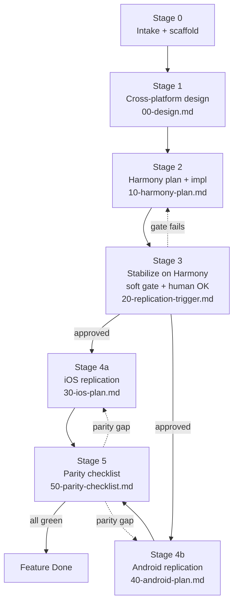

# Three-Platform Per-Feature SOP

> Status: active
> Audience: any coding agent (Cursor, Codex, Claude Code) and human owners
> Scope: every feature added *after* the initial HarmonyOS / iOS / Android baselines have all shipped
> Out of scope: the one-time bootstrap ports under [`docs/ios-replica/`](../ios-replica/) and [`docs/android-replica/`](../android-replica/)

This document is the single agent-followable Standard Operating Procedure for shipping any new product feature across all three native clients. It exists because the repo already has the primitives (specs, plans, contracts, fixtures, screenshots, command manifests, skills) but no documented loop that ties them together for ongoing per-feature work.

## 0. Mental model

Every feature is HarmonyOS-first. We design once, build and stabilize on HarmonyOS, then replicate to iOS and Android **in parallel** from a frozen design + delta letter. We do not redesign on the replica platforms.



## 1. Per-feature folder

Every feature lives in exactly one folder named `docs/features/<feature-id>/`, where `<feature-id> = YYYY-MM-DD-<kebab-slug>` (same convention as existing specs/plans, e.g. `2026-05-12-question-type-config`).

```text
docs/features/<feature-id>/
  00-design.md                # platform-neutral source of truth (Stage 1)
  10-harmony-plan.md          # Hypium / ohosTest task-by-task plan (Stage 2)
  20-replication-trigger.md   # gate evidence + delta letter (Stage 3)
  30-ios-plan.md              # XCTest / XCUITest plan (Stage 4a)
  40-android-plan.md          # JUnit / Compose UI / UI Automator plan (Stage 4b)
  50-parity-checklist.md      # H/iOS/Android matrix; all-green to be Done (Stage 5)
  60-followups.md             # optional: post-replication parity fixes
```

Templates live under [`docs/sop/templates/`](templates/). Stage 0 instructs the agent to copy them into the new feature folder.

## 2. Stages and gates

### Stage 0 — Intake

- [ ] Allocate `<feature-id>` (`YYYY-MM-DD-<kebab-slug>`).
- [ ] Copy every file from [`docs/sop/templates/`](templates/) into `docs/features/<feature-id>/`, dropping the `.template` segment in each filename.
- [ ] Add a row to [`docs/features/README.md`](../features/README.md) (id, slug, owner, current stage, link).
- [ ] Primary platform is HarmonyOS. This is a rule, not a per-feature choice.

### Stage 1 — Cross-platform design (`00-design.md`)

The design doc is the single source of truth. iOS and Android plans cite it; they do not redesign. The template enforces these sections:

- Motivation + non-goals.
- User flows (1 mermaid per non-trivial flow).
- **Stable test IDs** that all three platforms must implement verbatim. This is the parity contract for UI automation.
- Domain rules in pseudocode (platform-neutral).
- Persistence keys, migration steps, version-compat rules.
- `shared/contracts/` and `shared/fixtures/` touchpoints (new endpoints, new fields, fixture diffs).
- Edge cases / error paths.
- Telemetry / log events, if any.

Long-form HarmonyOS-only design notes can still live under [`docs/superpowers/specs/`](../superpowers/specs/); when they do, `00-design.md` cross-links to them rather than duplicating content.

### Stage 2 — Harmony implementation (`10-harmony-plan.md`)

Same shape as today's plans (e.g. [`docs/superpowers/plans/2026-05-11-question-type-config.md`](../superpowers/plans/2026-05-11-question-type-config.md)): task-by-task with `- [ ]`, citing files under `harmonyos/entry/src/main/ets/**` and tests under `harmonyos/entry/src/test/**` + `harmonyos/entry/src/ohosTest/**`.

Run loop:

- Use the existing scheduler skill: [`.cursor/skills/harmony-autofix-orchestrator/SKILL.md`](../../.cursor/skills/harmony-autofix-orchestrator/SKILL.md).
- All commands come from [`.cursor/ohos-dev-commands.md`](../../.cursor/ohos-dev-commands.md). Do not invent flags.
- Follow the TDD discipline that already governs the repo: write or update tests first.

### Stage 3 — Stabilization gate (`20-replication-trigger.md`)

This stage is the only gate that controls when iOS/Android can start. It has two layers and **both must pass** before Stage 4a/4b can begin.

#### 3.1 Soft gate (machine-checkable)

- [ ] `cd harmonyos && hvigorw -p module=entry@default test` green (no-device unit tests).
- [ ] `scripts/run_ui_tests.sh` green (`TestFinished-ResultCode: 0` and `OHOS_REPORT_CODE: 0`).
- [ ] `cd harmonyos && hvigorw assembleHap` produces **0** `ArkTS:WARN` lines (per [`.cursor/ohos-dev-commands.md`](../../.cursor/ohos-dev-commands.md) §1).
- [ ] `cd harmonyos && codelinter -c ./code-linter.json5 . --fix` clean.
- [ ] [`harmonyos/AppScope/app.json5`](../../harmonyos/AppScope/app.json5) `versionName` + `versionCode` bumped (current baseline at SOP authoring time: `0.6.7.8` / `1006016`).
- [ ] Feature merged to main.
- [ ] Screenshots refreshed under `assets/screenshots/harmonyos/` via `python3 scripts/capture_harmony_screenshots.py` for every screen the feature visibly changed.
- [ ] If the server contract changed: `cd server && uv run python ../tools/contracts/export_openapi.py` regenerated [`shared/contracts/openapi/`](../../shared/contracts/openapi/), `uv run pytest tests/test_shared_contracts.py -q` is green, and any updated [`shared/fixtures/`](../../shared/fixtures/) entries are committed.

#### 3.2 Human-confirm gate

The human owner reads the soft-gate evidence and the delta letter, then signs the bottom of `20-replication-trigger.md`:

```yaml
approved_by: <name>
approved_at: <ISO date, e.g. 2026-05-12>
replication_approved: true
```

**Without this signature block, iOS/Android agents must refuse to start Stage 4.** This is enforced by the SOP, by [`.cursor/skills/three-platform-feature-orchestrator/SKILL.md`](../../.cursor/skills/three-platform-feature-orchestrator/SKILL.md), and by the agent guides in [`AGENTS.md`](../../AGENTS.md) and [`CLAUDE.md`](../../CLAUDE.md). It is intentionally not enforced by code; the human read is the point.

#### 3.3 Delta letter

`20-replication-trigger.md` also carries a "delta letter" to iOS/Android agents:

- Files / services / models added or changed on Harmony.
- New persistence keys + migration semantics.
- Stable IDs introduced (cross-link to `00-design.md`).
- Edge cases discovered during stabilization that the design didn't predict.
- Tests that require parity counterparts on iOS and Android.
- Pitfalls / "do not repeat my mistakes" notes.

If the delta letter materially changes the contract, update `00-design.md` first, then summarize the diff in the trigger.

### Stage 4a — iOS replication (`30-ios-plan.md`)

- Reads `00-design.md` + `20-replication-trigger.md`. Does not redesign.
- Task-by-task; each task names files under `ios/WordMagicGame/...` and tests under `WordMagicGameTests/` + `WordMagicGameUITests/`.
- All commands come from [`.cursor/ios-dev-commands.md`](../../.cursor/ios-dev-commands.md).
- Stable IDs from the design doc become `accessibilityIdentifier` strings on SwiftUI views.
- Bumps `CFBundleShortVersionString` / `CFBundleVersion` in `ios/project.yml` (and regenerated `Info.plist`) to track HarmonyOS `versionName` / `versionCode`.

### Stage 4b — Android replication (`40-android-plan.md`)

Symmetric to iOS:

- Reads design + trigger; does not redesign.
- Task-by-task under `android/app/src/main/...`, tests under `app/src/test/` + `app/src/androidTest/`.
- All commands come from [`.cursor/android-dev-commands.md`](../../.cursor/android-dev-commands.md).
- Stable IDs become `Modifier.testTag(...)` on Compose nodes (and `contentDescription` where it doubles as a11y signal).
- `versionName` / `versionCode` in `android/app/build.gradle.kts` track HarmonyOS.

iOS and Android plans **run in parallel**, each in its own git worktree. No platform may consume mid-flight changes from the other; both consume only the frozen `00-design.md` + signed `20-replication-trigger.md`.

### Stage 5 — Parity checklist (`50-parity-checklist.md`)

A single matrix per feature. Rows are parity items: user flows, stable IDs, pure-rule tests, contract usage, screenshots. Columns are Harmony / iOS / Android (`[ ]` / `[x]`).

The feature is **Done** only when every row is all-green. A row that goes red after Done reopens the feature via `60-followups.md`; do not silently fix-and-close.

Screenshot parity rule: every visibly-changed screen must end with a refreshed PNG in all three of `assets/screenshots/{harmonyos,ios,android}/`. The SOP does not require pixel diff; it requires presence and an owner-readable visual match.

## 3. Maintenance rules

- A bugfix that *changes shared semantics* (rules, IDs, contracts, persistence) reopens the parity checklist for affected rows and gets a `60-followups.md` entry. It does **not** create a new feature folder.
- A bugfix that is platform-local (e.g. a Harmony-only ArkTS warning, an Android-only Compose recomposition fix) does not trigger replication and does not need a feature folder.
- Server contract changes always run [`tools/contracts/check_contracts.py`](../../tools/contracts/check_contracts.py) before the gate. Both Stage 4 plans must consume the regenerated contract.
- Asset retention policy from [`AGENTS.md`](../../AGENTS.md) (Asset retention policy) continues to apply; this SOP does not override it. Never delete unused images / audio / SVGs — move them under `assets/`.
- HarmonyOS version names are the product release source of truth (`harmonyos/AppScope/app.json5`). Starting with the PCM audio release, the cadence has crossed to `1.0.0`; iOS and Android mirror the same `versionName`, and their `versionCode` / `CFBundleVersion` are integers that the per-platform plan computes deterministically (the templates show how).

## 4. What an agent should do at the start of any task

The orchestrator skill walks the agent through the right entry point automatically; the human-readable rule is:

1. If the task description names a feature folder, read `docs/features/<feature-id>/` and pick the lowest-numbered file that still has unchecked `- [ ]` items. That is the current stage. Continue from there.
2. If the task is to start a new feature, run Stage 0.
3. If the task is "replicate feature X to iOS / Android", verify `20-replication-trigger.md` carries the signature block. If missing, refuse and ask the human owner. Do not start Stage 4 work.
4. If the task is a bugfix on an already-done feature, read `50-parity-checklist.md` to decide whether the fix changes shared semantics. If it does, re-open the relevant rows and write `60-followups.md` first.
5. Whichever stage you are in, your build / test / lint commands come from the per-platform manifest, not from your memory:
   - Harmony: [`.cursor/ohos-dev-commands.md`](../../.cursor/ohos-dev-commands.md)
   - iOS: [`.cursor/ios-dev-commands.md`](../../.cursor/ios-dev-commands.md)
   - Android: [`.cursor/android-dev-commands.md`](../../.cursor/android-dev-commands.md)

## 5. What this SOP does not do

- It does not add new scripts. The repo's existing tooling (hvigorw, codelinter, hdc, xcodebuild, gradlew, capture script, contracts exporter) is sufficient.
- It does not auto-enforce the human-confirm signature; the agent guides + orchestrator skill instruct agents to refuse Stage 4 without it.
- It does not move existing files under `docs/superpowers/{specs,plans}/`. Long-form specs stay where they are; the per-feature folder cross-links rather than duplicates.
- It does not replace the bootstrap docs under `docs/{ios,android}-replica/`. Those remain the V0.6.7.8 one-time port reference.

## 6. Worked example

A pre-filled example is at [`docs/features/_example/`](../features/_example/). Read it as a reference for what a fully populated feature folder looks like, including a signed Stage 3 and an all-green Stage 5.
