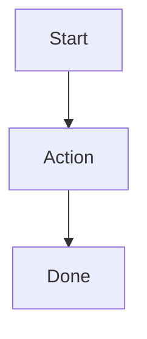

# <Feature Name> — Cross-Platform Design

> Feature ID: `<YYYY-MM-DD-kebab-slug>`
> Status: `draft` | `ready-for-harmony` | `frozen`
> Owner: <name>
> Last updated: <ISO date>

This document is the platform-neutral source of truth for this feature. HarmonyOS, iOS, and Android plans cite it; they do not redesign. Long-form HarmonyOS-only design notes (if needed) live under [`docs/superpowers/specs/`](../../superpowers/specs/) and are cross-linked here.

## 1. Motivation

<2-4 sentences explaining the user problem and why the existing product does not solve it.>

## 2. Goals

- <Goal 1>
- <Goal 2>

## 3. Non-Goals

- <Non-goal 1>
- <Non-goal 2>

## 4. User Flows

> One mermaid diagram per non-trivial flow. Keep node IDs camelCase or snake_case (no spaces).



## 5. Stable Test IDs (parity contract)

Every ID listed here must be implemented verbatim on all three platforms. Agents may not rename them per platform.

| ID | Where it lives | Purpose |
| --- | --- | --- |
| `<ExampleId>` | <screen / dialog / chip> | <what UI automation asserts> |

Platform mapping reminder:

- HarmonyOS: ArkUI `.id('<ID>')` and the `findComponent` lookup used by ohosTest.
- iOS: SwiftUI `.accessibilityIdentifier("<ID>")`.
- Android: Compose `Modifier.testTag("<ID>")`; use `contentDescription` only when the same string also doubles as accessibility text.

## 6. Domain Rules

> Pseudocode in a platform-neutral style (TypeScript-flavored is fine). The point is to specify behavior; the per-platform plan converts it to ArkTS / Swift / Kotlin.

```text
function decideX(input):
  if condition:
    return A
  else:
    return B
```

State transitions, RNG seeds, and clamp ranges go here. List defaults explicitly.

## 7. Persistence and Migration

| Key | Type | Default | Migration from older snapshot |
| --- | --- | --- | --- |
| `<persistenceKey>` | `<type>` | `<value>` | <none / how to backfill> |

Note any snapshot-version bump that the persistence layer performs.

## 8. Cross-Platform Contracts

If this feature touches the server or shared fixtures, fill in here. If not, write `None.`

- New / changed endpoints: <list>
- Schema additions: <list, with field types>
- Fixture diffs under [`shared/fixtures/`](../../../shared/fixtures/): <list>
- Regenerate: `cd server && uv run python ../tools/contracts/export_openapi.py`
- Verify: `cd server && uv run pytest tests/test_shared_contracts.py -q`

## 9. Edge Cases and Error Paths

- <Empty state>
- <Network failure>
- <Permission denied>
- <Migration from old data>
- <Concurrency / race>

## 10. Telemetry / Logs

If the feature emits new log lines or events, list their stable strings here so all three platforms emit identical ones.

| Event | Trigger | Fields |
| --- | --- | --- |

## 11. Accessibility / Localization

- Required `accessibilityLabel` strings (cross-platform).
- Languages: English first; Chinese label if the screen is parent-facing in zh-CN per existing product decisions.

## 12. Open Questions

- <Q1>
- <Q2>

## 13. References

- HarmonyOS source pages this feature touches.
- Existing specs that this design extends or supersedes.
- Screenshots under `assets/screenshots/harmonyos/` that establish the visual baseline.
