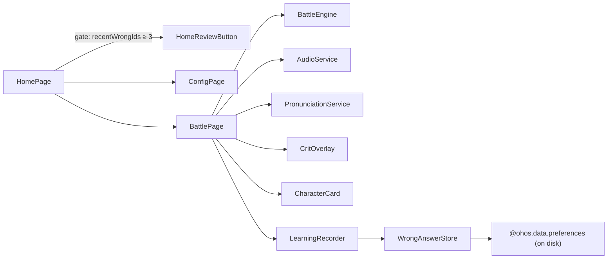

# WordMagicGame V0.2 — Feedback, Pronunciation, Learning Record, Review Mode

- **Date:** 2026-04-24
- **Branch target:** `cursor/wordmagic-t2-t4-skeleton`
- **Status:** Design-for-implementation, authored alongside the T9–T16 plan

## 1. Scope snapshot

V0.2 delivers the four spec §15 "后续" tracks that were deferred from
V0.1, on top of the existing combat / engine / config skeleton:

- **Track A — Feedback polish & crit spectacle.** Audio on every
  correct/wrong/victory/defeat outcome, player-nudge and monster-hurt
  animations for normal hits, and a dedicated crit layer that is
  visibly (and audibly) more powerful than a normal attack.
- **Track B — English pronunciation.** TTS-driven auto-play when each
  new question appears, plus a tap-to-replay speaker button next to
  the Chinese prompt. A `GameConfig.autoSpeak` toggle lets the player
  silence auto-play while keeping the speaker button.
- **Track C — Local learning record.** Per-word seen / correct / wrong
  / last-answered-ms persisted to disk via `@ohos.data.preferences`,
  surviving app-kill. The result page adds a "本局新学 N, 累计 M" footer
  so the player sees forward progress.
- **Track D — Wrong-answer review mode.** A second primary button on
  HomePage that is enabled only after the player has accumulated at
  least three distinct wrong answers in the recent window, and which
  launches a shorter (3-monster, 120 s) battle sourced from those
  wrong-answer IDs.

All other engine behavior (`BattleEngine`, `BattleState`, combo math,
reveal timing) is unchanged.

## 2. Architecture



### 2.1 New services

| Service | File | Responsibility |
|---|---|---|
| `AudioService` | `services/AudioService.ets` | One preloaded `AVPlayer` per SFX key, idempotent `prepare`, per-key mute-on-failure so a broken asset can't wedge the whole service. Replays on every `play(key)` by calling `reset→prepare→play`. |
| `PronunciationService` | `services/PronunciationService.ets` | Wraps `@kit.CoreSpeechKit` TTS. `speak(word)` cancels any in-flight utterance, `isAvailable` stays `false` on engine-create failure so the speaker button tap path is a silent no-op. |
| `WrongAnswerStore` | `services/WrongAnswerStore.ets` | Single-preference (`wordmagic_learning`) JSON-encoded snapshot with a `version` field. Abstracted behind a `StringPreferencesLike` interface so unit tests can inject an in-memory fake under ArkTS strict mode. |
| `LearningRecorder` | `services/LearningRecorder.ets` | In-memory snapshot + 100 ms debounced writes through `WrongAnswerStore`. API: `recordAnswer(wordId, correct)`, `recentWrongIds(limit)`, `newlyLearnedCount`, `totalLearnedCount`, `beginSession()`, `flushNow()`. |

### 2.2 New component

`components/CritOverlay.ets` is a self-contained `@Component` driven
by a single `@Prop @Watch critPulse: number` in `BattlePage`. When
`critPulse` ticks it runs three opacity/translate/scale animations in
parallel:

1. Full-bleed gold flash layer (`#FFB400`, opacity 0 → 0.55 → 0 over
   ~450 ms).
2. Big `-${damage}!` damage number (`id('CritDamageNumber')`, 72 vp)
   over the monster card, `translateY(0 → -60)` + `opacity(0 → 1 → 0)`
   + `scale(0.6 → 1.2 → 1.0)` over ~700 ms.
3. `CritCastGlow` golden ring on the player card (`id('CritCastGlow')`)
   that holds for ~500 ms, longer and more theatrical than the T10
   normal-hit nudge.

To keep Hypium's `visible:true` matcher stable, `CritGoldFlash` and
`CritDamageNumber` are always mounted — opacity (not conditional
mounting) drives the visual hide/show, so their IDs are present in
the component tree throughout the animation and on rest.

### 2.3 Extended component: `CharacterCard`

`CharacterCard` gains four new `@Prop @Watch` pulse counters. Each
counter's `onChange` callback runs an `animateTo` sequence locally so
`BattlePage` only has to increment the right counter on each outcome:

| Prop | Trigger | Animation |
|---|---|---|
| `hurtPulse` | correct answer on monster card | 150 ms scale 1.0 → 0.95 → 1.0 + red flash overlay |
| `nudgePulse` | correct answer on player card (non-crit) | 120 ms translateX 0 → 6 → 0 forward nudge |
| `zoomPulse` | crit answer on monster card | 220 ms ease-out scale to 1.12, 120 ms hold, 160 ms return |
| `castPulse` | crit answer on player card | 500 ms rotate + scale + golden glow ring |

## 3. Data model additions

### 3.1 `models/GameConfig.ets`

```ts
export const GAME_MODE_NORMAL: string = 'normal';
export const GAME_MODE_REVIEW: string = 'review';

export class GameConfig {
  // ... existing V0.1 fields (playerHp, monsterHp, monstersTotal,
  //     startingSeconds, enabledCategories, customWords) ...
  autoSpeak: boolean = true;
  mode: string = 'normal';
}
```

`cloneGameConfig` copies both new fields. `BattlePage.aboutToAppear`
reads `mode` to branch between normal and review-pool construction.

### 3.2 `models/SessionResult.ets`

```ts
export class SessionResult {
  // ... existing V0.1 fields ...
  newlyLearnedCount: number = 0;   // answered >= 1 correct this session
  totalLearnedCount: number = 0;   // cumulative across all sessions
}
```

These feed the `ResultPage` footer row.

### 3.3 `services/WrongAnswerStore.ets` schema

```ts
export class WordStat {
  wordId: string = '';
  seenCount: number = 0;
  correctCount: number = 0;
  wrongCount: number = 0;
  lastAnsweredMs: number = 0;
}

export class LearningSnapshot {
  version: number = 1;
  stats: WordStat[] = [];
}
```

Serialized into the single preference key `wordmagic_learning` as
JSON. `parseSnapshot` accepts malformed or missing strings and
returns an empty snapshot so a storage corruption can't brick the
app. `version` is reserved for future migrations.

## 4. Crit spectacle — the headline visual beat

The five visual / audio layers below stack on top of the existing
combo-burst feedback text (`连击 3! 魔法爆发 ×2`):

1. **Gold screen flash** (`CritGoldFlash`) — a full-bleed `Stack`
   layer at `backgroundColor('#FFB400')`, `opacity 0 → 0.55 → 0` over
   ~450 ms. Big enough to be unmistakably different from the normal
   hit feedback, short enough not to block option interactions.
2. **Big floating damage number** (`CritDamageNumber`) — 72 vp
   `-${outcome.damage}!` `Text`, animated `translateY(0 → -60)` +
   `opacity(0 → 1 → 0)` + `scale(0.6 → 1.2 → 1.0)` over ~700 ms. The
   damage is read straight from `AnswerOutcome.damage`, so it's
   always correct (normally `2` for a crit).
3. **Slow zoom on monster card** — `CharacterCard.zoomPulse`
   triggers a 220 ms zoom to 1.12, 120 ms hold, 160 ms return. The
   slower-than-normal ease-out sells the "big hit" feel.
4. **Distinct magic-burst sound** — `AudioService.play('hit_crit')`
   while normal hits stay on `hit_normal`. If the `hit_crit` asset
   fails to prepare, the service falls back to a silent no-op key so
   the visual layers still land.
5. **Extended player casting animation** — `CharacterCard.castPulse`
   holds a rotate + scale + golden glow for 500 ms on the player
   card. Clearly longer and more theatrical than T10's nudge so a
   child immediately reads "this was a big one".

`BattlePage.onOptionTap` checks `outcome.comboTriggered`:

- When `true`, fire `critPulse++`, `castPulse++`, `zoomPulse++`, and
  `AudioService.play('hit_crit')`. Skip the normal-hit `hurtPulse`
  and `nudgePulse` so the two feedback paths don't overlap.
- When `false`, fire `hurtPulse++`, `nudgePulse++`, and
  `AudioService.play(outcome.correct ? 'hit_normal' : 'answer_wrong')`.

`FEEDBACK_MS` remains 650 ms — the new animations fit inside that
window with 150 ms of tail on the damage number. If a future
tuning pass extends any layer, bump to 900 ms and document in the
relevant commit.

## 5. Pronunciation auto-play & tap-to-replay

### 5.1 Service

`PronunciationService` initialises a `CoreSpeechKit` engine with
`{ language: 'zh-CN', person: 0 }` on first use (verified 2026-04 on
MatePad Air / HarmonyOS 6: `createEngine` rejects `'en-US'` with
`1002300003 "person not support!"`, even on real hardware; the zh-CN
engine transparently synthesises latin-script input in English, so we
hand raw English words to `speak()` unchanged). On engine-create
failure (emulator without TTS capability, Kit version mismatch),
`isAvailable` stays `false` and every `speak(word)` call is a silent
no-op. This lets the speaker button stay visible even when TTS is
unavailable so the layout doesn't shift mid-session.

### 5.2 Auto-play gating (`BattlePage`)

When a new `Question` is produced via `syncFromEngine`:

1. `this.currentWordId = q.wordId` and `this.lastAnswerWord = q.answer`.
2. If `GameConfig.autoSpeak && tts.isAvailable && !this.isInReveal`,
   call `tts.speak(q.answer)`. The reveal gate prevents the auto-play
   audio from overlapping the crit / normal-hit SFX — by the time the
   next question arrives, the feedback audio has finished.

### 5.3 Speaker button

`BattlePage.questionArea` renders a `Button('🔊')` with
`id('BattleSpeakerButton')` next to the Chinese prompt. Tap
handler calls `tts.speak(this.lastAnswerWord)`. The button is always
rendered so UI tests can find it regardless of TTS availability.

### 5.4 Config toggle

`ConfigPage` adds an `autoSpeakRow` builder between the timer row
and the category row with a single `✓ 自动朗读` toggle button
(`id('ConfigAutoSpeakToggle')`). `cloneGameConfig` carries the flag
back into AppStorage on Save.

> **Layout note:** adding `autoSpeakRow` pushes `ConfigSaveButton` and
> `ConfigCancelButton` below the viewport on a narrow landscape
> emulator. The shared UI-test helpers `openConfigAndApply` and
> `openCustomWordsAndSave` now issue a single `driver.swipe` from
> `y=1100` to `y=300` before looking for those buttons, which is
> idempotent when they're already in view.

## 6. Local learning record

### 6.1 `LearningRecorder` API

```ts
class LearningRecorder {
  init(ctx: common.UIAbilityContext): Promise<void>;
  beginSession(): void;
  recordAnswer(wordId: string, correct: boolean): void;
  recentWrongIds(limit: number): string[];
  get newlyLearnedCount(): number;
  get totalLearnedCount(): number;
  flushNow(): Promise<void>;
  clear(): Promise<void>;
}
```

- `init(ctx)` is called once from `EntryAbility.onCreate` and from
  `BattlePage.aboutToAppear` / `HomePage.aboutToAppear` as an
  idempotent safety net. It loads the snapshot from disk and populates
  the in-memory `Map<wordId, WordStat>`.
- `recordAnswer` updates the stat for `wordId`, stamps
  `lastAnsweredMs = Date.now()`, increments a private monotonic
  `recordSequence`, and schedules a 100 ms debounced flush. The
  sequence number is used as a tiebreaker in `recentWrongIds` so
  rapid-fire same-millisecond events sort deterministically.
- `beginSession()` captures the set of word IDs with `correctCount >= 1`
  at the start of a session so `newlyLearnedCount` can report "newly
  crossed the learned threshold this session" independently of
  `totalLearnedCount` (cumulative).
- `recentWrongIds(limit)` returns the most-recent `limit` distinct
  wordIds with `wrongCount >= 1` AND no subsequent correct answer
  inside the same window (`lastAnsweredMs` sort, `recordSequence`
  tiebreaker). A follow-up correct answer drops the word from the
  window so the review pool only contains *currently-wrong* items.

### 6.2 Wiring

| Caller | Call | Reason |
|---|---|---|
| `EntryAbility.onCreate` | `getLearningRecorder().init(this.context)` | Warm the snapshot before HomePage paints so `reviewEnabled()` has authoritative data. |
| `HomePage.onPageShow` | `refreshWrongCount()` | Re-evaluate the review gate every time the player returns to Home. |
| `BattlePage.aboutToAppear` | `init(ctx)` → `beginSession()` | Start a fresh session counter. |
| `BattlePage.onOptionTap` | `recordAnswer(wordId, outcome.correct)` | Single source of truth — fires on every answer, correct or wrong. |
| `BattlePage.navigateToResult` | `flushNow()` + enrich `SessionResult` with `newlyLearnedCount` / `totalLearnedCount` | Persist before leaving the page and surface per-session progress. |

### 6.3 ResultPage footer

`本局新学 ${newlyLearnedCount} 个词，已累计学过 ${totalLearnedCount} 个`
appears between the existing stat rows and the primary action button.

## 7. Wrong-answer review mode

### 7.1 HomePage gate

`HomePage` owns an `@State recentWrongCount: number` refreshed in
`aboutToAppear` and `onPageShow` via
`getLearningRecorder().recentWrongIds(REVIEW_WINDOW_SIZE).length`.
Two constants drive the gate:

- `REVIEW_MIN_WRONG_IDS = 3` — must have at least this many *current*
  wrong words to unlock review.
- `REVIEW_WINDOW_SIZE = 12` — only the 12 most-recent wrong words
  contribute to the pool.

The `HomeReviewButton` renders always (disabled when
`recentWrongCount < REVIEW_MIN_WRONG_IDS`) with label
`复习错题 (${recentWrongCount})` when enabled, and `先答错几题再来复习吧`
when disabled.

### 7.2 Launching review

On tap, `enterReviewMode()`:

1. Clones the current `GameConfig` via `cloneGameConfig`.
2. Sets `cfg.mode = GAME_MODE_REVIEW`.
3. Writes back to `AppStorage[GAME_CONFIG_STORAGE_KEY]`.
4. Routes to `BattlePage`.

The normal start button goes through `enterNormalMode()` which does
the symmetric thing with `GAME_MODE_NORMAL`, so a previously-entered
review session can never leak into a subsequent "start" click.

### 7.3 BattlePage review branch

`BattlePage.aboutToAppear`:

```ts
this.isReviewMode = cfg.mode === GAME_MODE_REVIEW;
const universe: WordEntry[] = await this.loadWordUniverse(cfg);
const finalEntries: WordEntry[] = this.isReviewMode
  ? this.buildReviewPool(universe)
  : computeFinalPool(universe, cfg);

if (this.isReviewMode) {
  // Review-mode overrides documented in this spec §7.3.
  battleConfig.monstersTotal = REVIEW_MODE_MONSTERS_TOTAL; // 3
  battleConfig.startingSeconds = REVIEW_MODE_STARTING_SECONDS; // 120
}
```

`buildReviewPool` filters `universe` to the wordIds returned by
`recorder.recentWrongIds(REVIEW_WINDOW_SIZE)`, preserving their
recent-first ordering. If the intersection is empty (e.g., the
player cleared wrong words on another device), it falls back to the
normal `computeFinalPool` so the battle is never empty.

`BattlePage.navigateToResult` calls `resetModeToNormal()` right
before handing off `SessionResult`, so `mode` can never stay on
`review` after the session ends regardless of whether the outcome
was Win or Lost.

## 8. Assets

Placeholder OGG files were generated via `ffmpeg` during
implementation (sine-wave tones) and live at
`entry/src/main/resources/rawfile/sound/`:

- `hit_normal.ogg`
- `hit_crit.ogg`
- `answer_wrong.ogg`
- `monster_defeat.ogg`
- `victory.ogg`
- `defeat.ogg`

Final CC0 / MIT replacements are tracked as a V0.3 follow-up and
deliberately out of scope here — the placeholders exercise the
AudioService plumbing end-to-end.

## 9. Test plan

### 9.1 Unit tests (`entry/src/test/LocalUnit.test.ets`)

- `WrongAnswerStore` — JSON parse robustness (missing key, malformed
  JSON, old/new version), round-trip persistence through a
  `FakePreferences` adapter.
- `LearningRecorder` — `recordAnswer` updates `seenCount` / `correctCount`
  / `wrongCount`; `newlyLearnedCount` only grows on first-time learn;
  `totalLearnedCount` reflects cumulative learned words across
  sessions; `recentWrongIds` ordering is deterministic under
  rapid-fire same-millisecond events; a subsequent correct answer
  drops the word from the window; empty `wordId` is a no-op.

### 9.2 UI tests (`entry/src/ohosTest/ets/test/`)

- `CritSpectacle.ui.test.ets` — three consecutive correct taps reach
  `Combo: 0` (combo reset after crit). The spectacle visuals are
  exercised by the animation pipeline; Hypium's `visible:true`
  matcher proved unreliable for opacity-driven animated IDs, so the
  test asserts the behavioral invariant (`Combo: 0`) which can only
  be true after the crit triggered and reset.
- `SpeakerButton.ui.test.ets` — speaker button exists on BattlePage,
  is tappable twice back-to-back, and never mutates combo count,
  prompt text, or route.
- `ReviewMode.ui.test.ets` — review button starts disabled; after
  seeding three wrong answers in a default-config battle and
  returning home, the button becomes enabled; tapping it launches a
  battle with header text `Monster 1 / 3` (proving both `mode=review`
  and the 3-monster override fired).

All four suites share
`RoutingFlow.ui.test.ets::resetToDefaultConfigShared(driver)` to
neutralise state bleed from the prior
`configCustomWordsOnly_oneShotVictory` test (which leaves a 1-monster /
1-HP / custom-words config behind).

## 10. Risks & open calls

- **TTS availability.** `@kit.CoreSpeechKit` isn't guaranteed on every
  emulator image. Mitigation: silent no-op + always-visible speaker
  button + Config toggle so the player can disable auto-play entirely.
- **SFX asset licensing.** Placeholder OGGs are programmatically
  generated; final CC0 / MIT replacements are V0.3 follow-up work.
- **Preferences schema evolution.** `LearningSnapshot.version` is
  `1`; parser ignores unknown versions by returning an empty
  snapshot, so a future migration can deterministically upgrade.
- **UiTest visibility matching.** Opacity-driven animated components
  can flicker in and out of Hypium's `visible:true` set. Addressed
  by always mounting `CritGoldFlash` / `CritDamageNumber` and by
  asserting behavioral invariants (e.g. `Combo: 0`) instead of
  component presence in the crit spectacle test.
- **ConfigPage layout overflow.** Adding `autoSpeakRow` pushes the
  Save/Cancel buttons under the fold on narrow landscape emulators.
  Addressed with a one-shot `driver.swipe` in the shared helpers;
  the app-side Scroll container handles the user flow organically.

## 11. References

- [docs/WordMagicGame_overall_spec.md](../../WordMagicGame_overall_spec.md) §4.3 (combat feedback), §7.3 (service/component inventory), §15 (V0.2 roadmap).
- [.cursor/plans/wordmagic_v0.2_plan_2a515cfc.plan.md](../../../.cursor/plans/wordmagic_v0.2_plan_2a515cfc.plan.md) — the T9–T16 execution plan this design implements.
- [docs/superpowers/specs/2026-04-23-config-page-design.md](./2026-04-23-config-page-design.md) — ConfigPage baseline that `autoSpeakRow` and `mode` extend.
