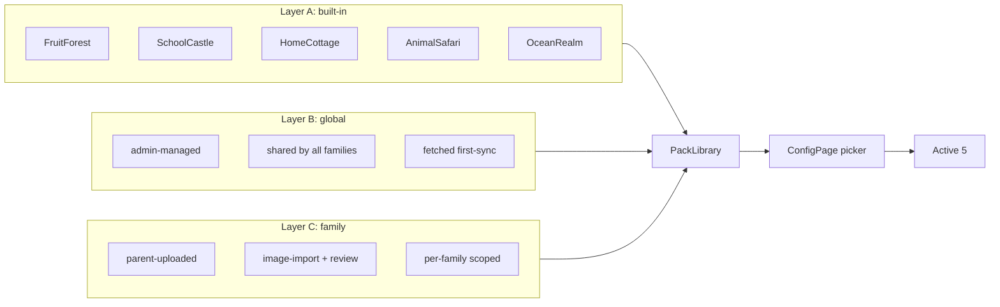
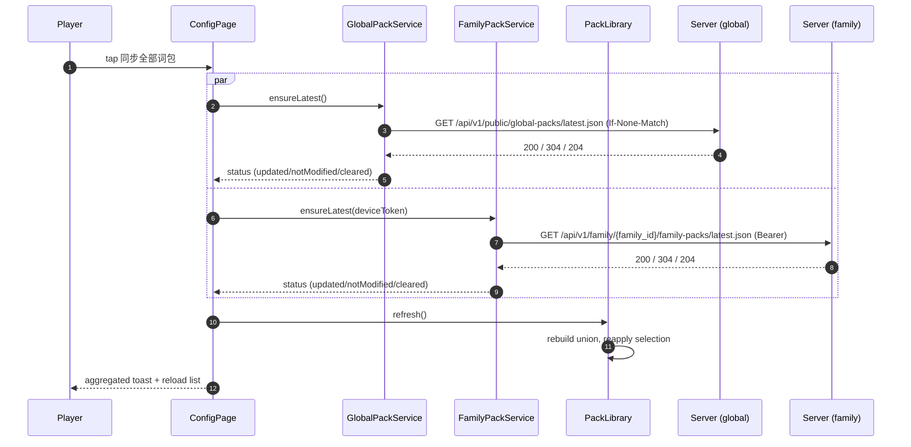

# V0.6.5 Three-layer Pack Model Design

- **Date:** 2026-05-09
- **Status:** Design-for-implementation
- **Roadmap:** V0.6.5 client minor release; no breaking server change.
- **Branch:** `cursor/v0.7-pack-layers` (created off `origin/main` 53fc587 before the version bump conversation; rename to `cursor/v0.6.5-pack-layers` is optional and non-blocking).
- **Primary goal:** Make every "battle scene" a first-class **Pack** sourced from one of three layers (built-in / global / family), let users pick up to 5 active packs with optional pin and 3-perfect-run auto-rotation, and decommission the legacy single-`WordRepository` pipeline that lets server test words leak into Today mode.

## 1. Background

### 1.1 Three concepts that secretly conflict today

The HarmonyOS client currently treats three concepts as decoupled, but they all point at the same domain object:

| Surface | What it does today | Where the data lives |
| --- | --- | --- |
| ConfigPage **词库类别** chips | Writes `GameConfig.enabledCategories`. `computeFinalPool` filters `repo.all()` by these categories at battle time (Normal / Review modes only). | Hardcoded `KNOWN_CATEGORIES = ['fruit','place','home']` + `'custom'` in [entry/src/main/ets/models/GameConfig.ets](entry/src/main/ets/models/GameConfig.ets). |
| ConfigPage **词包同步** button | `WordPackSyncService.syncOnce()` fetches `/api/v1/public/packs/latest.json` (one mega-pack of every global word) and writes it verbatim into `WordPackCache`. | `wordmagic_word_pack` preferences slot. Cold start uses this if `>= 3` valid words. |
| HomePage **可选战斗场景** chip row | Writes `TODAY_REGION_ID_KEY`. `TodayAdventureBuilder.gatherCandidates(region, repo)` filters by `region.themeWordCategories`. | Hardcoded 5 `AdventureRegion`s in [entry/src/main/ets/data/AdventureCatalog.ets](entry/src/main/ets/data/AdventureCatalog.ets), categories `['fruit','place','home','animal','ocean']`. |

The three category sets disagree: ConfigPage knows about 3 categories, HomePage knows 5, the synced pack can carry any string. The `enabledCategories` filter is silently bypassed in Today mode, while `gatherCandidates` silently falls back to `repo.all()` when its theme categories miss — which is precisely how a player who picked Fruit Forest after syncing a polluted preview pack ends up answering questions about words like `w-e2e-<run>-pack-1` (category `test`).

### 1.2 Asymmetric server pack model

The server has a clean, discrete multi-pack model for **family** packs (`FamilyPackDefinition`, `FamilyPackDraft`, `FamilyWordPack`, `FamilyPackPointer`, with parent CRUD at `/api/v1/family/{family_id}/family-packs/*` and child merged JSON at `/api/v1/family/{family_id}/family-packs/latest.json`). For **global** content the server still serves a single mega-pack at `/api/v1/public/packs/latest.json` produced by `pack_service.publish_pack(...)` — every published `Word` lands inside the one global snapshot regardless of category.

### 1.3 What the player should see

The player should see a library of discrete packs they can mix-and-match. Each pack is a coherent set of words with its own scene presentation. The player picks up to five packs to live on the home screen at any one time, with the option to pin packs they want kept around forever and a gentle auto-rotation that retires packs they have already mastered (3 perfect adventures) so newer packs cycle in.

## 2. Goals

- **G1.** Promote pack to a first-class entity, end the special status of the 5 hardcoded `AdventureRegion`s.
- **G2.** Source packs from three layers: built-in (rawfile), global (server-published, admin-managed), family (server-published, parent-managed).
- **G3.** Let the player pick exactly up to 5 active packs from the union of the three layers; render them as the home-page chip row.
- **G4.** Per-pack pin toggle; unpinned packs auto-rotate after 3 cumulative perfect adventures.
- **G5.** End the silent fallback in `TodayAdventureBuilder.gatherCandidates` so a missing-category region can never silently play another pack's words.
- **G6.** Reuse the family-pack server model for global packs (a reserved `family_id="__global__"` sentinel on `FamilyPackDefinition / FamilyPackDraft / FamilyWordPack / FamilyPackPointer`) so admin operations share the existing publish/draft/rollback machinery without duplicating any document type.
- **G7.** Backward-compatible for v0.6.x clients in the wild — the legacy `/api/v1/public/packs/latest.json` keeps working.

## 3. Non-Goals

- **NG1.** Pack reordering. The active row stays in insertion order until v0.6.6+.
- **NG2.** Cross-category global packs created by admin (the model supports it but no admin UI is shipped in v0.6.5).
- **NG3.** Migrating any v0.6.x clients off the legacy `/api/v1/public/packs/latest.json` endpoint.
- **NG4.** Cloud-syncing the active-set selection, pin state, or perfect-score counters. They are device-local and reset on app reinstall.
- **NG5.** Adding scene metadata (background colour, monster plan, boss rotation) to family packs. Family packs receive a default scene assigned client-side.
- **NG6.** Replacing the wishlist, parent admin console, lesson-import draft flow, or any V0.8 backoffice feature.

## 4. Decisions Confirmed

The brainstorming dialogue resolved the three plan-shape decisions:

- **Built-in content.** Ship animal + ocean rawfile words inside the HAP so all five default scenes are playable offline on a fresh install.
- **Server pack model.** Reuse `FamilyPackDefinition / FamilyPackDraft / FamilyWordPack / FamilyPackPointer` with a reserved `family_id="__global__"` sentinel; expose a thin `global_pack_service` wrapper and `GET /api/v1/public/global-packs/latest.json` as the global-read endpoint. No further conflation with `Category`, no duplicated document types.
- **Rotation rule.** A "perfect adventure" is one Today-mode adventure completed without a single wrong answer. Three cumulative perfect adventures (need not be consecutive) graduate an unpinned pack out of the active set. Replacements are pulled by FIFO of pack add-time. When the candidate pool is exhausted, the active set is frozen.

Version-bump decision (post-brainstorm): client release is **v0.6.5**, not v0.7.0. `versionName 0.6.1 -> 0.6.5`, `versionCode 1000000 -> 1000005`.

## 5. Pack Model

### 5.1 Three layers



The effective pack universe at runtime is the union of layers A + B + C, keyed by `pack_id`. Layer ownership rules:

- **Layer A (built-in)** ships in the HAP. Five packs, fixed ids (`fruit-forest`, `school-castle`, `home-cottage`, `animal-safari`, `ocean-realm`). Cannot be deleted; can be deactivated from the active set; cannot be edited.
- **Layer B (global)** is admin-managed via the new `/api/v1/admin/global-packs/*` API. All families see the same global packs. Cannot be deleted by users. Pulled on every "同步词包" tap.
- **Layer C (family)** is parent-managed via the existing `/api/v1/family/{family_id}/family-packs/*` API. Only visible to the device's bound family. Can be deleted from ConfigPage by the parent (existing server `DELETE` route is reused).

### 5.2 Pack identity

Same `pack_id` across layers means the same logical pack with override priority `family > global > builtin`. The migration script in M1 seeds the global layer with `pack_id`s `fruit-forest / school-castle / home-cottage / animal-safari / ocean-realm` so a published global revision overrides the built-in word list while keeping the built-in scene metadata.

### 5.3 Server data model — reuse FamilyPack stack

Global packs and family packs are operationally identical (CRUD + draft + publish + rollback + per-pointer current/previous). Per the field-alignment + DB-reuse directive, **v0.6.5 reuses the existing `FamilyPackDefinition / FamilyPackDraft / FamilyWordPack / FamilyPackPointer` documents verbatim** and discriminates global vs family by a reserved `family_id` sentinel:

```python
# server/app/services/family_pack_service.py
GLOBAL_PACK_FAMILY_ID: str = "__global__"
```

Properties of the sentinel:

- Not a valid `Family.id` (real ids are ObjectId hex strings; the underscore-padded sentinel cannot collide).
- `FamilyPackDefinition.pack_id` is already `Indexed(unique=True)`, so global pack ids cannot collide with family pack ids — no schema change there.
- Global pack ids use a distinct prefix (`gpk-...` vs family `fpk-...`) so the source layer is recognizable on inspection.

Two small additive changes to `FamilyPackDefinition` (no breaking change for v0.6.4 family packs because both new fields default to empty):

```diff
 class FamilyPackDefinition(Document):
     pack_id: Annotated[str, Indexed(unique=True)]
     family_id: Annotated[str, Indexed()]   # "__global__" for global packs
     name: str
+    description: str | None = None
+    scene: dict[str, Any] = {}             # bgPrimary/bgAccent/bossName/bossCandidates/monsterPlan/storyZh; empty for family packs
     state: FamilyPackState
     created_at: datetime
     updated_at: datetime
     archived_at: datetime | None = None
-    created_by_parent_id: str
+    created_by_parent_id: str              # for global packs: admin username
```

`FamilyWordPack`, `FamilyPackDraft`, `FamilyPackPointer` are reused with no schema change. The `published_by_parent_id / updated_by_parent_id` fields hold an admin identifier when `family_id == GLOBAL_PACK_FAMILY_ID`.

Service layer:

- `app/services/family_pack_service.py` — unchanged shape; one tiny extension is `MergedSlice` gains `description: str | None` and `scene: dict[str, Any]` so client wire payload can carry scene metadata.
- `app/services/global_pack_service.py` — new **thin wrapper** around `family_pack_service` that pins `family_id=GLOBAL_PACK_FAMILY_ID` and forces the `gpk-` id prefix in `_gen_pack_id`. It re-exports the same exception classes and merged-slice dataclass. The wrapper exists so admin callers never have to care about the sentinel and so future global-only behaviours (e.g. multi-admin approval workflow) have a divergence point.

```python
# server/app/services/global_pack_service.py (sketch)
from app.services import family_pack_service as fps

GLOBAL_PACK_FAMILY_ID = fps.GLOBAL_PACK_FAMILY_ID

async def create_definition(*, name, admin_id, description=None, scene=None, pack_id=None):
    return await fps.create_definition(
        family_id=GLOBAL_PACK_FAMILY_ID,
        parent_id=admin_id,
        name=name,
        description=description,
        scene=scene or {},
        pack_id=pack_id or _gen_global_pack_id(),
    )

async def collect_merged():
    # Reuses family_pack_service.collect_merged with the sentinel. Returns MergedSlice
    # objects whose `scene` field is populated for global packs and empty for family packs.
    return await fps.collect_merged(family_id=GLOBAL_PACK_FAMILY_ID)
```

Indexes and Beanie registration are untouched (the four collections are already in `init_beanie(...)`). The compound index on `(family_id, state, updated_at desc)` already serves the new admin list-query pattern (`family_id == GLOBAL_PACK_FAMILY_ID, state == ACTIVE`).

### 5.4 Client pack model

```typescript
// entry/src/main/ets/models/Pack.ets
export type PackSource = 'builtin' | 'global' | 'family';

export class SceneMetadata {
  bgPrimary: string = '#FFFFFF';
  bgAccent: string = '#FFFFFF';
  bossName: string = '';
  monsterPlan: MonsterPlan = new MonsterPlan();
  bossCandidates: number[] = [];
  storyZh?: string;
}

export class Pack {
  id: string = '';
  name: string = '';
  labelZh: string = '';
  source: PackSource = 'builtin';
  version: number = 0;
  publishedAtMs: number = 0;
  scene: SceneMetadata = new SceneMetadata();
  words: WordEntry[] = [];
}
```

`scene` carries everything the BattlePage needs (no more cross-referencing into a separate `AdventureRegion`). Scene resolution rules:

- Family packs have no server scene at all — `PackLibrary` assigns a default scene by hashing `pack_id` against a built-in palette `[FruitForest, SchoolCastle, HomeCottage]`.
- Global packs may publish a `scene` block in `latest.json`. When the field is absent (e.g. an older publish), `PackLibrary` first looks for a same-id built-in pack and inherits its scene; if no matching built-in exists, it falls back to the same hash-into-palette rule used for family packs.
- Built-in packs always carry a complete scene from their rawfile.

#### iOS replica parity note (2026-05-11)

The native iOS client must treat the HarmonyOS bundled rawfiles as the canonical built-in pack source. The five JSON files under `harmonyos/entry/src/main/resources/rawfile/data/builtin/` are copied byte-for-byte into the iOS app bundle and parsed by `BuiltinPackLoader`; Swift code must not recreate the built-in word list by hand.

Required built-in pack order and ids:

```text
fruit-forest
school-castle
home-cottage
animal-safari
ocean-realm
```

iOS `Pack` fields map from rawfile JSON as:

- `pack_id` -> `Pack.id`
- `name` -> English UI name / title
- `labelZh` -> Chinese subtitle / label
- `schema_version` -> `Pack.version`
- `scene.bgPrimary/bgAccent/bossName/bossCandidates/monsterPlan/storyZh` -> `SceneMetadata`
- `words[]` -> `WordEntry[]`

Battle startup on iOS must build a `WordRepository` from the selected `Pack.words` and feed a `QuestionGenerator` into `BattleEngine`. It must not generate `[answer, "moon", "star"]` or any other fixed fallback option set. Prompt text is the Chinese `meaningZh`; options are English words selected and shuffled by `QuestionGenerator`, with rawfile `distractors` preferred when present and category/global fallback otherwise.

## 6. Active Set & Rotation

### 6.1 Persistence shape

```typescript
// preferences slot: wordmagic_pack_selection
class PackSelection {
  schemaVersion: number = 1;
  activePackIds: string[] = [];          // length 0..5; defaults seeded on first launch
  pinnedPackIds: string[] = [];          // subset of activePackIds (and possibly stale ids)
  perfectScoresByPack: Record<string, number> = {};
}
```

Stored in a dedicated preferences bag `wordmagic_pack_selection` so it cannot collide with `wordmagic_word_pack` (legacy) or `wordmagic_family_packs`. Reset on app reinstall, per requirement. The in-memory representation in `PackSelectionService` may use `Map<string, number>` for the counter; persistence converts to/from a plain object.

### 6.2 First-launch defaults

```text
activePackIds = ['fruit-forest','school-castle','home-cottage','animal-safari','ocean-realm']
pinnedPackIds = []
perfectScoresByPack = {}
```

### 6.3 Perfect-adventure definition

A "perfect adventure" satisfies ALL of:

- `cfg.mode === GAME_MODE_TODAY` (Review and Normal modes are excluded so review-only practice never graduates a pack).
- The adventure ran to completion (BattlePage's existing "today completed" flag flipped on).
- The player did not register a single wrong answer in the adventure. The implementation reads a per-session wrong-answer count from `LearningRecorder` (existing `beginSession()` / per-question wrong increments). The plan task confirms the exact accessor and adds one if absent.

Player HP not consumed and combo unbroken are nice to have but not required — the bar is "no wrong answers". Strictly correct answers, including ones surfaced after the player taps Speak or uses any non-blocking aid, still count as correct.

### 6.3.1 Repo source per battle mode

`BattlePage` constructs the runtime `WordRepository` differently by mode:

- **Today mode (`mode === GAME_MODE_TODAY`).** Repo = words of the single pack named by `TODAY_REGION_ID_KEY`. `TodayAdventureBuilder` and `PlanQuestionSource` operate on that single-pack repo.
- **Review mode (`mode === GAME_MODE_REVIEW`).** Repo = union of words across every pack in `selection.activePackIds`. The recent-wrongs filter then narrows the set as today.
- **Normal mode (`mode === GAME_MODE_NORMAL`).** Repo = union of words across every pack in `selection.activePackIds`. Used only by legacy / dev-menu entry points; HomePage v0.6.5 does not surface a Normal-mode button.

The `computeFinalPool(repo.all(), enabledCategories, customWordsRaw)` helper from [entry/src/main/ets/models/GameConfig.ets](entry/src/main/ets/models/GameConfig.ets) is retired in v0.6.5 — `enabledCategories` and `customWordsRaw` no longer affect the pool. The function is removed; call sites switch to the per-mode repo construction described above.

### 6.4 Auto-rotation algorithm

Triggered on every battle end where the perfect predicate above passes. Pseudocode:

```text
on_perfect_adventure(packId):
  perfectScoresByPack[packId] += 1
  if pinnedPackIds.contains(packId):
    return                                  # pinned packs never rotate
  if perfectScoresByPack[packId] < 3:
    return
  candidate = next_inactive_pack()
  if candidate is None:
    return                                  # pool exhausted; freeze active set
  active_set.remove(packId)
  active_set.append(candidate.id)
  perfectScoresByPack[packId] = 0           # graduated; forget the count
```

`next_inactive_pack()` ordering is deterministic:

1. Compute `available = library.allPacks.filter(p => !active_set.contains(p.id))`.
2. Sort `available` by `(sourcePriority(family=0, global=1, builtin=2), -publishedAtMs, id ASC)` — i.e. lowest source priority value first, then newest `publishedAtMs` first, then `id` lexicographic.
3. Pick first; return `None` if `available` is empty.

Rationale for the sort order: brand-new family packs surface first (parent uploads should be felt immediately), then newest global packs (admin-published content), then unused built-ins (very rare given the seed). Built-in packs have `publishedAtMs = 0` so they always lose the timestamp tiebreak to anything published.

### 6.5 Pin semantics

- Toggling pin on an active pack is unconditional. Toggling pin on a non-active pack is a no-op (pin only matters for graduating-out).
- `pinnedPackIds` may temporarily include ids no longer present in the library (e.g. a deleted family pack); purged on next library refresh.
- Pinned packs still count perfect adventures, just never rotate out.

### 6.6 Pool exhaustion

If every library pack is in the active set or pinned, a graduating pack stays where it is and continues counting perfect adventures (no overflow / no panic). The next time a sync brings in a new global or family pack, the auto-rotation evaluates again on the next perfect adventure.

## 7. UI Surfaces

### 7.1 HomePage chip row

- Renders 1..5 chips in `selection.activePackIds` order.
- Each chip label: `pack.labelZh` if non-empty else `pack.name`.
- Chip badge: `📌` when pinned. The active chip carries the existing red-on-white selection style; non-active chips reuse today's outline style.
- Adventure card title + story bind to the selected pack (`pack.name` / `pack.scene.storyZh`).
- Below the chip row, a small text like `★ 2/3` appears when `perfectScoresByPack[id] >= 1`.

### 7.2 ConfigPage pack picker

The "词库类别" + "自定义词" + region-related rows are removed (one removal block in [entry/src/main/ets/pages/ConfigPage.ets](entry/src/main/ets/pages/ConfigPage.ets)). Replaced by a "战斗词包" section:

- Three subsections in order: **我的词包 (Family) / 系统词包 (Global) / 内置词包 (Built-in)**.
- Each row: pack name + 16-char description preview + source badge + word count.
- Row controls: `Active` switch (capped at 5 — toggling a 6th shows an inline hint and refuses), `📌 固定` toggle (only enabled when the row is Active), `🗑 删除` (Family rows only, hits `DELETE /api/v1/family/{family_id}/family-packs/{pack_id}`).
- A combined "同步全部词包" button at the top calls `GlobalPackService.ensureLatest()` and `FamilyPackService.ensureLatest(deviceToken)` in parallel, surfaces an aggregated toast, then invokes `PackLibrary.refresh()` so subsequent rows reflect new packs.

## 8. API Surface

### 8.1 Routing rules (project-wide convention introduced by v0.6.5)

All new HTTP surfaces in v0.6.5 (and onward) follow this three-way segmentation. Older endpoints are not renamed in this release — see §8.4 for the migration scope.

| Prefix | Audience | Auth | Notes |
|---|---|---|---|
| `/api/v1/admin/**` | System administrators | Admin auth via the existing `current_admin_user` FastAPI dependency (session-cookie based). v0.6.5 keeps this gate in place; a separate "long-lived admin token" surface is **deferred to a later version**. | New global-pack CRUD lives here; existing `/api/v1/admin/*` routes (admin_words / admin_packs / admin_lessons / etc.) already follow this pattern. |
| `/api/v1/public/**` | Anonymous (any caller) | None. Vercel deployment-protection still gates preview deploys; production is fully public. | `latest.json` feeds and any other content the client needs without a session — `preview-urls.json`, `global-packs/latest.json`, future AB-flag manifests, etc. |
| `/api/v1/family/{family_id}/**` | Members of one family (parents + bound child devices) | Per-family auth (parent session OR child Bearer device-token belonging to `family_id`). The auth dependency is **deferred to a later version**; v0.6.5 introduces this prefix as a convention only — no new endpoints land under it yet. | Future home for what currently lives at `/api/v1/family/{family_id}/family-packs/*` and `/api/v1/family/{family_id}/family-packs/*` (see §8.4). |

Rule of thumb when adding a new endpoint:

1. If the resource is per-family (or per-device-bound), use `/api/v1/family/{family_id}/...`.
2. Else, if it requires admin context (cross-tenant management, system content authoring), use `/api/v1/admin/...`.
3. Else, if it's anonymous-readable platform content, use `/api/v1/public/...`.
4. Otherwise stop and discuss — you probably haven't named the audience precisely.

**Web (HTML) pages mirror the same pattern**:

- `/admin/**` — system admin web shells (e.g. global-pack authoring UI in v0.6.6+).
- `/public/**` — anonymous landing pages (e.g. preview-urls dashboards).
- `/family/{family_id}/**` — parent web shell scoped to a family (will eventually replace today's `/family/{family_id}/**` once we wire family-id into the parent session).

### 8.2 v0.6.5 endpoints

```text
# admin (system-admin scope; auth dependency wired but lenient in v0.6.5):
GET    /api/v1/admin/global-packs
POST   /api/v1/admin/global-packs
GET    /api/v1/admin/global-packs/{pack_id}
PATCH  /api/v1/admin/global-packs/{pack_id}
GET    /api/v1/admin/global-packs/{pack_id}/draft
PUT    /api/v1/admin/global-packs/{pack_id}/draft/words/{word_id}
DELETE /api/v1/admin/global-packs/{pack_id}/draft/words/{word_id}
POST   /api/v1/admin/global-packs/{pack_id}/publish
POST   /api/v1/admin/global-packs/{pack_id}/rollback
GET    /api/v1/admin/global-packs/{pack_id}/versions

# public (anonymous):
GET  /api/v1/public/global-packs/latest.json
HEAD /api/v1/public/global-packs/latest.json
```

`/api/v1/public/global-packs/latest.json` returns a JSON shape parallel to the existing family-packs merged response:

```json
{
  "schema_version": 5,
  "merged_at": "2026-05-09T13:00:00Z",
  "packs": [
    {
      "pack_id": "fruit-forest",
      "name": "Fruit Forest",
      "labelZh": "水果森林",
      "version": 3,
      "schema_version": 5,
      "published_at": "2026-05-08T20:14:00Z",
      "scene": {
        "bgPrimary": "#FFF6E0",
        "bgAccent": "#FFD49A",
        "bossName": "Orchard Sentinel",
        "bossCandidates": [4, 5, 6],
        "monsterPlan": [
          {"kind": "normal"}, {"kind": "spelling"}, {"kind": "review"},
          {"kind": "elite"}, {"kind": "boss"}
        ]
      },
      "words": [{"id": "fruit-apple", "word": "apple", "meaningZh": "苹果", "category": "fruit", "difficulty": 1}]
    }
  ]
}
```

ETag derived from `(pack_id, version)` pairs of all current pointers, base64-encoded SHA-256 (same recipe as the family-pack ETag). Backed by `family_pack_service.collect_merged(family_id=GLOBAL_PACK_FAMILY_ID)` per §5.3.

### 8.3 Legacy endpoint compatibility

`GET /api/v1/public/packs/latest.json` (and its admin publish path) is left untouched. It continues to serve a single global mega-pack of every published `Word`. v0.6.x clients in the wild keep working unchanged.

In v0.6.5 the client never calls `/packs/latest.json` and never writes the `wordmagic_word_pack` preferences slot. The legacy slot is wiped on the first v0.6.5 launch (see Migration §10.2).

### 8.4 Out-of-scope route migration (v0.6.6+)

These existing routes do **not** follow the new pattern but are not migrated in v0.6.5 to keep this release's diff bounded:

- `/api/v1/family/{family_id}/family-packs/*` — parent-managed family packs. Should move to `/api/v1/family/{family_id}/packs/*` (parent-side actions) when the parent session learns to inject `family_id` automatically.
- `/api/v1/family/{family_id}/family-packs/*` — child-side merged read. Should move to `/api/v1/family/{family_id}/packs/latest.json` once Bearer auth is reframed around `family_id`.
- `/api/v1/family/{family_id}/*` HTML shells (`/family/{family_id}/login`, `/family/{family_id}/admin/...`). Should move to `/family/{family_id}/...` (and the operator-only stuff to `/admin/...`).
- `/api/v1/public/packs/latest.json` (legacy mega-pack). Should be aliased at `/api/v1/public/packs/latest.json` once we're confident every v0.6.x client has upgraded.

These migrations are tracked separately and will not block v0.6.5.

## 9. Sync Flow



`PackLibrary.refresh()` re-reads built-in (synchronous, cached after first load), global cache, and family cache, and recomputes the keyed union. `PackSelectionService` drops `activePackIds` entries no longer present in the library — e.g. a parent who deleted a family pack from ConfigPage will see the active row shrink from 5 to 4 chips immediately, and `pinnedPackIds` is filtered to remove the same stale id. `perfectScoresByPack` keeps the count for the now-absent id (cheap, harmless) so re-uploading the same pack id later resumes the existing progress; this is desirable for parents who delete-and-republish a fixed version of the same pack. v0.6.5 does **not** auto-add a replacement on shrinkage — the player can re-fill the active slot from ConfigPage.

## 10. Migration

### 10.1 Server

- The four `FamilyPack*` collections gain two **additive** fields on `FamilyPackDefinition` (`description`, `scene`) and otherwise are unchanged. Existing v0.6.4 family-pack rows continue to read back fine — Beanie returns the new fields with their declared defaults (`None` and `{}`).
- M1 ships [server/scripts/migrate_global_packs_v0_6_5.py](server/scripts/migrate_global_packs_v0_6_5.py). It calls `global_pack_service` (the thin wrapper from §5.3) which under the hood writes `FamilyPackDefinition(family_id=GLOBAL_PACK_FAMILY_ID, pack_id=...)` rows + drafts + publishes. Each of the five seed packs (`fruit-forest / school-castle / home-cottage / animal-safari / ocean-realm`) carries the matching `scene` block from the client's rawfile, so the public `latest.json` immediately serves complete scene metadata. Words for each pack are pulled from the existing `Word` collection by category (`fruit / place / home / animal / ocean`). Idempotent — skip pack_ids already populated.
- E2E hygiene: `_create_word` in [server/tests/e2e/test_admin_packs_e2e.py](server/tests/e2e/test_admin_packs_e2e.py) keeps inserting test words with `category="test"` (no behaviour change), but `family_pack_service.publish` gains a guard that drops `category=="test"` entries when `family_id == GLOBAL_PACK_FAMILY_ID` so they cannot enter `/api/v1/public/global-packs/latest.json`. The legacy `/api/v1/public/packs/latest.json` keeps the old, contaminated behaviour for v0.6.x compatibility. Family packs (real `family_id`) are unaffected by the guard.

### 10.2 Client

- On first v0.6.5 launch:
  - `wordmagic_word_pack` (legacy global cache) → cleared.
  - `wordmagic_pack_selection` (new) → seeded with the 5 default built-in ids.
- `computeFinalPool` and the `enabledCategories / customWordsRaw` fields are removed from [entry/src/main/ets/models/GameConfig.ets](entry/src/main/ets/models/GameConfig.ets). `cloneGameConfig` and `GameConfigPersistence` keep accepting legacy persisted JSON containing the now-unknown fields (they ignore them silently) so a v0.6.4-saved config still rehydrates without losing HP / timer / pin / mode settings.
- The `CustomWordsPage` route is preserved as a temporary deprecated stub that surfaces a "v0.6.5 起词包已统一管理" notice and a button back to ConfigPage. The route is fully removed in v0.6.6.
- ConfigPage no longer routes to `CustomWordsPage`; the legacy "自定义" chip + edit pencil button are deleted from [entry/src/main/ets/pages/ConfigPage.ets](entry/src/main/ets/pages/ConfigPage.ets).
- All call sites of the retired classes `WordPackCache`, `WordPackSyncService`, `CategoryCatalog`, `AdventureCatalog`, `getRegionById`, `DEFAULT_REGION_ID`, `ADVENTURE_REGIONS`, and `computeFinalPool` are removed in M3-M6. The deprecated source files themselves stay in tree until v0.6.6 to keep the diff focused.

## 11. Risks & Open Issues

- **Additive schema change to `FamilyPackDefinition`.** Adding `description: str | None` and `scene: dict[str, Any] = {}` is backwards-compatible for Mongo (missing fields read back as defaults) but the deployed v0.6.4 server's Beanie validator must be redeployed before any client starts writing a global pack with `scene`. Sequence: deploy v0.6.5 server first, run migration, then start cutting v0.6.5 client builds. A regression test asserts that a v0.6.4-shaped `FamilyPackDefinition` document (no `description`, no `scene`) loads cleanly under the v0.6.5 model.
- **Family pack scenes.** Family packs may publish a `scene` block in v0.6.5 (the schema allows it), but there is **no UI to author scene metadata for family packs in this release** — every family pack ends up with an empty `scene`, and `PackLibrary` falls back to `hash(pack_id) % builtinPalette.length` where `builtinPalette` is `[FruitForest, SchoolCastle, HomeCottage]`. Animal Safari and Ocean Realm palettes are reserved for built-ins so family packs never accidentally look "official". A parent-side scene authoring UI is a v0.6.6+ candidate.
- **Sentinel `family_id` collision.** Defending against a real family ever getting id `__global__` requires either (a) reserving the literal in `Family.id` validation, or (b) trusting the ObjectId-hex shape of real ids. v0.6.5 takes (b) — `Family.id` is generated by the DB driver as ObjectId hex (24 hex chars), which can never equal `__global__`. A unit test on `family_pack_service` pins this expectation.
- **Custom words feature.** The freeform `CustomWordsPage` flow is retired in v0.6.5: the entry point on ConfigPage is removed and the page itself becomes a deprecated stub. If users complain we will reintroduce the feature in v0.6.6 as a parent-managed family pack so it joins the same picker. Existing user-entered custom words stored in `GameConfig.customWordsRaw` are not migrated — they are dropped silently (acceptable: only a small minority of dev-test users have non-empty custom words).
- **Pool exhaustion message.** When the player has rotated through every available pack, the home page shows no "you're done" affordance — the rotation just stops. This is intentional and very unlikely to be hit in practice (5 built-ins + N global + N family); a banner is cheap to add later.
- **Legacy mega-pack contamination.** Any v0.6.x client still on the field will keep seeing the polluted `/packs/latest.json` until it upgrades. We accept this for the duration of one minor release.

## 12. Test Strategy

### 12.1 Server (pytest)

- `test_family_pack_definition_v065_schema.py` — backwards-compatible read of a v0.6.4-shaped row (no `description`, no `scene`); v0.6.5-shaped row round-trip.
- `test_global_pack_service.py` — wrapper pins `family_id=GLOBAL_PACK_FAMILY_ID`; `_gen_pack_id` produces `gpk-` prefix; create/list/get/draft/publish/rollback all delegate correctly; `category=="test"` words rejected on global publish; family path unaffected.
- `test_admin_global_pack_router.py` — admin-only auth, 201/200/404/409 happy + sad paths under `/api/v1/admin/global-packs/*`.
- `test_public_global_pack_router.py` — anonymous access under `/api/v1/public/global-packs/latest.json`, ETag 200/304, 204 when nothing published, scene metadata round-trip.
- `tests/e2e/test_global_packs_e2e.py` (`@pytest.mark.e2e`) — end-to-end against preview deploy, exercises both `/api/v1/admin/global-packs/*` and `/api/v1/public/global-packs/latest.json`.

### 12.2 Client unit tests (entry/src/test, no device)

- `BuiltinPackLoader.test.ets` — every built-in JSON parses and contains `>= MIN_REPO_SIZE` valid words; malformed JSON returns `undefined`; words missing required fields are skipped.
- `GlobalPackService.test.ets` — 200 caches body and parses `Pack[]`; 304 returns cached blob; 204 clears cache; network failure falls back to memory cache.
- `PackLibrary.test.ets` — override priority (family > global > builtin), scene fallback (own → builtin sibling → hashed palette), `allPacks()` deduplication.
- `PackSelectionService.test.ets` — first-launch seeds 5 builtin defaults; `setActiveIds` rejects duplicates and 6th entry; `togglePin` only affects active ids; `recordPerfectAdventure` counts; pin guard; FIFO swap-in deterministic ordering; pool exhaustion freezes set.
- `TodayAdventureBuilder.test.ets` — pack-direct `gatherCandidatesForPack`; boss rotation reads `pack.scene.bossCandidates`; no theme fallback.

### 12.3 UI automation suites (ohosTest, on-device against `mock_ui_server`)

All suites assume the standard `scripts/run_ui_tests.sh` orchestration: mock server bound to `localhost:8123`, `hdc rport`, AppStorage `serverBaseUrlOverride` set in `List.test.ets` `beforeAll`. Every suite resets device prefs in `beforeAll` (clear `wordmagic_pack_selection` + `wordmagic_global_packs`) so first-launch seeding paths are exercised deterministically.

| Suite | New / Modified | Coverage | Mock dependency |
|---|---|---|---|
| `HomePackChipsFlow.ui.test.ets` | New | First-launch shows 5 builtin chips; `★n/3` perfect-score badge after a perfect Today run; chips re-order with `activePackIds` change persisted by ConfigPage | `GET /api/v1/public/global-packs/latest.json` returns 5-pack fixture; `__mock_state__` reset between cases |
| `ConfigPackPickerFlow.ui.test.ets` | New | 3-section list (我的 / 系统 / 内置) renders with badges; toggling 6th active pack triggers max-5 alert; pin badge persists across page re-entry; delete button only on family rows | Mock seeds two synthetic family packs via `POST /__mock_state__/family-packs/seed` |
| `ConfigSyncAllFlow.ui.test.ets` | New (replaces `ConfigSyncFlow.ui.test.ets` legacy cases) | "同步全部词包" button drives both global + family endpoints; success toast aggregates both statuses; second tap returns 304 path; clearing global packs (mock 204) shrinks pack picker to builtins+family | `POST /__mock_state__/global-packs/clear`, `POST /__mock_state__/global-packs/republish` |
| `BattleTodayFromActivePackFlow.ui.test.ets` | New | Today mode battle uses ONLY the words of the currently selected chip; switching the chip + re-entering Today yields a different word universe | None beyond fixture pack |
| `CustomWordsPageDeprecatedFlow.ui.test.ets` | New | Visiting `pages/CustomWordsPage` (only via deep-link / debug entry — no nav from ConfigPage) shows the deprecated banner + back button | None |
| `RegionPickerFlow.ui.test.ets` | Modified | Chip ids `RegionChip_<pack-id>` keep working under v0.6.5 (active set defaults to the 5 builtins). Update assertion text "Animal Safari" → still matches because rawfile name is unchanged | None |
| `ConfigFlow.ui.test.ets` | Modified | Drop the entire "词库类别 chip toggle" sub-suite (rows no longer rendered); keep HP / timer / parental-pin sub-suites unchanged | None |
| `ConfigSyncFlow.ui.test.ets` | Removed | Replaced by `ConfigSyncAllFlow.ui.test.ets`. Old single-endpoint `/packs/latest.json` tests are no longer representative of any v0.6.5 client surface. Move to `assets/legacy/ohosTest/` per asset-retention policy | n/a |
| `LessonDraftReviewFlow.ui.test.ets`, `ParentAdminFlow.ui.test.ets`, `WishlistFlow.ui.test.ets`, `CloudSyncFlow.ui.test.ets`, gameplay suites (`FillLetterFlow`, `SpellQuestionFlow`, `ReviewMode`, `MagicAttack`, etc.) | Unchanged | These suites do not exercise the pack picker, so no v0.6.5 churn — but gameplay tests depend on the 50 words still being reachable from the active pool. Verified by Task 13 (5 split rawfiles still cover the same 50 prod words) | Existing endpoints |

#### Detailed test cases

**`HomePackChipsFlow.ui.test.ets`** (new)

| # | Case | Steps | Assertion |
|---|---|---|---|
| H1 | `firstLaunchShowsFiveBuiltinChips` | clear prefs → launch → return to home | All 5 `RegionChip_<builtin-id>` exist; first chip selected by default; `AdventureCardTitle` reads the first builtin's `labelZh` |
| H2 | `chipPinBadgeAppearsAfterTogglingPin` | enable pin on a builtin in ConfigPage → return home | `RegionChip_fruit-forest` has visible 📌 marker overlay |
| H3 | `perfectScoreBadgeShowsCounterOnSelectedChip` | force 1 perfect via test hook (see §12.4 device hook) → return home | Element id `HomeChipPerfectBadge_fruit-forest` reads `★ 1/3` |
| H4 | `globalPackChipsAppearAfterSync` | tap ConfigPage sync → return home → switch active set to include a `gpk-*` id | Chip with id matching the global pack id is rendered |

**`ConfigPackPickerFlow.ui.test.ets`** (new)

| # | Case | Steps | Assertion |
|---|---|---|---|
| C1 | `threeSectionListRenders` | open ConfigPage → scroll to "战斗词包" | Headers `我的词包` / `系统词包` / `内置词包` exist; builtin section has 5 rows |
| C2 | `togglingSixthActivePackShowsAlert` | seed 5 active builtins (default) → tap any inactive pack toggle | AlertDialog with text containing `最多 5 个词包` shown; toggle remains off |
| C3 | `pinTogglePersistsAcrossPageReentry` | tap pin on `fruit-forest` → press back → re-enter ConfigPage | Pin button reads 📌 (active state) |
| C4 | `familyPackHasDeleteButton` | seed family pack via `POST /__mock_state__/family-packs/seed` → tap sync → open Config | `ConfigPackDelete_fam-mock-001` button exists; tapping it removes the row and shrinks active list if it was active |
| C5 | `builtinAndGlobalPacksHaveNoDeleteButton` | open ConfigPage | No `ConfigPackDelete_fruit-forest` element; only family rows expose the button |
| C6 | `disablingPinnedPackUnpinsIt` | pin a pack → toggle its active switch off | Pin state cleared on next render (verified after re-entry) |

**`ConfigSyncAllFlow.ui.test.ets`** (new, replaces legacy ConfigSyncFlow)

| # | Case | Steps | Assertion |
|---|---|---|---|
| S1 | `tapSyncTriggersBothEndpointsHappy` | open ConfigPage → tap `ConfigSyncAllButton` | Toast text contains `Global: updated` and `Family:` (status varies by binding); button re-enables within 5s |
| S2 | `secondTapReturnsNotModified` | run S1 → tap again | Toast contains `Global: not_modified` |
| S3 | `republishingGlobalPacksTriggersUpdate` | run S1 → `POST /__mock_state__/global-packs/republish` (mock bumps version) → tap | Toast contains `Global: updated` again; pack list section refreshes |
| S4 | `clearingGlobalPacksShrinksPicker` | run S1 → `POST /__mock_state__/global-packs/clear` → tap | Toast contains `Global: cleared`; only builtin rows remain in 内置 section; 系统 section is hidden (header conditional on non-empty group) |
| S5 | `unboundDeviceSkipsFamilySync` | clear binding via existing pair-redeem flow → tap sync | Toast contains `Family: unbound`; global half still runs |

**`BattleTodayFromActivePackFlow.ui.test.ets`** (new)

| # | Case | Steps | Assertion |
|---|---|---|---|
| B1 | `todayBattleWordsBelongToActivePack` | force `activePackIds = ['fruit-forest']`, set today region → start battle | All visible word options are subset of `fruit-forest` rawfile words (assert by checking 3 random monster slots' `BattleQuestionWord` text exists in fruit list) |
| B2 | `switchingChipChangesTodayWords` | run B1 → return to home → tap `RegionChip_animal-safari` → start battle | At least one `BattleQuestionWord` text matches an animal word and none match a fruit word from B1 |

**`CustomWordsPageDeprecatedFlow.ui.test.ets`** (new)

| # | Case | Steps | Assertion |
|---|---|---|---|
| W1 | `customWordsRouteShowsDeprecatedBanner` | navigate to `pages/CustomWordsPage` via debug deep-link | Element `CustomWordsDeprecatedTitle` reads `自定义词包已升级`; `CustomWordsBackButton` returns to ConfigPage on tap |

#### Test ergonomics: device hooks for state injection

Forcing things like "1 perfect score on fruit-forest" or "active set = ['fruit-forest']" through real gameplay would explode test runtime. The v0.6.5 suite adds **two debug hooks** wired only when a non-release build is detected (the same gate that exposes DevMenu under Settings → Developer):

- `globalThis.__hwTestSetActiveIds__(ids: string[])` — in-memory mutator that sets `PackSelectionService.activeIds` and persists. Called from `beforeEach` of suites H4 / B1 / B2.
- `globalThis.__hwTestRecordPerfect__(packId: string, count: number)` — bumps perfect-score counter `count` times via the real `recordPerfectAdventure` (so rotation logic is exercised honestly when count ≥ 3). Called from H3 / B2.

These hooks live on `globalThis` (set by the EntryAbility on debug-build start-up only) and have a single-line guard that returns early when `serverBaseUrlOverride` is empty — release builds therefore see no surface change. The hooks are out of scope for ohosTest UiTest's a11y tree and are purely TypeScript-level reach-arounds.

### 12.4 Mock UI server (`server/mock_ui_server.py`) changes

The mock server gets the following additions for v0.6.5. **Backwards compatibility:** every existing endpoint stays exactly as it is so unrelated suites (gameplay, lesson-draft review, parent admin, wishlist, cloud-sync) keep passing without churn.

#### 12.4.1 New endpoint: `GET /api/v1/public/global-packs/latest.json`

Mirrors the production schema described in §8.2. Fixture body is a 5-pack array sourced from the same five builtin rawfile JSONs the client ships (`fruit-forest / school-castle / home-cottage / animal-safari / ocean-realm`). Recipe:

```python
GLOBAL_PACK_FIXTURE_BASE: dict[str, Any] = {
    "schema_version": 5,
    "merged_at": "2026-05-09T13:00:00+00:00",
    "packs": _load_builtin_rawfile_packs(),  # see §12.4.2
}

@app.get("/api/v1/public/global-packs/latest.json")
async def latest_global_packs(
    if_none_match: str | None = Header(None, alias="If-None-Match"),
) -> Response:
    if not _global_state["packs"]:
        return Response(status_code=204)
    etag = f'"{_global_state["version"]}"'
    if if_none_match is not None and if_none_match == etag:
        return Response(status_code=304, headers={"ETag": etag})
    body = json.dumps({
        "schema_version": 5,
        "merged_at": _now_iso(),
        "packs": _global_state["packs"],
    }, ensure_ascii=False)
    return Response(
        status_code=200, content=body, media_type="application/json",
        headers={"ETag": etag, "Cache-Control": "public, max-age=60"},
    )

@app.head("/api/v1/public/global-packs/latest.json")
async def head_global_packs(...) -> Response:
    return Response(status_code=200, headers={"ETag": f'"{_global_state["version"]}"'})
```

Mutable module-level state:

```python
_global_state: dict[str, Any] = {
    "version": 1,
    "packs": [],   # filled at app startup from _load_builtin_rawfile_packs()
}
```

Reset by `_reset_state()` (already invoked at `create_app()` time and from new `__mock_state__` mutators below).

#### 12.4.2 Fixture loading: builtin rawfile reuse

Add a sibling to `_load_prod_catalog_words()`:

```python
_BUILTIN_PACK_DIR: Path = (
    Path(__file__).resolve().parent.parent
    / "entry" / "src" / "main" / "resources" / "rawfile" / "data" / "builtin"
)
_BUILTIN_PACK_FILES: list[str] = [
    "fruit-forest.json", "school-castle.json", "home-cottage.json",
    "animal-safari.json", "ocean-realm.json",
]

def _load_builtin_rawfile_packs() -> list[dict[str, Any]]:
    """Read the 5 v0.6.5 builtin rawfiles and reshape into wire pack entries."""
    out: list[dict[str, Any]] = []
    for filename in _BUILTIN_PACK_FILES:
        p: Path = _BUILTIN_PACK_DIR / filename
        try:
            with p.open(encoding="utf-8") as fh:
                raw: dict[str, Any] = json.load(fh)
        except FileNotFoundError:
            continue   # graceful in fresh checkouts that haven't synced rawfiles
        out.append({
            "pack_id": raw["pack_id"],
            "name": raw.get("name", raw["pack_id"]),
            "labelZh": raw.get("labelZh", ""),
            "version": 1,
            "schema_version": raw.get("schema_version", 1),
            "published_at": "2026-05-09T12:00:00+00:00",
            "scene": raw.get("scene", {}),
            "words": raw.get("words", []),
        })
    return out
```

This is the same lockstep pattern §12.4.0 already uses for `words_v1.json` — change the rawfile, change the mock fixture in one go.

#### 12.4.3 Test-state mutators

Three new endpoints under `__mock_state__` so UI test `beforeEach` blocks can drive the 200 / 304 / 204 paths and the cleared-cache scenario:

```python
@app.post("/__mock_state__/global-packs/clear")
async def mock_clear_global_packs() -> dict[str, Any]:
    _global_state["packs"] = []
    _global_state["version"] += 1
    return {"ok": True, "version": _global_state["version"], "count": 0}

@app.post("/__mock_state__/global-packs/republish")
async def mock_republish_global_packs() -> dict[str, Any]:
    _global_state["packs"] = _load_builtin_rawfile_packs()
    _global_state["version"] += 1
    return {"ok": True, "version": _global_state["version"], "count": len(_global_state["packs"])}

@app.post("/__mock_state__/family-packs/seed")
async def mock_seed_family_pack(body: dict[str, Any] | None = None) -> dict[str, Any]:
    pack_id: str = (body or {}).get("pack_id", "fam-mock-001")
    _family_state["packs"] = [{
        "pack_id": pack_id,
        "name": (body or {}).get("name", "Test Family Pack"),
        "version": 1, "schema_version": 5,
        "words": [
            {"id": f"{pack_id}-w1", "word": "moon", "meaningZh": "月亮", "category": "extra", "difficulty": 1},
            {"id": f"{pack_id}-w2", "word": "star", "meaningZh": "星星", "category": "extra", "difficulty": 1},
        ],
    }]
    return {"ok": True, "pack_id": pack_id}
```

`_family_state` is a sibling module-level dict; the existing `child/family-packs/active.json` (which today returns an empty `packs` array) gets one extra branch:

```python
if _family_state["packs"]:
    return {"family_id": _PAIR_FAMILY_ID, "packs": _family_state["packs"], "etag": f'"fam-{len(_family_state[\"packs\"])}"'}
return {"family_id": _PAIR_FAMILY_ID, "packs": [], "etag": ""}
```

The matching `latest.json` shape for the v0.6.5 client (`GET /api/v1/family/{family_id}/family-packs/latest.json`) is added if it isn't already there:

```python
@app.get("/api/v1/family/{family_id}/family-packs/latest.json")
async def child_family_packs_latest(
    authorization: str | None = Header(None, alias="Authorization"),
    if_none_match: str | None = Header(None, alias="If-None-Match"),
) -> Response:
    if not _is_authorized(authorization):
        raise _err(401, "UNAUTHORIZED", "missing or invalid token")
    packs: list[dict[str, Any]] = _family_state["packs"]
    if not packs:
        return Response(status_code=204)
    etag = f'"fam-{len(packs)}"'
    if if_none_match == etag:
        return Response(status_code=304, headers={"ETag": etag})
    body = json.dumps({"schema_version": 5, "packs": packs}, ensure_ascii=False)
    return Response(status_code=200, content=body, media_type="application/json", headers={"ETag": etag})
```

#### 12.4.4 Family pack delete endpoint

`ConfigPackPickerFlow C4` (delete a family pack) requires the parent-admin DELETE route to be reachable from the device build. Add:

```python
@app.delete("/api/v1/family/{family_id}/family-packs/{pack_id}")
async def parent_delete_family_pack(pack_id: str) -> dict[str, Any]:
    before: int = len(_family_state["packs"])
    _family_state["packs"] = [p for p in _family_state["packs"] if p["pack_id"] != pack_id]
    if before == len(_family_state["packs"]):
        raise _err(404, "PACK_NOT_FOUND", f"family pack {pack_id} not found")
    return {"ok": True, "deleted": pack_id}
```

No auth — consistent with the rest of mock_ui_server's permissive posture; the real server gates this route behind `current_parent_user`.

#### 12.4.5 Updated `__mock_state__` debug payload

Extend the existing `GET /__mock_state__` to include the new sub-states so a developer running the loop can `curl` the host to inspect what the device has done:

```python
return {
    "drafts": _drafts,
    "published_versions": _published_versions,
    "active_bindings": sorted(_active_bindings),
    "global_packs": {"version": _global_state["version"], "count": len(_global_state["packs"])},
    "family_packs": {"count": len(_family_state["packs"])},
}
```

#### 12.4.6 Lockstep contract (must-do for reviewers)

When any of the 5 `entry/src/main/resources/rawfile/data/builtin/*.json` files changes, [server/mock_ui_server.py](server/mock_ui_server.py) automatically picks up the new content via `_load_builtin_rawfile_packs()` (no code change needed). However, **bump `_global_state["version"]` baseline** by editing `_reset_state()` if the change is meant to invalidate every test cache between runs. The default policy is "version=1 every cold start" — sufficient for in-test mutators since `republish` increments locally.

#### 12.4.7 Suite ordering / cleanup contract

Each new suite's `beforeAll` issues an HTTP `POST /__mock_state__/global-packs/republish` (idempotent reset) and clears family state with `POST /__mock_state__/family-packs/seed` only when needed. No suite leaks state into another. Existing suites that don't touch packs are unaffected.

## 13. Out of Scope

- Pack reordering (deferred to v0.6.6+).
- Admin UI for cross-category global packs.
- Cloud-syncing the local selection / pin / counters.
- Removing the legacy `/packs/latest.json` endpoint.
- Family pack scene customization.
- Reintroducing the custom-words flow.
