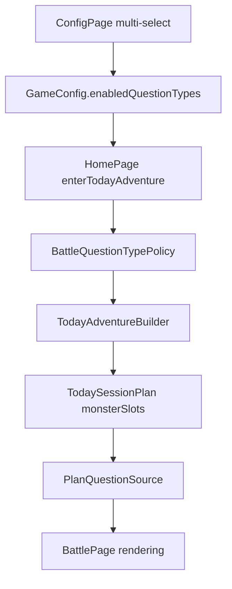

# Question Type Config Design

## Goal

Add a product-level battle question-type selector so parents and UI tests can choose which implemented question types appear in today's battle. The selected types drive both question generation and monster difficulty.

## Confirmed Decisions

- This is a product setting, not a test-only override.
- Implemented selectable types are:
  - Chinese choice (`QuestionKind.Choice`)
  - Single-letter fill (`QuestionKind.FillLetter`)
  - Double-letter fill (`QuestionKind.FillLetterMedium`)
  - Multi-letter selection (`QuestionKind.Spell`)
- Sentence fill is shown as a disabled "coming soon" option and never enters battle in this change.
- Difficulty mapping is strict one-to-one:
  - `Choice -> MonsterKind.Normal`
  - `FillLetter -> MonsterKind.Spelling`
  - `FillLetterMedium -> MonsterKind.Elite`
  - `Spell -> MonsterKind.Boss`
- Question types drive monsters. If only one type is selected, every today-plan slot uses that type's matching monster kind.
- If the active pack has no eligible words for the selected types, Home blocks battle start and shows an inline toast.

## Architecture

The setting lives in `GameConfig` and is persisted with the existing game-config preferences blob. A new policy helper owns type ordering, labels, sanitization, eligibility, and type-to-monster mapping.

## Data Model

`GameConfig` gets an `enabledQuestionTypes: string[]` field. Defaults and migration enable all four implemented question types so upgraded users keep seeing mixed battles. Sanitization removes unknown values, removes disabled future values, preserves difficulty order, and falls back to all implemented types when the stored list is empty or invalid.

Sentence fill is represented in the UI metadata but not in `enabledQuestionTypes` until the actual question kind, generator, engine branch, and renderer exist.

## Battle Composition

`TodayAdventureBuilder` accepts selected question types when creating a today's-adventure plan. It cycles through selected types in fixed difficulty order and generates `monsterSlots` with matching `MonsterKind` values.

Examples:

- `FillLetterMedium` only: all slots are Elite and every generated question must be double-letter fill.
- `Choice + Spell`: slots alternate Normal and Boss difficulty in that order, wrapping across the configured slot count.
- All implemented types: slots follow `Choice`, `FillLetter`, `FillLetterMedium`, `Spell`, then wrap. The old Review monster is no longer part of normal today battles.

## Question Generation

`PlanQuestionSource` generates the exact question kind required by the current monster slot. It may skip ineligible words inside the current plan, but it must not silently degrade to easier question kinds for today-plan slots.

If no word in the active pack can generate any selected type, Home blocks before routing. This avoids a battle that immediately falls back to a different type.

## Config UI

`ConfigPage` adds a question-type multi-select section with stable ids for UI automation:

- `ConfigQuestionType_choice`
- `ConfigQuestionType_fill-letter`
- `ConfigQuestionType_fill-letter-medium`
- `ConfigQuestionType_spell`
- `ConfigQuestionType_sentence-fill`
- `ConfigQuestionTypeLastEnabledHint`

The first four chips toggle. The sentence-fill chip is disabled and labeled as coming soon. The page prevents disabling the final implemented type and shows an inline hint instead.

## Home Error Handling

Home adds a deterministic inline toast when the current active pack cannot support the selected question types. The toast has a stable id so UI tests can assert the blocked-start behavior.

## Testing Strategy

Service tests cover:

- `GameConfig` clone/default behavior.
- Config JSON migration and sanitization.
- Policy order, type-to-monster mapping, and eligibility.
- Today-plan monster generation from selected types.
- Plan question source exact-kind generation and in-plan word skipping.

UI tests cover:

- Config persistence and last-enabled protection.
- Sentence-fill disabled placeholder.
- `FillLetterFlow` selects exactly single-letter or double-letter type before validating that type.
- `SpellQuestionFlow` selects exactly multi-letter selection before validating spell behavior.

## Scope Boundaries

This change does not implement sentence-fill questions. It does not redesign the pack system, word learning buckets, or non-today review battle flow.
