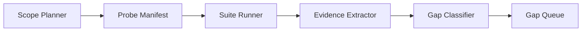

# Three-Platform Gap Detector Design

## Goal

Create a repo-local Tools + SKILL workflow that actively finds behavior-logic and UI-style gaps in the iOS and Android clients, using the latest HarmonyOS client on `main` as the baseline. The detector uses simulator/device screenshots, UI automation evidence, and expected-behavior clues from product specs and implementation plans.

## Confirmed Decisions

- Use a manifest-driven runner as the core architecture.
- Default to scoped investigation when the user names a feature folder, spec, plan, page, or suite.
- Run global investigation only when the user explicitly asks for `overall`.
- If the user does not specify a scope, generate a search-path plan first and ask the user which paths to run.
- Compare against latest HarmonyOS on `main` or `origin/main`, not against stale local screenshots alone.
- Analyze one page/suite batch at a time: run, capture, classify, then move to the next batch.
- Use specs, plans, feature docs, stable IDs, existing UI tests, and screenshots together. Screenshot comparison is evidence, not the only source of truth.
- The output is a gap queue that can feed future development tasks or requirements. Filling those gaps is outside this tool's scope.

## Non-Goals

- Do not modify iOS, Android, HarmonyOS, server, or shared runtime code as part of detection.
- Do not open PRs, create fix branches, or generate implementation patches.
- Do not produce a polished release report as the primary output.
- Do not replace the existing three-platform feature SOP. The detector consumes its artifacts.
- Do not require pixel-perfect cross-platform visual matching. It should flag hierarchy, copy, state, behavior, stable-ID, and obvious style drift.

## Architecture

The tool is a six-stage pipeline:



### 1. Scope Planner

The planner resolves the user's requested scope into candidate probe paths.

Supported modes:

- `feature`: `docs/features/<feature-id>/`
- `spec`: one file under `docs/superpowers/specs/`
- `plan`: one file under `docs/superpowers/plans/`
- `page`: a named UI surface such as `Home`, `Battle`, `Config`, `PackManager`, `ParentAdmin`, or `BoundDeviceInfo`
- `suite`: an explicit automation suite or test file
- `overall`: explicit global search

Rules:

- If the scope is specific and maps to one path, build the manifest immediately.
- If the scope maps to multiple candidate paths, list candidates and ask the user to choose before running simulator/device commands.
- If the scope is absent, do not default to global. Produce a search-path plan and ask the user to select paths.
- If the user says `overall`, first split the repo into branch paths and ask which paths to run.

Default `overall` branch paths:

- Core Loop: Home, Battle, Result, question types, pronunciation, timer, monster effects.
- Growth: Wishlist, redemption history, Monster Codex, Today Plan, Learning Report.
- Parent/Admin: Config, Parent PIN, ParentAdmin, LessonDraftReview.
- Cloud: parent binding, bound child profile, pack sync, global/family packs.
- Debug: DevMenu, preview routing, bypass secret, version-label entry.
- Contracts: shared fixtures, server contracts, DTO decoding, API shape parity.

### 2. Probe Manifest

The manifest is the durable investigation contract for one run. It is generated by the tool and stored with run artifacts. It is resumable, but it is not a permanent product spec.

Proposed schema:

```yaml
scope:
  mode: feature | spec | plan | page | suite | overall
  input: docs/features/2026-05-12-question-type-config
  baseline_branch: origin/main
  selected_paths:
    - Core Loop
sources:
  docs:
    - docs/features/2026-05-12-question-type-config/00-design.md
    - docs/features/2026-05-12-question-type-config/20-replication-trigger.md
    - docs/superpowers/specs/2026-05-11-question-type-config-design.md
  tests:
    harmony:
      - harmonyos/entry/src/ohosTest/ets/test/ConfigFlow.ui.test.ets
    ios:
      - ios/WordMagicGameUITests/WordMagicGameUITests.swift
    android:
      - android/app/src/androidTest/java/cool/happyword/wordmagic/ConfigCloudSyncVisibilityTest.kt
probes:
  - id: config-question-types
    page: Config
    expected:
      behavior:
        - Only implemented question chips render.
        - Selection persists after save.
      stable_ids:
        - ConfigQuestionType_choice
        - ConfigQuestionType_fill-letter
        - ConfigQuestionType_fill-letter-medium
        - ConfigQuestionType_spell
      style_refs:
        - assets/screenshots/harmonyos/config-question-types.png
    runners:
      harmony:
        suite: ConfigFlow
        case: questionTypeSectionRendersImplementedChineseChipsOnly
      ios:
        suite: WordMagicGameUITests
        route: config
      android:
        suite: ConfigCloudSyncVisibilityTest
        route: config
    classify_as:
      - behavior_drift
      - missing_stable_id
      - style_drift
    status: pending | running | classified | skipped
```

The manifest should record skipped paths and skip reasons so a later run can resume deliberately instead of rediscovering the same decision.

### 3. Suite Runner

The runner executes one manifest probe or small probe batch at a time.

Per-batch loop:

1. Confirm baseline source: latest HarmonyOS from `main` or `origin/main`.
2. Run or reproduce the HarmonyOS source suite/page.
3. Capture HarmonyOS screenshot, UI tree, command log, and any relevant test output.
4. Run the iOS counterpart through XCUITest or deterministic simulator route.
5. Capture iOS simulator screenshot, accessibility evidence, command log, and test output.
6. Run the Android counterpart through Compose UI test, UI Automator, or deterministic route.
7. Capture Android emulator screenshot, semantics/UI hierarchy evidence, command log, and test output.
8. Classify gaps before moving to the next probe batch.

The runner should reuse existing command manifests:

- HarmonyOS: `.cursor/ohos-dev-commands.md`
- iOS: `.cursor/ios-dev-commands.md`
- Android: `.cursor/android-dev-commands.md`

Initial implementation can wrap existing project entrypoints instead of inventing new platform runners:

- HarmonyOS UI: `scripts/run_ui_tests.sh --suite <SuiteName>` where available, plus `scripts/capture_harmony_screenshots.py` for screenshot baselines.
- iOS UI: `xcodebuild test -scheme WordMagicGame ... -only-testing:WordMagicGameUITests/...`, plus `xcrun simctl io ... screenshot`.
- Android UI: `cd android && ./gradlew connectedDebugAndroidTest`, focused test filters where practical, plus `adb exec-out screencap -p`.

### 4. Evidence Extractor

The extractor normalizes artifacts into a small evidence bundle per probe and platform.

Evidence types:

- Screenshot PNGs.
- UI tree or accessibility/semantics dump when available.
- Stable ID presence/absence.
- Test assertions and command logs.
- Relevant source snippets from docs, specs, plans, and UI tests.
- Existing reference screenshots from `assets/screenshots/harmonyos/`.

Artifacts should live outside product source by default, for example:

```text
.gap-detector/runs/<timestamp>-<scope>/
  manifest.yaml
  gaps.yaml
  probes/
    config-question-types/
      harmony/
      ios/
      android/
```

`.gap-detector/` should be gitignored. If a later workflow decides evidence should become product documentation, that workflow can copy selected artifacts into tracked docs or screenshots deliberately.

### 5. Gap Classifier

The classifier compares expected behavior and evidence. It should prefer precise, actionable findings over broad summaries.

Gap categories:

- `missing_flow`: a whole page or route exists on HarmonyOS but not on a replica.
- `behavior_drift`: same surface exists, but state transitions, persistence, copy, validation, or business logic differ.
- `missing_stable_id`: expected automation ID is missing or semantically mismatched.
- `style_drift`: visible hierarchy, spacing, orientation, button prominence, or child/parent workflow layout diverges materially.
- `screenshot_missing`: expected screenshot artifact cannot be captured or located.
- `test_coverage_gap`: replica lacks a corresponding UI or unit test for a HarmonyOS behavior.
- `contract_drift`: server/shared fixture shape is consumed differently across platforms.
- `manual_gate`: the detector cannot inspect a path automatically because of a known manual-only policy.

Screenshot analysis should be layered:

1. Confirm that screenshots exist and match expected orientation.
2. Use UI tree and stable IDs to locate the intended surface.
3. Use reference screenshots to compare visible hierarchy, copy, and missing elements.
4. Use visual review only as supporting evidence when structured data is insufficient.

### 6. Gap Queue

The primary output is a queue of gap items, not a polished report.

Proposed item shape:

```yaml
- id: gap-config-question-types-ios-001
  probe: config-question-types
  platform: ios
  severity: high
  category: behavior_drift
  expected: Only implemented question chips render; selection persists after save.
  observed: iOS route exposes Config, but no question-type chip section is present.
  evidence:
    docs:
      - docs/superpowers/specs/2026-05-11-question-type-config-design.md
    baseline_screenshot: .gap-detector/runs/.../harmony/config-question-types.png
    replica_screenshot: .gap-detector/runs/.../ios/config.png
    runner_log: .gap-detector/runs/.../ios/WordMagicGameUITests.log
  downstream_hint: Create a follow-up iOS parity task; implementation belongs outside this detector.
  status: open
```

Severity guide:

- `critical`: user cannot reach a major HarmonyOS flow on a replica.
- `high`: important behavior or page state differs and could invalidate parity.
- `medium`: visible UI or automation contract drift that should be planned.
- `low`: minor polish, missing screenshot artifact, or documentation mismatch.

## Tool Package Shape

Planned repo-local layout:

```text
tools/gap-detector/
  README.md
  gap_detector/
    __init__.py
    scope_planner.py
    manifest.py
    runners/
      __init__.py
      harmony.py
      ios.py
      android.py
    evidence.py
    classifier.py
    cli.py
  tests/
    test_scope_planner.py
    test_manifest.py
    test_classifier.py

.agents/skills/three-platform-gap-detector/SKILL.md
.cursor/skills/three-platform-gap-detector/SKILL.md
```

CLI shape:

```sh
uv run python -m tools.gap_detector plan --scope docs/features/<feature-id>
uv run python -m tools.gap_detector plan --scope overall
uv run python -m tools.gap_detector run --manifest .gap-detector/runs/<run>/manifest.yaml --probe <probe-id>
uv run python -m tools.gap_detector classify --run .gap-detector/runs/<run>
```

The plan command may stop after producing candidate paths when user confirmation is required. The run command should be resumable by reading probe statuses from the manifest.

## SKILL Operating Rules

The SKILL should be installed for both Codex and Cursor because this workflow spans agent guidance and local scripts.

Trigger description should be condition-only, for example:

```yaml
description: Use when investigating iOS or Android parity gaps against the HarmonyOS baseline in WordMagicGame, especially when comparing behavior, UI style, stable IDs, screenshots, specs, plans, or three-platform feature docs.
```

Rules inside the SKILL:

- Start by resolving scope. Do not run `overall` unless the user explicitly requests it.
- If the request is ambiguous, generate a search-path plan and ask the user to choose paths.
- Use latest HarmonyOS on `main` or `origin/main` as the baseline.
- Read specs, plans, feature docs, and existing tests before judging screenshots.
- Build or update a probe manifest before running simulators.
- Run one suite/page probe batch at a time.
- After each batch, classify findings into the gap queue before continuing.
- Stop at evidence-backed gap findings. Do not edit app source, create fix commits, or open PRs.
- If the user wants to fix a gap, hand off to the applicable feature/bugfix workflow with the gap queue item as input.

## Error Handling

- Missing simulator/device: mark the probe as `blocked`, record the command and missing dependency, and continue only if another selected path can run without that dependency.
- Missing counterpart suite: create a `test_coverage_gap` item rather than silently skipping.
- Screenshot capture failure: create `screenshot_missing` with command output and UI tree if available.
- Ambiguous mapping between HarmonyOS suite and replica suite: stop and ask the user to select the candidate mapping.
- Manual-only debug paths: record `manual_gate`; do not force DevMenu or preview-routing coverage into ohosTest if repo policy excludes it.

## Testing Strategy

Unit tests should cover:

- Scope planner maps feature/spec/plan/page inputs to expected source files.
- Ambiguous and absent scopes produce confirmation-required search plans.
- `overall` splits into the agreed branch paths.
- Manifest serialization preserves selected/skipped paths and probe statuses.
- Classifier creates the right category for missing stable IDs, missing screenshots, missing counterpart tests, and observed behavior drift.

Integration tests can use fixture logs and tiny screenshot placeholders. They should not require real simulators in CI. Device/simulator execution remains a local validation path.

## Acceptance Criteria

- A user can name a feature/spec/plan/page and get a scoped manifest without global crawling.
- A user can request `overall` and receive selectable branch paths before any expensive simulator run.
- A probe can run suite-by-suite and produce per-platform artifacts.
- Each completed probe creates zero or more concrete gap queue items with evidence.
- The tool does not modify product source while in detection mode.
- The SKILL teaches agents to stop at gap evidence and hand off remediation to later workflows.

## Open Implementation Notes

- The implementation plan should decide whether to use the existing root `uv` environment or add a small `pyproject` under `tools/gap-detector/`.
- Focused Android instrumentation filtering may need confirmation from the local Gradle setup before the runner can target one test class or method reliably.
- iOS accessibility tree extraction may start with XCUITest assertions and screenshots, then add richer dumps later if the local toolchain exposes a stable path.
